# 数据结构与算法

> 部分目录缺失


### 工具类：

全部都是静态方法

#### Arrays：

1. 数组元素拼接：

   1. static String toString(Object[] a) ：对数组中每个元素调用toString打印，并用","拼接
2. 排序：
3. static void sort(int[] a, int fromIndex, int toIndex) ：对数据进行部分升序排序
4. static void sort(T[] a, Comparator<? super T> c)：对数据元素进行定制排序
5. static void sort(Object[] a) ：对数组元素进行自然排序
6. 数组复制：
7. static T[] copyOf(T[] original,int newLength)：从原数组复制长度为newLength的数组并返回新数组
8. static T[] copyOfRange(T[] original,int from,int to)：复制原数组的[from,to）的数组元素并返回新数组
9. 比较：
10. static boolean equals(Object[] a,Object[] a2)：判断两个数组元素以及长度是否完全相同。
11. 填充数组：
12. static void fill(Object[] a,Object val)：将所有位置设置为val
13. static void fill(Object[] a, int fromIndex, int toIndex, Object val) ：[from,to)位置设置为val

#### Collections：

1. 排序操作：

   1. sort(List)：对列表元素进行自然升序排序
   2. sort(List，Comparator):定制排序
   3. reverse(List)：翻转列表元素位置
   4. swap(List，int， int)：将List的i位置和j位置元素交换
2. 查找：
3. Object max(Collection)：自然排序下的最大值。也可以传入Compatator进行定制排序
4. int frequency(Collection c，Object o)：返回列表中元素出现的次数
5. 添加：
6. boolean addAll(Collection c,T... elements):将所有指定元素添加到集合中

### 集合框架：


#### Collection接口：

#### 接口的方法

1. 添加：add(E obj)：添加元素对象到当前集合中。addAll(Collection other)：this = this ∪ other
2. 判断：
   1. int size()：长度
   2. boolean isEmpty()：是否为空
   3. boolean contains(Object obj)：通过equals进行判断
   4. boolean containsAll(Collection coll)：判断元素是否都包含
3. 删除：
4. clear()：清空
5. remove(),removeAll()：删除第一个匹配的元素。删除全部匹配的元素。

#### List

主要使用ArrayList，以及LinkedList

1. 插入:

   1. *void add(int index, Object ele)*:在 index 位置插入 ele 元素
2. 获取：
3. *Object get(int index)*:获取指定 index 位置的元素
4. List subList(int fromIndex, int toIndex):返回从 fromIndex 到 toIndex 位置的子集合
5. 位置：
6. int indexOf(Object obj):返回 obj 在集合中首次出现的位置
7. int lastIndexOf(Object obj):返回 obj 在当前集合中末次出现的位置
8. 删除替换：
9. *Object remove(int index)*:移除指定 index 位置的元素
10. *Object set(int index, Object ele)*:设置指定 index 位置的元素为ele

#### Set

主要使用HashSet

### Map接口：


#### 接口的方法

1. 添加

   1. Object put(Object key,Object value)：将指定 key-value 添加到(或修改)当前的Map对象中。
   2. void putAll(Map m):将 m 中的所有 key-value 对存放到当前 map 中
2. 删除
3. Object remove(Object key)：移除指定 key 的 key-value 对，并返回 value
4. void clear()：清空当前 map 中的所有数据
5. 查询

#### 2.HashMap最常用

1. 线程不安全
2. 允许key和value是null值
3. key相等：通过hashcode判断。value相等：通过equals方法判断。

## 数据结构：

### 栈

1. 类：Stack
2. 方法：
   1. peek()：查看栈顶元素
   2. pop()：弹出并返回栈顶元素
   3. push()：将元素压栈

### 队列与双端队列与优先队列

1. 类：接口：
   1. 队列：Queue，实现类LinkedList
   2. 双端队列：Deque<T> deque = new ArrayDeque<>();
   3. 优先队列：PriorityQueue<T> heap = new PriorityQueue<>((a,b)->a[1]-b[1])
2. 方法：
3. 添加：add,offer
4. 查看队列头部：peek
5. 获取并出队头部:poll

# 数据量与对应算法

1. 平台运行要求：
   1. c/c++运行时间1s，java/python/go等语言运行时间1-2s
   2. 对应的常数指令操作量是10^8以内，必须限制在这个数量级，和平台无关
   3. 假设n = 10^6,则O(n^2)算法必然TLE
2. 对应算法

2^n常对应递归展开(每个位置暴力枚举)


### 选择排序：

i\~n-1范围上，找到最小值并放在i位置，然后i+1\~n-1范围上继续

```
     //选择排序
    public static void selectionSort(int[] arr) {
        if (arr == null || arr.length < 2) {
            return;
        }
        for (int minIndex, i = 0; i < arr.length - 1; i++) {
            minIndex = i;
            for (int j = i + 1; j < arr.length; j++) {
                if (arr[j] < arr[minIndex]) {
                    minIndex = j;
                }
            }
            swap(arr, i, minIndex);
        }
    }
```

### 冒泡排序：

0\~i范围上，相邻位置较大的数滚下去，最大值最终来到i位置，然后0\~i-1范围上继续

```
    public static void bubbleSort(int[] arr) {
        if (arr == null || arr.length < 2) {
            return;
        }
        for (int end = arr.length - 1; end > 0; end--) {
            for (int i = 0; i < end; i++) {
                if (arr[i] > arr[i + 1]) {
                    swap(arr, i, i + 1);
                }
            }
        }
    }
```

### 插入排序：

0\~i范围上已经有序，新来的数从右到左滑到不再小的位置插入，然后继续

```
    public static void insertionSort(int[] arr) {
        if (arr == null || arr.length < 2) {
            return;
        }
        for (int i = 1; i < arr.length; i++) {
        //从0到i-1部分，进行滑动插入
        //每次都能保证0到i-1部分有序，新来的是arr[i],在下面的循环中新来的数一直是arr[j+1].
            for (int j = i - 1; j >= 0 && arr[j] > arr[j + 1]; j--) {
                swap(arr, j, j + 1);
            }
        }
    }
```


### 快速排序

1. 基本思路：
   1. 将数列划分为两部分，第一步要是要把数列分成两个部分，然后保证前一个子数列中的数都小于后一个子数列中的数。也就是划分为前一部分<=nums[x],后一部分>nums[x]。则此时将x位置的数移动到<=位置的最后一个，也就是两个序列中间，意味着nums[x]已经排好序了。
   2. 递归到两个子序列中进行a操作。每一次划分就会排序好一个数
   3. 不用合并，此时序列已经完全有序
   4. 时间复杂度：O(n\*logn),最差O(n^2)
2. 经典模板：

```
class Solution {
    public int[] sortArray(int[] nums) {
        quickSort(nums, 0, nums.length-1);
        return nums;
    }
    public static void quickSort(int[] nums, int l, int r){
        if(l>=r) return;
        int x = nums[l + (int)(Math.random()*(r-l+1))];
        int mid = partition(nums, x,l,r);
        quickSort(nums, l,mid-1);
        quickSort(nums, mid+1,r);
    }
    public static int partition(int[] nums, int x,int l, int r){
        //[l,cnt)是<=x的数组
        int cnt = l;
        int xIndex = 0;
        for(int i=l; i<=r;i++){
            if(nums[i] <= x){
                swap(nums,i,cnt);
                //被交换到了cnt位置
                if(nums[cnt] == x) xIndex = cnt;
                cnt++;
            }
        }
        swap(nums,xIndex,cnt-1);
        return cnt-1;
    }
    public static void swap(int[] nums, int a, int b){
        int temp = nums[a];
        nums[a] = nums[b];
        nums[b] = temp;
    }
}
```

1. 优化(三路快速排序，基于荷兰国旗问题)：
   1. 思路：将数组划分为<x,=x,>x三个部分。直接确定了=x的位置，而不是一次一次确定。在有重复值数据上表现更好。
   2. 时间复杂度:O(n\*logn)，最优为O(n)，最差情况O(n^2)
   3. 划分步骤：
      1. 使用两个变量first，last记录<x和>x的更新的数组位置
      2. 如果nums[i]<x，则进行swap(nums,i,first),并将first++,然后i++;
      3. 如果nums[i]>x，则进行swap(nums,i,last),并将last--,但是i不变 ，需要再次进行进行判断是否需要进行交换。
      4. 整体就是从左往右，每一个数字依次都是经过检查的，从后面交换的没有check过，所以i不变。

```
class Solution {
    public int[] sortArray(int[] nums) {
        quickSort(nums, 0, nums.length-1);
        return nums;
    }
    public static void quickSort(int[] nums, int l, int r){
        if(l>=r) return;
        int x = nums[l + (int)(Math.random()*(r-l+1))];
        int[] bound = partition(nums, x,l,r);
        int lmid = bound[0], rmid = bound[1];
        quickSort(nums, l,lmid-1);
        quickSort(nums, rmid+1,r);
    }
    //partition部分是O(n)
    public static int[] partition(int[] nums, int x,int l, int r){
        int first = l;
        int last = r;
        int i = l;
        while(i<=last){
            if(nums[i] < x){
                swap(nums, first, i);
                first++;
                i++;
            }else if(nums[i] > x){
                swap(nums, i, last);
                last--;
            }else{
                i++;
            }
        }
        return new int[]{first,last};
    }
    public static void swap(int[] nums, int a, int b){
        int temp = nums[a];
        nums[a] = nums[b];
        nums[b] = temp;
    }
}
```

### 随机选择算法

1. 原理：

   1. 基于随机快速排序
   2. 如果partition之后=x的部分是[first,last]，这一部分是排序好的。如果这一部分下标包含target，则直接返回。
   3. 如果没有命中，可以根据大小关系只进行一侧的递归查找
2. 复杂度：
3. 时间复杂度O(n)
4. 空间复杂度O(1)
5. 例题：leetcode215 第k大的数
6. 思路：排序：O(n\*logn)。随机选择：O(n)

```
class Solution {
    public int findKthLargest(int[] nums, int k) {
        return randomSelect(nums, nums.length-k);
    }
    //nums排序，在i位置上的数是什么
    public static int randomSelect(int[] nums,int i){
        int l = 0, r = nums.length-1;
        int ans = 0;
        while(l<=r){
            int x = nums[l+(int)(Math.random()*(r-l+1))];
            int[] bound = partition(nums, x, l, r);
            int lmid = bound[0], rmid = bound[1];
            if(i < lmid){
                r = lmid-1;
            }else if( i > rmid){
                l = rmid+1;
            }else{
                ans = nums[i];
                break;
            }
        }
        return ans;
    }
    public static int[] partition(int[] nums, int x, int l, int r){
        int first = l;
        int last = r;
        int i = l;
        while(i<=last){
            if(nums[i] < x){
                swap(nums, first,i);
                first++;
                i++;
            }else if(nums[i] > x){
                swap(nums,i,last);
                last--;
            }else{
                i++;
            }
        }
        return new int[]{first,last};
    }
    public static void swap(int[] nums, int l, int r){
        int temp = nums[l];
        nums[l] = nums[r];
        nums[r] = temp;
    }
}
```

## 对数器：

场景：对于测试用例不够的场景，用来自我验证

基本思路：先实现暴力解，再实现最优解，然后生成随机数据，然后 验证暴力解和最优解的结果是否一致，这就是对数器。

对数器的门槛其实是比较高的，因为往往需要在两种不同思路下实现功能相同的两个方法，暴力一个、想象中的最优解是另一个。

以后的很多题目都会用到对数器，几乎可以验证任何方法，尤其在验证贪心、观察规律方面很有用

到时候会丰富很多对数器的实战用法，这里只是一个简单易懂的示例

## 二分搜索：

**👋**

前三种情况必须要数组体现有序才可以使用

### 情况一：num == target

```
    public static boolean exist(int[] arr, int num) {
        if (arr == null || arr.length == 0) {
            return false;
        }
        int l = 0, r = arr.length - 1, m = 0;
        while (l <= r) {
            m = (l + r) / 2;
            if (arr[m] == num) {
                return true;
            } else if (arr[m] > num) {
                r = m - 1;
            } else {
                l = m + 1;
            }
        }
        return false;
    }
```

### 情况二: num >= target的最左边位置

```
    public static int findLeft(int[] arr, int num) {
        int l = 0, r = arr.length - 1, m = 0;
        int ans = -1;
        while (l <= r) {
            // m = (l + r) / 2;
            // m = l + (r - l) / 2;
            m = l + ((r - l) >> 1);

            if (arr[m] >= num) {
                ans = m;
                r = m - 1;
            } else {
                l = m + 1;
            }
        }
        return ans;
    }
```

### 情况三： num <= target的最右边位置

```
    public static int findRight(int[] arr, int num) {
        int l = 0, r = arr.length - 1, m = 0;
        int ans = -1;
        while (l <= r) {
            //防止精度溢出
            m = l + ((r - l) >> 1); 
            if (arr[m] <= num) {
                ans = m;
                l = m + 1;
            } else {
                r = m - 1;
            }
        }
        return ans;
    }
```

### 情况四： 峰值问题：

思路：

1. 验证0位置和n-1位置的数，如果有符合峰值的情况，直接返回
2. 如果没有，那么开头是上升的，结尾是下降的，一定存在转折点，也就是峰值。
3. 二分查找到中点，看与左右边界构成的区间如果是上升+下降组合，那么峰值必然在区间内，在区间内二分即可。

示例：

```
// 峰值元素是指其值严格大于左右相邻值的元素
// 给你一个整数数组 nums，已知任何两个相邻的值都不相等
// 找到峰值元素并返回其索引
// 数组可能包含多个峰值，在这种情况下，返回 任何一个峰值 所在位置即可。
// 你可以假设 nums[-1] = nums[n] = 无穷小
// 你必须实现时间复杂度为 O(log n) 的算法来解决此问题。
public class Code04_FindPeakElement {

    // 测试链接 : https://leetcode.cn/problems/find-peak-element/
    class Solution {

        public static int findPeakElement(int[] arr) {
            int n = arr.length;
            if (arr.length == 1) {
                return 0;
            }
            if (arr[0] > arr[1]) {
                return 0;
            }
            if (arr[n - 1] > arr[n - 2]) {
                return n - 1;
            }
            int l = 1, r = n - 2, m = 0, ans = -1;
            while (l <= r) {
                m = (l + r) / 2;
                if (arr[m - 1] > arr[m]) {
                    r = m - 1;
                } else if (arr[m] < arr[m + 1]) {
                    l = m + 1;
                } else {
                    ans = m;
                    break;
                }
            }
            return ans;
        }
    }
}
```

## 二分答案法：

### 步骤

1. 估计最终答案可能的范围是什么
2. 分析问题和给定条件之间的单调性
3. 建立一个check函数，在答案固定的情况下，判断给定的条件是否达标(也就是答案需要满足的性质)
4. 不断调整范围，直到二分结束找到答案

### 例题

1. leetcode 875

珂珂喜欢吃香蕉。这里有 `<span class="color_font"><span>n</span></span>` 堆香蕉，第 `<span class="color_font"><span>i</span></span>` 堆中有 `<span class="color_font"><span>piles[i]</span></span>` 根香蕉。警卫已经离开了，将在 `<span class="color_font"><span>h</span></span>` 小时后回来。

珂珂可以决定她吃香蕉的速度 `<span class="color_font"><span>k</span></span>` （单位：根/小时）。每个小时，她将会选择一堆香蕉，从中吃掉 `<span class="color_font"><span>k</span></span>` 根。如果这堆香蕉少于 `<span class="color_font"><span>k</span></span>` 根，她将吃掉这堆的所有香蕉，然后这一小时内不会再吃更多的香蕉。  珂珂喜欢慢慢吃，但仍然想在警卫回来前吃掉所有的香蕉。返回她可以在 `<span class="color_font"><span>h</span></span>` 小时内吃掉所有香蕉的最小速度 `<span class="color_font"><span>k</span></span>`（`<span class="color_font"><span>k</span></span>` 为整数）。

* 思路：要求的是最小速度，思考速度的范围[l,r]。
  * r最大只需要就只用数组中最大值就可以了，再大了就没收益，和r的效果一样。
  * l最小的情况，根据实际情况判断。
  * 单调性：如果速度增加，则所用的耗时只会减小或者不变。
  * 接着二分：在速度数组中进行二分，不断缩小范围。如果x速度满足，则只用在[l,x-1]范围内继续二分就可以。

**🔔**

这里的整体模型就是满足性质的最左位置，是上面的二分搜索情况二的推广。

```
class Solution {
    //区间长度10^9,如果使用O(n)必然超时，需要二分
    public int minEatingSpeed(int[] piles, int h) {
        int l = 1, r = 0;
        for(int pile : piles){
            r = Math.max(r,pile);
        }   
        int ans = Integer.MIN_VALUE;
        while(l<=r){
            int mid = l + (r-l)/2;
            if(check(piles,mid,h)){
                ans = mid;
                r = mid-1;
            }else{
                l = mid+1;
            }
        }
        return ans;
    }
    public static boolean check(int[]piles, int mid, int h){
        //注意数据量到了10^9了。int类型范围到[-2亿，2亿]，换为long更保险
        long cost = 0L;
        for(int pile : piles){
            cost += Math.ceilDiv(pile, mid);
        }
        return cost <= h;
    }
}
```

1. leetcode 410画匠问题

给定一个非负整数数组 `<span class="color_font"><span>nums</span></span>` 和一个整数 `<span class="color_font"><span>k</span></span>` ，你需要将这个数组分成 `<span class="color_font"><span>k</span></span>` 个非空的连续子数组。

设计一个算法使得这 `<span class="color_font"><span>k</span></span>` 个子数组各自和的最大值最小。

抽象为画匠问题就是每个画家负责连续的一段，并行进行画作，最后结束的时间就是画家中耗时最久的时间。求最终任务结束的最小时间。

1. 思路：
   1. s问题：每部分的累加和求出的最大值最小。
   2. [l,r]计算：答案的可能值的最小值是0，最大值可以定的比较粗，可以假设为整个数组的累加和。
   3. check函数：在每个部分的值不超过mid的情况下，则k最小值为多少就可以做到。
   4. 单调性：
      1. 每一部分limit的增加，对应着k的最小值减小。我们要考虑的肯定是最值情况，而不是中间值的情况。
      2. 如果每一部分要求的结果的最大值limit增加，则对应的k值的最小值必然减小。

则如果目前的mid对应的k的最小值满足性质(至多k段)，则可以向mid减小的方向缩小范围继续二分。

否则需要向mid增加的方向缩小。

**💡**

题目要求划分成 k 段，但其实如果能划分成小于 k 段，也可以划分成 k 段。比如划分成 k−1 段，那么把其中的一个长度至少为 2 的段分成两段，这两段的元素和都比原来的一段小，也满足要求。所以题目相当于：把数组划分成至多 k 段，分别计算每一段的元素和，最小化元素和的最大值

遇到最大化最小值或最小化最大值，就是二分题型。

时间复杂度O(n \* logsum)。

```
class Solution {
    public int splitArray(int[] nums, int k) {
        int sum = 0;
        for(int item : nums){
            sum += item;
        }
        int l = 0, r = sum;
        int ans = 0;
        while(l<=r){
            int mid = l + (r-l)/2;
            if(check(nums,mid,k)){
                ans = mid;
                r = mid-1;
            }else{
                l = mid+1;
            }
        }
        return ans;
    }
    public static boolean check(int[] nums, int limit, int k){
        int cnt = 1;
        int cur = 0;
        for(int item : nums){
            if(item > limit) return false;
            if(cur + item > limit){
                cnt++;
                cur = item;
            }else{
                cur += item;
            }
        }
        return cnt<=k;
    }
}
```

1. leetcode 719 第k小的数对距离
   1. 题目：数对 `<span>(a,b)</span>` 由整数 `<span>a</span>` 和 `<span>b</span>` 组成，其数对距离定义为 `<span>a</span>` 和 `<span>b</span>` 的绝对差值。返回第k小的数对距离。
   2. 思路：
      1. 暴力：存储所有的数对，然后使用快速选择算法进行选择第k小。空间会被卡。
      2. 二分+空间优化：
         1. 数组：任意两个数的距离
         2. 范围[l,r]: l=0, r = max-min
         3. check:距离<=mid的数量有几个
         4. 单调性：距离增加，则满足的数量必然增加。因为是求<=某个距离的数量。 如果差值<=mid，数量不足k个，则需要向[mid+1,r]搜索。否则如果数量>=k个，则说明>=mid的范围均满足，则向[l,mid-1]范围搜索。则最后结束就是dis<=mid 刚好为k个的距离。

## 链表

### 按值传递和按引用传递：

int ,byte,short,long,char,float double,boolean 以及String是按值传递

其他是按照引用传递，比如所有的引用类型(数组，类，等)

### 单链表翻转：

三步曲：对于当前节点cur，

1. 保存cur.next的位置
2. 改变指针也就是next指向，指向pre
3. pre向后移动

```
//单链表翻转：
        public static ListNode reverseList(ListNode head) {
            ListNode pre = null;
            ListNode next = null;
            while (head != null) {
                next = head.next;
//head.next = pre 最开始表示的是让head指向null
                head.next = pre;
                pre = head;
//head随着每一步往后移动
                head = next;
            }
            return pre;
        }
//也就是有pre = null,next = null;然后的话让两者同时平移到head和head.next
```

### 双链表翻转：

```
    public static class DoubleListNode {
        public int value;
        public DoubleListNode last; //上一个
        public DoubleListNode next; //下一个

        public DoubleListNode(int v) {
            value = v;
        }
    }

    public static DoubleListNode reverseDoubleList(DoubleListNode head) {
        DoubleListNode pre = null;
        DoubleListNode next = null;
        while (head != null) {
            next = head.next;
            head.next = pre;
            head.last = next;
            pre = head;

            head = next;
        }
        return pre;
    }
```

### 合并两个有序链表：

一共三个变量：

1. pre指向的是当前最新的排好的节点。
2. c1指向第一个等待排序的链表头
3. c2指向第二个等待排序的链表头

```
public static ListNode mergeTwoLists(ListNode head1, ListNode head2) {
            if (head1 == null || head2 == null) {
                return head1 == null ? head2 : head1;
            }
            ListNode head = head1.val <= head2.val ? head1 : head2;
            ListNode cur1 = head.next;
            ListNode cur2 = head == head1 ? head2 : head1;
            ListNode pre = head;
            while (cur1 != null && cur2 != null) {
                if (cur1.val <= cur2.val) {
                    pre.next = cur1;
                    cur1 = cur1.next;
                } else {
                    pre.next = cur2;
                    cur2 = cur2.next;
                }
                pre = pre.next;
            }
            pre.next = cur1 != null ? cur1 : cur2;
            return head;
        }
}
```

### 链表相加：

其实就是高精度大数相加，是一道模拟

注意留在本位的数字是sum % 10,而进位的是carry = sum / 10;

最后的进位由于都时空值已经退出循环了。所以需要特判。

```
public static ListNode addTwoNumbers(ListNode h1, ListNode h2) {
            ListNode ans = null, cur = null;
            int carry = 0;
            for (int sum, val; // 声明变量
                    h1 != null || h2 != null; // 终止条件
                    h1 = h1 == null ? null : h1.next, // 每一步h1的跳转
                    h2 = h2 == null ? null : h2.next // 每一步h2的跳转
                    ) {

                sum = (h1 == null ? 0 : h1.val)
                        + (h2 == null ? 0 : h2.val)
                        + carry;

                val = sum % 10;
                carry = sum / 10;
                if (ans == null) {
                    ans = new ListNode(val);
                    cur = ans;
                } else {
                    cur.next = new ListNode(val);
                    cur = cur.next;
                }
            }
            if (carry == 1) {
                cur.next = new ListNode(1);
            }
            return ans;
        }
```

### 链表划分：

给你一个链表的头节点 head 和一个特定值 x

请你对链表进行分隔，使得所有 小于 x 的节点都出现在 大于或等于 x 的节点之前。

你应当 保留 两个分区中每个节点的初始相对位置

核心思路：开两个链表，一个保存小的部分，一个保存大的部分，最后前一部分的next指向后一部分你的头。使用了一个next变量来保存遍历到节点的next指针。

```
public static ListNode partition(ListNode head, int x) {
            ListNode leftHead = null, leftTail = null; // < x的区域
            ListNode rightHead = null, rightTail = null; // >=x的区域
            ListNode next = null;
            while (head != null) {
                next = head.next;
                head.next = null;
                if (head.val < x) {
                    if (leftHead == null) {
                        leftHead = head;
                    } else {
                        leftTail.next = head;
                    }
                    leftTail = head;
                } else {
                    if (rightHead == null) {
                        rightHead = head;
                    } else {
                        rightTail.next = head;
                    }
                    rightTail = head;
                }
                head = next;
            }
            if (leftHead == null) {
                return rightHead;
            }
            // < x的区域有内容！
            leftTail.next = rightHead;
            return leftHead;
        }
```

### \*\*\*链表的高频题目总结

1. 注意点：

   1. 一般通过核心代码模式进行
   2. 如果空间不严格，可以直接使用容器进行解决。
   3. 如果空间严格，需要优化空间，比如O(1)。
   4. 最常见技巧：快慢指针
   5. 核心考察点：coding能力
2. 题目：
3. [返回两个无环链表相交的第一个节点 ](https://leetcode.cn/problems/intersection-of-two-linked-lists/)
4. 题目：给定两个链表，判断结构上是不是有相交。
5. 思路：
6. 只判断是否相交：因为无环，所以结尾必然是相交的(同一个节点).单链表只有一个next指针，也不会有人字形的结构出现。
7. 判断相交的第一个节点：如果长度分别是a,b 并且(b>a)。则可以使b先走b-a步。然后两个链表同步走，必然会同时走到相交的位置。也可以通过使用HashSet来进行对象是否相等的判断，方法是先将一个结点全部存入HashSet中。在遍历另一个的时候进行判断。
8. [k个一组翻转链表](https://leetcode.cn/problems/reverse-nodes-in-k-group/)
9. 给定一个链表，每k个节点一组进行调整。
10. 思路：
11. 使用容器：将链表所有节点的值放入数组中，然后对数组进行每k个翻转，最后再构建链表。
12. 不使用容器：假设链表头部为a->b->c->d...，同时k=3则过程：先记住头c，反转后记住尾a,并将a->d。每次都要记住上一次的尾，因为上一个的尾会指向下一个新调整的头。


1. [复制带随机指针的链表](https://leetcode.cn/problems/copy-list-with-random-pointer/)

   1. 题目背景：原来的单链表节点的指针多了一个random指针，可以指向该链表的任何节点或者null。要求对该链表进行深拷贝。
   2. 思路：
      1. 使用容器：使用map结构。对原来的链表的节点作为key，新构造的节点作为value。然后遍历map在，对于一个k-v来说，新构造节点的next和random指针，可以通过查找key来确定。利用map对v的指针域赋值上对应的新构造的节点地址，从而达到深拷贝。
2. [判断链表是否是回文结构](https://leetcode.cn/problems/palindrome-linked-list/)
3. 回文链表示例：30->100->30->null
4. 思路：
5. 使用栈进行判断：现将节点全部入栈，同时弹出节点和遍历链表，一一判断。
6. 使用快慢指针：
7. [返回一个链表的入环节点](https://leetcode.cn/problems/linked-list-cycle-ii/)
8. 思路：
9. 使用容器：使用HashSet。变量链表，如果不在就添加进去，当再次遍历的时候在了，就返回该节点
10. 不使用容器(结论)：
11. 先使用快慢指针(一个走两步，一个走一步)，到达第一个相遇的点
12. 然后快指针回到开头，快慢指针同时走(同时走一步)，则必然在入环节点处相遇。

## 队列和栈

队列和栈都是一种逻辑结构，物理结构可以用数组或者链表进行实现。

队列：先进先出,从尾进，从头出。

栈：先进后出

插入删除都是O(1)的时间复杂度

### 队列的实现：

```
public static class Queue1 {

        // java中的双向链表LinkedList
        // 单向链表就足够了
        public Queue<Integer> queue = new LinkedList<>();

        // 调用任何方法之前，先调用这个方法来判断队列内是否有东西
        public boolean isEmpty() {
            return queue.isEmpty();
        }

        // 向队列中加入num，加到尾巴
        public void offer(int num) {
            queue.offer(num);
        }

        // 从队列拿，从头拿
        public int poll() {
            return queue.poll();
        }

        // 返回队列头的元素但是不弹出
        public int peek() {
            return queue.peek();
        }

        // 返回目前队列里有几个数
        public int size() {
            return queue.size();
        }

    }

//数组实现：
// 实际刷题时更常见的写法，常数时间好
    // 如果可以确定加入操作的总次数不超过n，那么可以用
    // 一般笔试、面试都会有一个明确数据量，所以这是最常用的方式
    // 队列的存储范围是[l,r)
    public static class Queue2 {

        public int[] queue;
        public int l;
        public int r;

        // 加入操作的总次数上限是多少，一定要明确
        public Queue2(int n) {
            queue = new int[n];
            l = 0;
            r = 0;
        }

        // 调用任何方法之前，先调用这个方法来判断队列内是否有东西
        public boolean isEmpty() {
            return l == r;
        }

        public void offer(int num) {
            queue[r++] = num;
        }

        public int poll() {
            return queue[l++];
        }
        // ?
        // l...r-1 r
        // [l..r)
        public int head() {
            return queue[l];
        }

        public int tail() {
            return queue[r - 1];
        }

        public int size() {
            return r - l;
        }

    }
```

### 栈的实现

```
// 直接用java内部的实现
    // 其实就是动态数组，不过常数时间并不好
    public static class Stack1 {

        public Stack<Integer> stack = new Stack<>();

        // 调用任何方法之前，先调用这个方法来判断栈内是否有东西
        public boolean isEmpty() {
            return stack.isEmpty();
        }

        public void push(int num) {
            stack.push(num);
        }

        public int pop() {
            return stack.pop();
        }

        public int peek() {
            return stack.peek();
        }

        public int size() {
            return stack.size();
        }

    }

// 实际刷题时更常见的写法，常数时间好
    // 如果可以保证同时在栈里的元素个数不会超过n，那么可以用
    // 也就是发生弹出操作之后，空间可以复用
    // 一般笔试、面试都会有一个明确数据量，所以这是最常用的方式
    public static class Stack2 {

        public int[] stack;
        public int size;

        // 同时在栈里的元素个数不会超过n
        public Stack2(int n) {
            stack = new int[n];
            size = 0;
        }

        // 调用任何方法之前，先调用这个方法来判断栈内是否有东西
        public boolean isEmpty() {
            return size == 0;
        }

        public void push(int num) {
            stack[size++] = num;
        }

        public int pop() {
            return stack[--size];
        }

        public int peek() {
            return stack[size - 1];
        }

        public int size() {
            return size;
        }
    }
```

### 环形队列的实现

底层还是使用数组。共有4个变量：l,r,size,limit。使用size来限制加入和弹出的操作

如果size >0,可以弹出。如果size < limit，可以加入。

队列的范围还是始终是[l,r)

```
class MyCircularQueue {

        public int[] queue;

        public int l, r, size, limit;

        // 同时在队列里的数字个数，不要超过k
        public MyCircularQueue(int k) {
            queue = new int[k];
            l = r = size = 0;
            limit = k;
        }

        // 如果队列满了，什么也不做，返回false
        // 如果队列没满，加入value，返回true
        public boolean enQueue(int value) {
            if (isFull()) {
                return false;
            } else {
                queue[r] = value;
                // r++, 结束了，跳回0
                r = r == limit - 1 ? 0 : (r + 1);
                size++;
                return true;
            }
        }

        // 如果队列空了，什么也不做，返回false
        // 如果队列没空，弹出头部的数字，返回true
        public boolean deQueue() {
            if (isEmpty()) {
                return false;
            } else {
                // l++, 结束了，跳回0
                l = l == limit - 1 ? 0 : (l + 1);
                size--;
                return true;
            }
        }

        // 返回队列头部的数字（不弹出），如果没有数返回-1
        public int Front() {
            if (isEmpty()) {
                return -1;
            } else {
                return queue[l];
            }
        }
        //返回队列尾部的数字，不弹出
        public int Rear() {
            if (isEmpty()) {
                return -1;
            } else {
                int last = r == 0 ? (limit - 1) : (r - 1);
                return queue[last];
            }
        }

        public boolean isEmpty() {
            return size == 0;
        }

        public boolean isFull() {
            return size == limit;
        }

    }
```

### 栈和队列相互实现

#### 使用栈实现队列：

方法：使用in, out两个栈

1. out 必须为空，in才能倒入数据
2. in只要倒入数据，就必须倒完
3. 自己封装的时候，无论是push,pop还是peek都调用inToOut，能不能执行方法体取决于上面两个条件。push的方法在in中操作，pop和peek在out中操作。
4. 时间复杂度：每个数顶多都只会执行4次操作。所以为O(1)

```
class MyQueue {

        public Stack<Integer> in;

        public Stack<Integer> out;

        public MyQueue() {
            in = new Stack<Integer>();
            out = new Stack<Integer>();
        }

        // 倒数据
        // 从in栈，把数据倒入out栈
        // 1) out空了，才能倒数据
        // 2) 如果倒数据，in必须倒完
        private void inToOut() {
            if (out.empty()) {
                while (!in.empty()) {
                    out.push(in.pop());
                }
            }
        }

        public void push(int x) {
            in.push(x);
            inToOut();
        }

        public int pop() {
            inToOut();
            return out.pop();
        }

        public int peek() {
            inToOut();
            return out.peek();
        }

        public boolean empty() {
            return in.isEmpty() && out.isEmpty();
        }

    }
```

#### 队列实现栈：

队列：尾进头出

核心思想：队列出队是顺序的，而栈弹出的话为倒序。所以每次都把队列新加入的数前面的数全部从队列头弹出，再从尾部进入，也就是逆序。

单次push的时间复杂度是O(n)；

```
class MyStack {

        Queue<Integer> queue;

        public MyStack() {
            queue = new LinkedList<Integer>();
        }

        // O(n)
        public void push(int x) {
            int n = queue.size();
            queue.offer(x);
            for (int i = 0; i < n; i++) {
                queue.offer(queue.poll());
            }
        }

        public int pop() {
            return queue.poll();
        }

        public int top() {
            return queue.peek();
        }

        public boolean empty() {
            return queue.isEmpty();
        }

    }
```

### 最小栈

除了实现常规的栈功能，还需要实现getmin方法，这个方法需要可以在任何时候用O(1)的时间复杂度内找到最小值

方法

1. 使用两个栈 data 和 min
2. min随着data的压入数据，每一次和最小栈的栈顶对比。
3. 如果当前数字大于min栈顶，重复压入min的栈顶。如果小于min栈顶，则压入data中新加入的数据。
4. 初始情况：如果min为空，则data栈也必然为空，同步压入数据就可以。
5. 每次弹出的时候，data和min同步弹出

```
//使用数组实现的部分
class MinStack2 {
        // leetcode的数据在测试时，同时在栈里的数据不超过这个值
        // 这是几次提交实验出来的，哈哈
        // 如果leetcode补测试数据了，超过这个量导致出错，就调大
        public final int MAXN = 8001;

        public int[] data;
        public int[] min;
        int size;

        public MinStack2() {
            data = new int[MAXN];
            min = new int[MAXN];
            size = 0;
        }

        public void push(int val) {
            data[size] = val;
            if (size == 0 || val <= min[size - 1]) {
                min[size] = val;
            } else {
                min[size] = min[size - 1];
            }
            size++;
        }

        public void pop() {
            size--;
        }

        public int top() {
            return data[size - 1];
        }

        public int getMin() {
            return min[size - 1];
        }
    }
```

### 双端队列：

可以直接使用内部的LinkedList实现Deque接口，也可以使用数组实现。

数组实现的效率比较高，LinkedList实现比较简洁。

```
class MyCircularDeque1 {

        public Deque<Integer> deque = new LinkedList<>(); //
        public int size;
        public int limit;

        public MyCircularDeque1(int k) {
            size = 0;
            limit = k;
        }

        public boolean insertFront(int value) {
            if (isFull()) {
                return false;
            } else {
                deque.offerFirst(value);
                size++;
                return true;
            }
        }

        public boolean insertLast(int value) {
            if (isFull()) {
                return false;
            } else {
                deque.offerLast(value);
                size++;
                return true;
            }
        }

        public boolean deleteFront() {
            if (isEmpty()) {
                return false;
            } else {
                size--;
                deque.pollFirst();
                return true;
            }
        }

        public boolean deleteLast() {
            if (isEmpty()) {
                return false;
            } else {
                size--;
                deque.pollLast();
                return true;
            }
        }

        public int getFront() {
            if (isEmpty()) {
                return -1;
            } else {
                return deque.peekFirst();
            }
        }

        public int getRear() {
            if (isEmpty()) {
                return -1;
            } else {
                return deque.peekLast();
            }
        }

        public boolean isEmpty() {
            return size == 0;
        }

        public boolean isFull() {
            return size == limit;
        }

//使用数组实现：
class MyCircularDeque2 {

        public int[] deque;
        public int l, r, size, limit;

        public MyCircularDeque2(int k) {
            deque = new int[k];
            l = r = size = 0;
            limit = k;
        }

        public boolean insertFront(int value) {
            if (isFull()) {
                return false;
            } else {
                if (isEmpty()) {
                    l = r = 0;
                    deque[0] = value;
                } else {
                    l = l == 0 ? (limit - 1) : (l - 1);
                    deque[l] = value;
                }
                size++;
                return true;
            }
        }

        public boolean insertLast(int value) {
            if (isFull()) {
                return false;
            } else {
                if (isEmpty()) {
                    l = r = 0;
                    deque[0] = value;
                } else {
                    r = r == limit - 1 ? 0 : (r + 1);
                    deque[r] = value;
                }
                size++;
                return true;
            }
        }

        public boolean deleteFront() {
            if (isEmpty()) {
                return false;
            } else {
                l = (l == limit - 1) ? 0 : (l + 1);
                size--;
                return true;
            }
        }

        public boolean deleteLast() {
            if (isEmpty()) {
                return false;
            } else {
                r = r == 0 ? (limit - 1) : (r - 1);
                size--;
                return true;
            }
        }

        public int getFront() {
            if (isEmpty()) {
                return -1;
            } else {
                return deque[l];
            }
        }

        public int getRear() {
            if (isEmpty()) {
                return -1;
            } else {
                return deque[r];
            }
        }

        public boolean isEmpty() {
            return size == 0;
        }

        public boolean isFull() {
            return size == limit;
        }
```

## 二叉树：

### 递归遍历：

前序，中序，后序：

```
public static void preOrder(TreeNode head) {
        if (head == null) {
            return;
        }
        System.out.print(head.val + " ");
        preOrder(head.left);
        preOrder(head.right);
    }

    // 中序打印所有节点，递归版
    public static void inOrder(TreeNode head) {
        if (head == null) {
            return;
        }
        inOrder(head.left);
        System.out.print(head.val + " ");
        inOrder(head.right);
    }

    // 后序打印所有节点，递归版
    public static void posOrder(TreeNode head) {
        if (head == null) {
            return;
        }
        posOrder(head.left);
        posOrder(head.right);
        System.out.print(head.val + " ");
    }
```

### 非递归遍历：

1. 对于先序遍历：
   1. 使用一个栈
   2. 注意判空
   3. 每次对于弹出的节点，弹出就执行相关操作，然后先压入右子节点，再压入左子节点。
2. 对于中序遍历：
3. 首先，让整个左树的左边界全部进入栈，直到为空
4. 然后开始弹出，每弹出一个节点执行相关操作，然后对于它的右树，重复步骤a
5. 重点是对于每一个节点，都是处理干净左子树，然后对自己进行操作，再进行右子树重复。这就是中序遍历

```
// 先序打印所有节点，非递归版
    public static void preOrder(TreeNode head) {
        if (head != null) {
            Stack<TreeNode> stack = new Stack<>();
            stack.push(head);
            while (!stack.isEmpty()) {
                head = stack.pop();
                System.out.print(head.val + " ");
                if (head.right != null) {
                    stack.push(head.right);
                }
                if (head.left != null) {
                    stack.push(head.left);
                }
            }
            System.out.println();
        }
    }

    // 中序打印所有节点，非递归版
    public static void inOrder(TreeNode head) {
        if (head != null) {
            Stack<TreeNode> stack = new Stack<>();
            //栈不为空，或者当前的子树不为空
            while (!stack.isEmpty() || head != null) {
                if (head != null) {
                    stack.push(head);
                    head = head.left;
                } else {
                    //head等于自己弹出的节点
                    head = stack.pop();
                    System.out.print(head.val + " ");
                    head = head.right;
                }
            }
            System.out.println();
        }
    }

    // 后序打印所有节点，非递归版
    // 这是用两个栈的方法
    public static void posOrderTwoStacks(TreeNode head) {
        if (head != null) {
            Stack<TreeNode> stack = new Stack<>();
            Stack<TreeNode> collect = new Stack<>();
            stack.push(head);
            while (!stack.isEmpty()) {
                head = stack.pop();
                collect.push(head);
                if (head.left != null) {
                    stack.push(head.left);
                }
                if (head.right != null) {
                    stack.push(head.right);
                }
            }
            while (!collect.isEmpty()) {
                System.out.print(collect.pop().val + " ");
            }
            System.out.println();
        }
    }

    // 后序打印所有节点，非递归版
    // 这是用一个栈的方法
    public static void posOrderOneStack(TreeNode h) {
        if (h != null) {
            Stack<TreeNode> stack = new Stack<>();
            stack.push(h);
            // 如果始终没有打印过节点，h就一直是头节点
            // 一旦打印过节点，h就变成打印节点
            // 之后h的含义 : 上一次打印的节点
            while (!stack.isEmpty()) {
                TreeNode cur = stack.peek();
                if (cur.left != null && h != cur.left && h != cur.right) {
                    // 有左树且左树没处理过
                    stack.push(cur.left);
                } else if (cur.right != null && h != cur.right) {
                    // 有右树且右树没处理过
                    stack.push(cur.right);
                } else {
                    // 左树、右树 没有 或者 都处理过了
                    System.out.print(cur.val + " ");
                    h = stack.pop();
                }
            }
            System.out.println();
        }
    }
```

### 二叉树高频题

#### [二叉树的层序遍历](https://leetcode.cn/problems/binary-tree-level-order-traversal/)

1. 思路1：bfs。使用队列实现，一节节点入队并操作之后，弹出，有左加左，有右加右。而按层收集节点的时候，通过哈希表进行收集每个节点所对应的层数。
2. 思路2：bfs优化版，使用数组模拟队列。然后一次处理一层数据。
   1. 获得当前的队列长度size
   2. 循环size次，对每个节点进行操作，左右入队。最后添加该层结果到最终结果。
3. 代码实现：

```
//思路一：
class Solution {
    private List<List<Integer>> res = new ArrayList<>();
    public List<List<Integer>> levelOrder(TreeNode root) {
        if(root == null) return new ArrayList<>();

        Queue<TreeNode> que = new LinkedList<>();
        HashMap<TreeNode,Integer> map = new HashMap<>();
        que.offer(root);
        map.put(root,0);
        while(!que.isEmpty()){
            TreeNode cur = que.poll();
            int level = map.get(cur);
            if(level == res.size()){
                res.add(new ArrayList<>());
            }
            res.get(level).add(cur.val);
            if(cur.left != null){
                que.offer(cur.left);
                map.put(cur.left,level+1);
            }
            if(cur.right != null){
                que.offer(cur.right);
                map.put(cur.right,level+1);
            }
        }
        return res;
    }
}

//思路二
class Solution {
    private List<List<Integer>> res = new ArrayList<>();
    private int MAXN = 2001;
    public List<List<Integer>> levelOrder(TreeNode root) {
        if(root == null) return new ArrayList<>();
  
        TreeNode[] que = new TreeNode[MAXN];
        int l=0,r=0;
        que[r++] = root;

        while(l<r){
            int size = r-l;
            List<Integer> level = new ArrayList<>();
            for(int i=0; i<size; i++){
                TreeNode cur = que[l++];
                level.add(cur.val);
                if(cur.left != null){
                    que[r++] = cur.left;
                }
                if(cur.right != null){
                    que[r++] = cur.right;
                }
            }
            res.add(level);
        }
        return res;
    }
}
```

#### [二叉树的锯齿状遍历](https://leetcode.cn/problems/binary-tree-zigzag-level-order-traversal/)：

1. 要求：二叉树的层序遍历，但是左右交替。
2. 思路：可以在for循环的时候处理左右循环的时候控制，也可以对每层结果进行翻转。

#### [二叉树的最大特殊宽度](https://leetcode.cn/problems/maximum-width-of-binary-tree/)

1. 二叉树每层的宽度定义为最左和最右非空节点之间的节点数。中间的null值也占据空间
2. 使用bfs数组优化版，通过引入编号(i,2\*i,2\*i+1)来避免操作null节点。

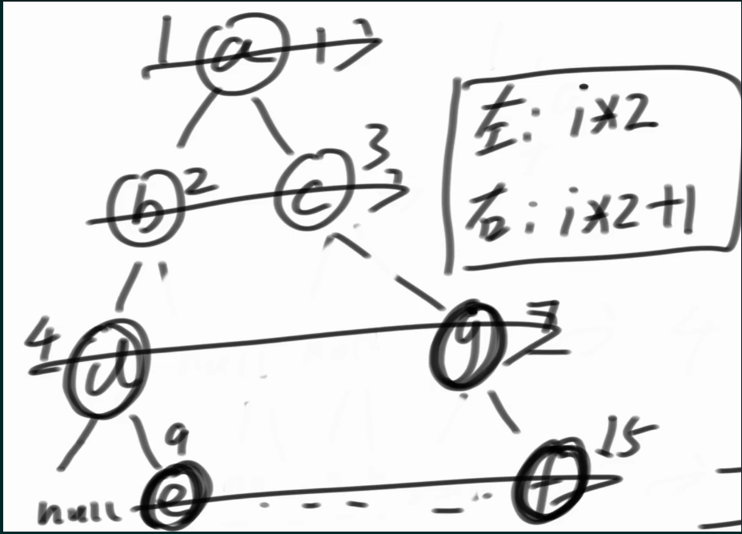

1. 二叉树的最大和最小深度：
   1. 思路：最大深度：使用递归求解。max(left,right)+1；
   2. 思路：最小深度：注意递归终止点是叶子结点。需要防止null值干扰。常规操作是现将值设置为MAX\_VALUE，如果存在叶子节点，自然会在比较的之后被替换掉。

```
class Solution {
    public int minDepth(TreeNode root) {
        //特判，并不是递归终止点。
        if(root == null){
            return 0;
        }
        //递归终止点
        if(root.left == null && root.right == null){
            return 1;  
        }
  
        int ldeep = Integer.MAX_VALUE;
        int rdeep = Integer.MAX_VALUE;

        if(root.left != null) ldeep = minDepth(root.left);
        if(root.right != null) rdeep = minDepth(root.right);

        return Math.min(ldeep,rdeep)+1;

  
    }
}
```

#### 二叉树的序列化和反序列化

1. 序列化是将一个数据结构或者对象转换为连续的比特位的操作，进而可以将转换后的数据存储在一个文件或者内存中，同时也可以通过网络传输到另一个计算机环境，采取相反方式重构得到原数据。
2. 思路：哪种方式遍历(dfs,bfs)都可以。
   1. dfs先序遍历：

```
public class Codec {
    private int cnt = 0;
    // Encodes a tree to a single string.
    public String serialize(TreeNode root) {
        StringBuilder str = new StringBuilder();
        encode(root,str);
        return str.toString();
    }
    private void encode(TreeNode root,StringBuilder s){
        if(root == null){
            s.append("#,");
            return;
        }
        s.append(root.val + ",");
        encode(root.left,s);
        encode(root.right,s);
    }

    // Decodes your encoded data to tree.
    public TreeNode deserialize(String data) {
        String[] vals = data.split(",");
        cnt = 0;
        return decode(vals);
    }

    private TreeNode decode(String[] vals){
        String cur = vals[cnt++];
        if(cur.equals("#")){
            return null;
        }
        //前序遍历解决
        TreeNode head = new TreeNode(Integer.valueOf(cur));
        head.left = decode(vals);
        head.right = decode(vals);

        return head;
  
    }
}
```

#### [利用先序遍历和中序遍历构建二叉树](https://leetcode.cn/problems/construct-binary-tree-from-preorder-and-inorder-traversal/)

1. 原理：没有重复值的情况下(例如1,1,1)：中序和先序/后序会唯一确定一颗二叉树
2. 思路：构造递归函数，通过头节点位置划分子区间进行递归

```
public static TreeNode buildTree(int[] pre, int[] in) {
        if (pre == null || in == null || pre.length != in.length) {
            return null;
        }
        HashMap<Integer, Integer> map = new HashMap<>();
        for (int i = 0; i < in.length; i++) {
            map.put(in[i], i);
        }
        return f(pre, 0, pre.length - 1, in, 0, in.length - 1, map);
    }

    public static TreeNode f(int[] pre, int l1, int r1, int[] in, int l2, int r2, HashMap<Integer, Integer> map) {
        if (l1 > r1) {
            return null;
        }
        TreeNode head = new TreeNode(pre[l1]);
        if (l1 == r1) {
            return head;
        }
        int k = map.get(pre[l1]);
        // pre : l1(........)[.......r1]
        // in  : (l2......)k[........r2]
        // (...)是左树对应，[...]是右树的对应
        head.left = f(pre, l1 + 1, l1 + k - l2, in, l2, k - 1, map);
        head.right = f(pre, l1 + k - l2 + 1, r1, in, k + 1, r2, map);
        return head;
    }
```

#### 验证完全二叉树：

1. 判断一个二叉树是否是完全二叉树。完全二叉树：除了叶子结点之外全部层都满，并且叶子结点之间没有跳过。
2. 原理：通过bfs，对于每个节点，
   1. 如果出现有右无左，则返回。
   2. 如果发现孩子节点不全的节点，则接下来遍历的节点必须全是叶子节点。

#### [普通二叉树寻找两个节点的最近公共祖先(LCA)](https://leetcode.cn/problems/lowest-common-ancestor-of-a-binary-tree/)

1. 该问题又叫LCA算法。基于LCA会有批量查询，在线查询问题。
2. 问题：假设p，q为二叉树两个不同的节点，要求查找最近公共祖先
3. 思路：分两种情况解决：

   1. 包含关系(在同一颗树上)：最近公共祖先是p,q中的一个。面对包含的情况，一旦遇到了p的时候就直接向上返回。
   2. 无包含关系(在两颗树上)：最近公共祖先不是p,q，是递归开始的该节点为LCA
4. 代码：
5. 因为要找最近，所以深度优先到最小节点
6. 到了base case，如果左边右边都null，返回null。如果只有一侧，返回仅有的那一侧，如果两边都有，返回根节点root
7. 也就是从最底部向上开始回溯判断，这样在所有满足条件的LCA中，一定是最底部的LCA被首先访问，所以就是深度最大的公共祖先。
8. 复杂度:
9. 时间：O(n)，所有节点都最多会被执行一次判断逻辑，进行计算一次
10. 空间:O(n)

```
    public TreeNode lowestCommonAncestor(TreeNode root, TreeNode p, TreeNode q) {
        if(root == null || root == p || root == q){
            return root;
        }
        TreeNode lres = lowestCommonAncestor(root.left,p,q);
        TreeNode rres = lowestCommonAncestor(root.right,p,q);

        if(lres != null && rres != null){
            return root;
        }else if(lres == null && rres == null){
            return null;
        }else{
            return lres != null? lres:rres;
        }

    }
```

#### [搜索二叉树上的LCA](https://leetcode.cn/problems/lowest-common-ancestor-of-a-binary-search-tree/)

1. 搜索二叉树：一棵树左子树的值永远小于根，根的值永远小于右子树的值
2. 优化部分：
   1. 利用二叉搜索树性质，左<中<右
   2. 假设p=30,q=100。也就是p<q如果当前节点cur，
      1. cur<min(p,q)则结果必然在右子树，访问cur.right。
      2. cur>max(p,q)否则访问cur.left.
      3. cur=p或者cur=q直接返回就好(这点和普通二叉树相同)。
      4. p<cur<q,则当前的就是最近公共祖先
3. 复杂度：
4. 时间:O(n)
5. 空间: O(n),最差情况是线性情况

```
class Solution {
    public TreeNode lowestCommonAncestor(TreeNode root, TreeNode p, TreeNode q) {
        int x = root.val;
        if (p.val < x && q.val < x)
            return lowestCommonAncestor(root.left, p, q);
        if (p.val > x && q.val > x)
            return lowestCommonAncestor(root.right, p, q);
        return root;
    }
}
```

#### [路径综合==aim](https://leetcode.cn/problems/path-sum-ii/)

1. 给你二叉树的根节点 root 和一个整数目标和 targetSum ，找出所有 从根节点到叶子节点 路径总和等于给定目标和的路径。
2. 核心：状态恢复。希望f对于a,b,c情况都是同样的状态开始

```
class Solution {
    private List<List<Integer>> ans = new ArrayList<>();
    private List<Integer> path = new ArrayList<>();
    public List<List<Integer>> pathSum(TreeNode root, int targetSum) {
        traverse(root,0,targetSum);
        return  ans;
    }
    public void traverse(TreeNode cur,int curSum, int targetSum){
        if(cur == null) return ;
        if(cur.left == null && cur.right == null){
            if(curSum+cur.val == targetSum){
                path.add(cur.val);
                ans.add(new ArrayList<>(path));
                path.remove(path.size()-1);
            }
            return;
        }
  
        if(cur.left != null) {
            path.add(cur.val);
            traverse(cur.left,curSum+cur.val,targetSum);
            path.remove(path.size()-1);
        }
        if(cur.right != null) {
            path.add(cur.val);
            traverse(cur.right,curSum+cur.val,targetSum);
            path.remove(path.size()-1);
        }
    }
}
```

#### [验证平衡二叉树](https://leetcode.cn/problems/balanced-binary-tree/)

1. 平衡二叉树：定义：每个点左右子树的高度差值的绝对值小于等于1，则称为平衡二叉树
2. 定义一个全局布尔值
3. 在求每个节点的高度的时候，一旦发现左右子树满足差值>1，就直接改变状态。

```
class Solution {
    private boolean isBalance = true;
    public boolean isBalanced(TreeNode root) {
        int leftHeight = traverse(root);
        return isBalance;
    }
    private int traverse(TreeNode cur){
        if(cur == null) return 0;
        if(cur.left == null && cur.right == null){
            return 1;
        }
        int leftHeight = traverse(cur.left);
        int rightHeight = traverse(cur.right);
        if(Math.abs(leftHeight-rightHeight)>1) isBalance = false;
        return Math.max(leftHeight,rightHeight)+1;
    }
}
```

#### [验证搜索二叉树](https://leetcode.cn/problems/validate-binary-search-tree/)

1. 性质：搜索二叉树的中序遍历的值一定是有序的。中序遍历有序的二叉树是搜索二叉树的充要条件
2. 思路：通过递归到base case进行判断

## 位运算

优势：常数时间很好，几乎和赋值操作一样。

**📌**

十进制和二进制之间的转换

十进制转换为x进制：Integer.toString(n,x);，需要注意补充前面的0

x进制转换为十进制:  Integer.parseInt(str,x);还有无符号数的Integer.parseUnsignedInt(str,x);

1. leetcode 231：判断一个整数是不是2的幂。
   1. 思路：2的幂，则只有某一位是1，其余都是0

**👋**

Brian Kernighan算法：用于提取最右侧的1，结果是只有之前的数的最高位的1的数

n & -n

1. leetcode 326 判断是否为3的幂
   1. 思路:通过找出int范围内3的最大次幂是3^19.然后该数只含有3一个质数因子。所以只要该数%x==0,则 x必然是3的幂。

**👋**

如果一个数m%n == 0，则n一定是m的因子。

1. leetcode 201：返回[x,y]区间内所有数字&的结果
   1. 思路：
      1. 将y的二进制形式从低位到高位，使用BK算法进行处理，每次判断是否大于x。
      2. 如果满足，则将最低位的1除去，继续循环。因为如果还是大于的话，则必有y-1也就是低位的0全部变为1的情况包含在区间，此时进行&的结果必然是0,保不住1。
      3. 简单一句，就是求区间边上的数字的最长公共前缀。


```
    public static int rangeBitwiseAnd(int left, int right) {
        while (left < right) {
            right -= right & -right;
        }
        return right;
    }
```

1. leetcode 190颠倒二进制位

思路：还有更简单的API：Integer.reverse(n)

```
class Solution {
    // you need treat n as an unsigned value
    public int reverseBits(int n) {
        StringBuilder ans = new StringBuilder();
        String temp = Integer.toBinaryString(n);
        for(int i=0; i<32-temp.length();i++){
            ans.append('0');
        }
        ans.append(temp);
        return Integer.parseUnsignedInt(ans.reverse().toString(),2);
    }
}
```

1. leetcode 461汉明距离
   1. 汉明距离是使用在数据传输差错控制编码里面的，汉明距离是一个概念，它表示两个（相同长度）字符串对应位置的不同字符的数量，我们以d（x,y）表示两个字x,y之间的汉明距离。对两个字符串进行异或运算，并统计结果为1的个数，那么这个数就是汉明距离。
   2. 思路：使用1<<i，获取x与y的每一位数，如果不同,cnt++

```
class Solution {
    public int hammingDistance(int x, int y) {
        int cnt = 0;
        for(int i=0; i<32;i++){
            if((x&(1<<i)) != (y&(1<<i))) cnt++;
        }
        return cnt;
    }
}
```

## 递归和master公式

### 递归：

具体内容：递归 = 递归逻辑+ base case。多画递归调用图。

递归必然可以转换为非递归，这时候就把系统栈空间的使用转变为堆内存空间。同时可以更细粒度地控制。工程上必然要改为非递归。除非层数特别少。

常见的不用改的递归有:归并排序，快速排序，线段树，很多平衡树。

```
    public static int f(int[] arr, int l, int r) {
        //base case
        if(l == r){
            return arr[l];
        }
        int m = (l + r)/2;
        int lmax = f(arr,l,m);
        int rmax = f(arr,m+1, r);
        return Math.max(lmax,rmax);
    }
```

### master公式

基本原理：后面的O()项就是其余代码部分的时间复杂度，也就是除了递归调用的部分。同时最终是log(b,a)和c进行对比，谁大谁做指数。如果相等，则c\*logn做指数。

注意事项：使用需要注意左右两侧递归调用需要规模相同，都是T(n/b)

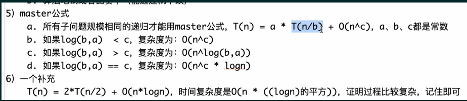

例子：假设求[l,r]范围上的最大值，一共n个数。

则如果采用递归求最值，则T(N) = 2\* T(N/2) + O(1)。这里a=2,b=2,c=0

则时间复杂度为：O(n^1) = O(n)

### 递归高频题目总结

递归可以分为带路径的递归和不带路径的递归，而大部分的dp,状态压缩dp都是认为是路径简化 。任何递归都是dfs并且非常灵活。

1. [返回字符串所有子序列](https://www.nowcoder.com/practice/92e6247998294f2c933906fdedbc6e6a)，并且子序列要求去重
   1. abc情况
   2. abbc情况

```
public class Solution {

    public String[] generatePermutation (String s) {
        // write code here
        char[] chars = s.toCharArray();
        StringBuilder path = new StringBuilder();
        HashSet<String> set = new HashSet<>();
        f1(chars,0,path,set);
        String[] ans = new String[set.size()];
        int i = 0;
        for(String item : set){
            ans[i++] = item;
        } 
        return ans;
    }
    //有状态恢复版本
    private void f1(char[] s, int i, StringBuilder path,HashSet<String> set){
        if(i == s.length){
            set.add(path.toString());
            return;
        }
        //有s[i]
        path.append(s[i]);
        f1(s,i+1,path,set);
        path.deleteCharAt(path.length()-1);
        //没有s[i]
        f1(s,i+1,path,set);
    }
    //不用状态恢复的方法，将path变为数组进行保存
    public static void f2(char[] s, int i, char[] path, int size, HashSet<String> set) {
        if (i == s.length) {
            set.add(String.valueOf(path, 0, size));
        } else {
            path[size] = s[i];
            f2(s, i + 1, path, size + 1, set);
            f2(s, i + 1, path, size, set);
        }
    }
}
```

1. [返回数组所有子集](https://leetcode.cn/problems/subsets-ii/)
   1. 子集就是从数组中随机挑选一些元素(幂集)
   2. 思路：
      1. 先排序，之后相同的数字在一起。
      2. 以相同数字为一组，分类讨论该数组不同数量情况下的情况
   3.

## 笔试中的输入输出

### 核心代码模式：

组成：代码，data文件，answer文件

规则：只用填逻辑就可以，不能改类名，方法名，参数类型

### acm模式：

组成:data文件，answer文件。

规则：写code读取data文件，输出结果到后台和answer文件对比。

1. 输入：
   1. Scanner：一次读一行数据
   2. BufferReader：一次读多行数据，减少IO交互
   3. StreamTokenizer:基于BufferReader构建，在BufferReader中一个一个读取数组，标识符，字符串等。会自动忽略掉所有的空格和回车。
   4. in.nval:读取整数值。in.sval:读取字符

```
    public static void main(String[] args) throws IOException {
        // 把文件里的内容，load进来，保存在内存里，很高效，很经济，托管的很好
        BufferedReader br = new BufferedReader(new InputStreamReader(System.in));
        // 一个一个读数字
        StreamTokenizer in = new StreamTokenizer(br);
        // 提交答案的时候用的，也是一个内存托管区
        PrintWriter out = new PrintWriter(new OutputStreamWriter(System.out));


        while (in.nextToken() != StreamTokenizer.TT_EOF) { // 文件没有结束就继续
            //代码逻辑
            in.nextToken():获取下一个元素(自动忽略回车换行符)
            out.println(maxSumSubmatrix(mat, n, m));
        }
        out.flush();
        br.close();
        out.close();
    }
```

1. 输出
   1. System.out.println():不推荐，因为IO效率低，一次对一个测试数据
   2. PrintWritter()：每次都将数据打印到内存中。当数据量足够，则可以使用flush方法进行一次性
2. 空间：
3. 不论是数据空间还是辅助空间，都推荐使用静态开辟，注意数据量与复用(例如使用Arrays.fill(arr,0,m,0)等方法进行清空)即可。

## 归并：

### 归并排序：

1. 时间复杂度O(n\*logn)：T(n) = 2\*T(n/2) + O(n),则log(2,2)=1，则为O(n^1 \* logn) = O(nlogn)
2. 核心：递归
3. 步骤：
   1. 先递归调用，在进行merge并刷回原数组。
   2. 每次进行的merge都是先左右指针分别指向左右两侧的已经有序的结果，merge写入help数组之后，如果一侧有剩余则直接写入。最后刷回原数组。
   3. 为了归并排序的稳定性，则规定当merge的时候先copy左侧的数到help数组中。

```
    // 归并排序递归版
    public static void mergeSort1(int[] arr) {
        //对[0,arr_len-1]进行归并排序
        sort(arr, 0, arr.length - 1);
    }

    public static void sort(int[] arr, int l, int r) {
        //直到base case。只有一个数就不用排序
        if (l == r) {
            return;
        }
        int m = (l + r) / 2;
        //递归调用部分
        sort(arr, l, m);  
        sort(arr, m + 1, r);
        //合并部分
        merge(arr, l, m, r);
    }
  
    //merge是非递归方法
    //传入的三个参数，可以标记[1,m],[m+1,r]的左右两个需要merge的数组
    //使用双指针法排序
    public static void merge(int[] arr, int l, int m, int r) {
        int i = l;
  
        int a = l;
        int b = m + 1;
        //当两边都没有遍历完的时候
        while (a <= m && b <= r) {   
            help[i++] = arr[a] <= arr[b] ? arr[a++] : arr[b++];
        }
        while (a <= m) {
            help[i++] = arr[a++];
        }
        while (b <= r) {
            help[i++] = arr[b++];
        }
        //刷回原数组
        for (i = l; i <= r; i++) {
            arr[i] = help[i];
        }
    }
```

## 差分

### 一维差分

1. 场景：对于一个数组，要多次在不同区间快速完成整体的加减。
2. 原理：

前缀和数组：前缀和可以简单理解为「数列的前 n 项的和」。

差分数组对应的概念是前缀和数组，对于数组 [1,2,2,4]，其差分数组为 [1,1,0,2]，差分数组的第 i 个数即为原数组的第 i−1 个元素和第 i 个元素的差值，也就是说我们对差分数组求前缀和即可得到原数组。

差分数组的性质是，当我们希望对原数组的某一个区间 [l,r] 施加一个增量inc 时，差分数组 d 对应的改变是：d[l] 增加 inc，d[r+1] 减少 inc(用于抵消给前面区间+inc的效果)。这样对于区间的修改就变为了对于两个位置的修改。并且这种修改是可以叠加的，即当我们多次对原数组的不同区间施加不同的增量，我们只要按规则修改差分数组即可。

1. 对于原数组，如果要在[L,R]范围上+v,
2. 只需要在对应的差分数组上让[L]-v, [R+1]+v
3. 然后对差分数组进行前缀和就可以得到结果
4. 模板题：

这里有 `<span class="color_font"><span>n</span></span>` 个航班，它们分别从 `<span class="color_font"><span>1</span></span>` 到 `<span class="color_font"><span>n</span></span>` 进行编号。

有一份航班预订表 `<span class="color_font"><span>bookings</span></span>` ，表中第 `<span class="color_font"><span>i</span></span>` 条预订记录 `<span class="color_font"><span>bookings[i] = [first</span></span>``<sub><span class="color_font"><span>i</span></span></sub>``<span class="color_font"><span>, last</span></span>``<sub><span class="color_font"><span>i</span></span></sub>``<span class="color_font"><span>, seats</span></span>``<sub><span class="color_font"><span>i</span></span></sub>``<span class="color_font"><span>]</span></span>` 意味着在从 `<span class="color_font"><span>first</span></span>``<sub><span class="color_font"><span>i</span></span></sub>` 到 `<span class="color_font"><span>last</span></span>``<sub><span class="color_font"><span>i</span></span></sub>` （**包含** `<span class="color_font"><span>first</span></span>``<sub><span class="color_font"><span>i</span></span></sub>` 和 `<span class="color_font"><span>last</span></span>``<sub><span class="color_font"><span>i</span></span></sub>` ）的 **每个航班** 上预订了 `<span class="color_font"><span>seats</span></span>``<sub><span class="color_font"><span>i</span></span></sub>` 个座位。

请你返回一个长度为 `<span class="color_font"><span>n</span></span>` 的数组 `<span class="color_font"><span>answer</span></span>`，里面的元素是每个航班预定的座位总数

```
class Solution {
    public int[] corpFlightBookings(int[][] bookings, int n) {
        int[] cnt = new int[n+1];

        for(int[] info : bookings){
            int l = info[0], r = info[1];
            int num = info[2];
            cnt[l] += num;
            //此处进行特判，或者开cnt的时候多开一个
            if(r+1<cnt.length) cnt[r+1] -=  num;
        }
        for(int i=1; i<cnt.length; i++){
            cnt[i] += cnt[i-1];
        }
        return Arrays.copyOfRange(cnt, 1, n+1);
    }
}
```

1. 一位子数组异或值
   1. 解决办法完全同一维前缀和
   2. 利用异或的性质
      1. 0^x = x
      2. 交换律
      3. 结合律

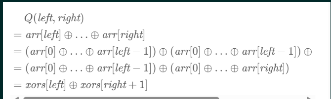

```
  def xorQueries(arr: Array[Int], queries: Array[Array[Int]]): Array[Int] = {
    val prefix: Array[Int] = arr.scanLeft(0)((x, y) => (x ^ y))
    //注意scala的scanLeft结果的开头是初始值，则需要r+1 - l 而不是r-(l-1)   
    for(q <- queries) yield prefix(q(1)+1) ^ prefix(q(0))
  }
```

### 二维差分

二维前缀和

1. 例子：
   1. 求快速求得下面矩阵不同位置子矩阵((a,b)->(c,d))的元素和
   2. 使用二维前缀和来处理，使得获得结果的时间是O(1)
   3. 步骤：
      1. 先预处理sum数组
      2. 不同的子矩阵都可以通过sum数组获得


| 3 | 1  | -2 |
| :- | :- | :- |
| 5 | -3 | 4  |
| 3 | 6  | 2  |

1. 原理：
   1. 使用容斥原理
   2. 实际上经常通过补sum的第0行和第0列来防止额外的边界判断。额外的位置全部设置为0，防止影响操作。

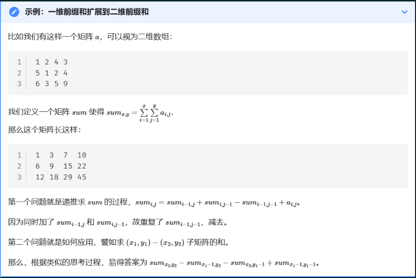

1. 模板题：

```
class NumMatrix {
    public int[][] sum;

    public NumMatrix(int[][] matrix) {
        int m = matrix.length;
        int n = matrix[0].length;
        sum = new int[m + 1][n + 1];
        // 进行扩充
        for (int i = 0; i < m; i++) {
            for (int j = 0; j < n; j++) {
                sum[i + 1][j + 1] = matrix[i][j];
            }
        }
        // 预处理sum
        for (int i = 1; i <= m; i++) {
            for (int j = 1; j <= n; j++) {
                sum[i][j] += sum[i][j - 1] + sum[i - 1][j] - sum[i - 1][j - 1];
            }
        }
    }

    public int sumRegion(int a, int b, int c, int d) {
        int x1 = a + 1, y1 = b + 1;
        int x2 = c + 1, y2 = d + 1;
        return sum[x2][y2] - sum[x1 - 1][y2] - sum[x2][y1 - 1] + sum[x1 - 1][y1 - 1];
    }
}
```

1. leetcode 1139
   1. 给你一个由若干 `<span>0</span>` 和 `<span>1</span>` 组成的二维网格 `<span>grid</span>`，请你找出边界全部由 `<span>1</span>` 组成的最大 **正方形** 子网格，并返回该子网格中的元素数量。如果不存在，则返回 `<span>0</span>`
   2. 思路：
      1. 暴力：
         1. 时间复杂度O(m\*n^2)，其中n<m
      2. 优化步骤：使用前缀合

```
class Solution {
    public int largest1BorderedSquare(int[][] grid) {
        int ans = 0;
        int m = grid.length;
        int n = grid[0].length;
        //(i,j,l)：是以(i,j)开头，大小为l的矩阵。
        //则i范围是[0,m-l)。j范围是[0,n-1)
        int limit = Math.min(m,n);
        for(int l = limit; l>=1;l--){
            for(int i=0; i<=m-l; i++){
                for(int j=0; j<=n-l;j++){
                    if(check(i,j,l,grid)){
                        ans = Math.max(l*l,ans);
                    }
                }
            }
        }
        return ans;
    }
    public boolean check(int a, int b, int l, int[][] grid){
        //检查边界(竖着的)
        for(int i=a;i<a+l;i++){
            if(grid[i][b] == 0) return false;
            if(grid[i][b+l-1] == 0) return false;
        }
        //横着的
        for(int i=b; i<b+l;i++){
            if(grid[a][i] == 0) return false;
            if(grid[a+l-1][i] == 0) return false;
        }
        return true;
    }
}
//使用前缀和
class Solution {
    public int largest1BorderedSquare(int[][] grid) {
        int ans = 0;
        int m = grid.length;
        int n = grid[0].length;
        int limit = Math.min(m,n);
        for(int l = limit; l>=1;l--){
            for(int i=0; i<=m-l; i++){
                for(int j=0; j<=n-l;j++){
                    if(check(i,j,l,grid)){
                        return l*l;
                    }
                }
            }
        }
        return ans;
    }
    public boolean check(int a, int b, int l, int[][] grid){
        NumMatrix tool = new NumMatrix(grid);
        int x1=a, y1=b;
        int x2=a+l-1, y2=b+l-1;
        int sum1 = tool.sumRegion(x1, y1, x2, y2);
        int sum2 = 0;
        if(l==1){
            return grid[a][b] == 1;
        }
        if(l>=3) sum2 = tool.sumRegion(x1+1, y1+1, x2-1, y2-1);
        if(sum1-sum2 != 4*l-4) return false;
        return true;
    }
}

class NumMatrix {
    public int[][] sum;

    public NumMatrix(int[][] matrix) {
        int m = matrix.length;
        int n = matrix[0].length;
        sum = new int[m + 1][n + 1];
        for(int i=0 ;i<m+1;i++){
            Arrays.fill(sum[i],0);
        }
        // 进行扩充
        for (int i = 0; i < m; i++) {
            for (int j = 0; j < n; j++) {
                sum[i + 1][j + 1] = matrix[i][j];
            }
        }
        // 预处理sum
        for (int i = 1; i <= m; i++) {
            for (int j = 1; j <= n; j++) {
                sum[i][j] += sum[i][j - 1] + sum[i - 1][j] - sum[i - 1][j - 1];
            }
        }
    }

    public int sumRegion(int a, int b, int c, int d) {
        int x1 = a + 1, y1 = b + 1;
        int x2 = c + 1, y2 = d + 1;
        return sum[x2][y2] - sum[x1 - 1][y2] - sum[x2][y1 - 1] + sum[x1 - 1][y1 - 1];
    }
}
```

二维差分

1. 场景：(a,b)->(c,d)的子矩阵进行很多次的加减操作
2. 原理：
   1. 如果要在(1,1)->(2,2)统一加3，需要在如下位置进行操作
   2. 同样要使用一圈0把真实数据进行扩充，防止边界情况
   3. 读取原始矩阵也可以使用单个元素的差分进行替代

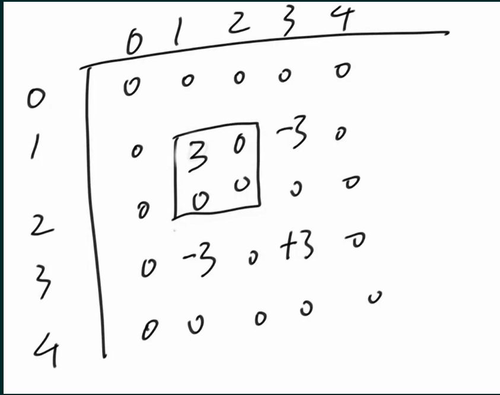

1. 模板：

```
import java.util.*;
import java.io.*;

class Main {
    public static int MAXM = 1005;
    public static int MAXN = 1005;
    public static long[][] diff = new long[MAXM][MAXN];
    public static int n, m, q;
    public static void main(String[] args) throws IOException {

        BufferedReader br = new BufferedReader(new InputStreamReader(System.in));
        StreamTokenizer in = new StreamTokenizer(br);
        PrintWriter out = new PrintWriter(new OutputStreamWriter(System.out));
        while (in.nextToken() != StreamTokenizer.TT_EOF) {
            n = (int)in.nval;
            in.nextToken();
            m = (int)in.nval;
            in.nextToken();
            q = (int)in.nval;
            for (int i = 1; i <= n; i++) {
                for (int j = 1; j <= m; j++) {
                    in.nextToken();
                    //必须要用同样的方式进行添加数据，否则结构会乱
                    add(i, j, i, j, (int)in.nval);
                }
            }
            for (int i = 0; i < q; i++) {
                in.nextToken();
                int a = (int)in.nval;
                in.nextToken();
                int b = (int)in.nval;
                in.nextToken();
                int c = (int)in.nval;
                in.nextToken();
                int d = (int)in.nval;
                in.nextToken();
                int k = (int)in.nval;
                add(a, b, c, d, k);
            }
            build();
            for(int i=1;i<=n;i++){
                out.print(diff[i][1]);
                for(int j=2; j<=m;j++){
                    out.print(" " + diff[i][j]);
                }
                out.println();
            }
            //防止下一份测试数据被上一组干扰
            clear();
        }
        out.flush();
        br.close();
        out.close();
    }
    public static void add(int a, int b, int c, int d, int k) {
        diff[a][b] += k;
        diff[a][d + 1] -= k;
        diff[c + 1][b] -= k;
        diff[c + 1][d + 1] += k;
    }
    public static void build() {
        for (int i = 1; i <= n; i++) {
            for (int j = 1; j <= m; j++) {
                diff[i][j] += diff[i - 1][j] + diff[i][j - 1] - diff[i - 1][j - 1];
            }
        }
    }
    public static void clear() {
        for (int i = 1; i <= n + 1; i++) {
            for (int j = 1; j <= m + 1; j++) {
                diff[i][j] = 0;
            }
        }
    }
}
```

### 离散化技巧

1. 核心问题：怎么处理不是整数下标位置的格子。数据是[0.5,1,1.5,2,2.5].....
2. 思路：
   1. 坐标位置统一放大一倍。比如说区域是以x,y为中心点，长度为r的正方形。则变换为中心点为(2x,2y)，长度为2r的正方形。保证了区域的相对位置不变。
   2. 边界位置也是2\*(x-r/2)，同样也是乘2

## 堆

### 堆结构

1. 堆的实质：将序列映射为二叉树(实际上就是在数组中操作)，并维持某些性质

堆是一棵树，其每个节点都有一个键值，且每个节点的键值都大于等于/小于等于其父亲的键值。

每个节点的键值都大于等于其父亲键值的堆叫做小根堆，否则叫做大根堆

（小根）堆主要支持的操作有：插入一个数、查询最小值、删除最小值、合并两个堆、减小一个元素的值。

1. 二叉树的性质：假设节点按照层序遍历进行排序，

   1. 则i位置的左孩子是2i+1， 右孩子节点是2i+2.
   2. 第i位置的父节点是(i-1)/2。这么算0的父亲节点还是0(有环)
   3. 完全二叉树的高度就是log(2,N)
2. 将一个序列的前缀范围进行建立堆，则需要通过size来进行限制堆中的元素
3. 大根堆：
4. 定义：二叉树的任何一颗子树的最大值都在顶部。
5. 插入：对于新来的数，向上调整大根堆(实质上是进行数组的调整)
6. Java 的PriorityQueue默认内部使用的是小根堆来实现。优先队列就是根据优先级进行重排元素的队列。如果使用堆排序的话可以直接使用PriorityQueue。

```
   //向上调整
   //范围是[0,i]
    public static void heapInsert(int[] arr, int i) {
        //来到0位置的话也会跳出while，因为不满足arr[0]>arr[0]
        while (arr[i] > arr[(i - 1) / 2]) {
            swap(arr, i, (i - 1) / 2);
            i = (i - 1) / 2;
        }
    }
    //向下调整
    //范围是[i,size]
    public static void heapify(int[] arr, int i, int size) {
        int l = i * 2 + 1;
        //l<size 就是 有左孩子
        while (l < size) {
            // 右孩子，l+1
            // 评选，最强的孩子，是哪个下标的孩子
            int best = l + 1 < size && arr[l + 1] > arr[l] ? l + 1 : l;
            // 上面已经评选了最强的孩子，接下来，当前的数和最强的孩子之前，最强下标是谁
            best = arr[best] > arr[i] ? best : i;
            if (best == i) {
                break;
            }
            swap(arr, best, i);
            i = best;
            l = i * 2 + 1;
        }
    }
```

### 堆排序

1. 步骤：
   1. 先对整个数组建立大根堆
   2. 将得到的最大值和最后一个值进行交换。同时堆的大小-1。
   3. 对根位置向下调整
   4. 对剩下的位置重复abc操作。
2. 时间复杂度:
3. 单个元素的插入删除调整都是O(logn)，对n个元素就是n\*logn
4. 建立大根堆:时间复杂度是O(n\*logn)。也就是log(2,1) + log(2,2) +...+log(2,N)->n\*logn
5. 调整:时间复杂度也是O(n\*logn)
6. 则时间复杂度是O(n\*logn)

```
 // 从顶到底建立大根堆，O(n * logn)
    // 依次弹出堆内最大值并排好序，O(n * logn)
    // 整体时间复杂度O(n * logn)
    public static void heapSort1(int[] arr) {
        int n = arr.length;
        for (int i = 0; i < n; i++) {
            heapInsert(arr, i);
        }
        int size = n;
        while (size > 1) {
            swap(arr, 0, --size);
            heapify(arr, 0, size);
        }
    }
```

### 堆的常见题

1. 合并K个有序链表：
   1. 思路1：收集所有节点，将节点进行排序，然后再统一装起来。
      1. 时间复杂度:O(n\*logn) + O(n)=O(n\*logn)。
      2. 空间复杂度：O(n)(就是收集所有节点的位置)
   2. 思路2：使用堆。
   3. 使用小根堆，利用链表自身有序的性质。
   4. 现将K个链表的头结点加入堆。从中选取最小的，就是全局最小的。则将其弹出，并将其后继节点加入堆。
   5. 优点：堆的大小始终不超过K。
   6. 时间复杂度:O(n\*logk)
   7. 空间复杂度：O(k)

```
public class Code01_MergeKSortedLists {

    // 不要提交这个类
    public static class ListNode {
        public int val;
        public ListNode next;
    }

    // 提交以下的方法
    public static ListNode mergeKLists(ArrayList<ListNode> arr) {
        // 小根堆
        PriorityQueue<ListNode> heap = new PriorityQueue<>((a, b) -> a.val - b.val);
        for (ListNode h : arr) {
            // 遍历所有的头！
            if (h != null) {
                heap.add(h);
            }
        }
        //如果全是空链表
        if (heap.isEmpty()) {
            return null;
        }
        // 先弹出一个节点，做总头部。
        //poll方法取出优先队列的头部
        ListNode h = heap.poll();
        ListNode pre = h;
        if (pre.next != null) {
            heap.add(pre.next);
        }
        while (!heap.isEmpty()) {
            ListNode cur = heap.poll();
            pre.next = cur;
            pre = cur;
            if (cur.next != null) {
                heap.add(cur.next);
            }
        }
        return h;
    }

}
```

**💡**

传入比较器的写法：可以使用lambda表达式，也可以常规传入Comparator

PriorityQueue<ListNode> heap = new PriorityQueue<>(new Comparator<ListNode>() {

@Override

public int compare(ListNode o1, ListNode o2) {

return o1.val - o2.val;
}

});

## 哈希表

### HashSet and HashMap

1. 注意Java中==和equals方法的使用
2. 对于所有包装类型，以及String都按照值来使用(调用equals方法)

```
public static void main(String[] args) {
        // Integer、Long、Double、Float
        // Byte、Short、Character、Boolean
        // String等都有这个特征
        String str1 = new String("Hello");
        String str2 = new String("Hello");
        // false，因为不同的内存地址
        System.out.println(str1 == str2);
        // true，因为它们的值是相同的
        System.out.println(str1.equals(str2));

        HashSet<String> set = new HashSet<>();
        set.add(str1);
        System.out.println(set.contains("Hello"));
        System.out.println(set.contains(str2));
        set.add(str2);
        System.out.println(set.size());
        set.remove(str1);
        set.clear();
        System.out.println(set.isEmpty());

        System.out.println("===========");

        HashMap<String, String> map1 = new HashMap<>();
        map1.put(str1, "World");
        //此处判断必然是存在的，因为HashMap内部中通过equals方法进行判断
        System.out.println(map1.containsKey("Hello"));
        System.out.println(map1.containsKey(str2));
        System.out.println(map1.get(str2));
        System.out.println(map1.get("你好") == null);
        map1.remove("Hello");
        System.out.println(map1.size());
        map1.clear();
        System.out.println(map1.isEmpty());

        System.out.println("===========");

        // 一般在笔试中，未必需要申请哈希表
        HashMap<Integer, Integer> map2 = new HashMap<>();
        map2.put(56, 7285);
        map2.put(34, 3671263);
        map2.put(17, 716311);
        map2.put(24, 1263161);
        // 上面的map2行为，可以被如下数组的行为替代
        int[] arr = new int[100];
        arr[56] = 7285;
        arr[34] = 3671263;
        arr[17] = 716311;
        arr[24] = 1263161;
        // 哈希表的增、删、改、查，都可以被数组替代，前提是key的范围是固定的、可控的
        System.out.println("在笔试场合中哈希表往往会被数组替代");

        System.out.println("===========");
        Student s1 = new Student(17, "张三");
        Student s2 = new Student(17, "张三");
        HashMap<Student, String> map3 = new HashMap<>();
        map3.put(s1, "这是张三");
        System.out.println(map3.containsKey(s1));
        System.out.println(map3.containsKey(s2));
        map3.put(s2, "这是另一个张三");
        System.out.println(map3.size());
        System.out.println(map3.get(s1));
        System.out.println(map3.get(s2));
    }
```

### 比较器

Java中的实现对象排序由两种方式：自然排序和定制排序

1. 自然排序：

```
public interface Comparable{
 int compareTo(Object obj);
}
```

1. 全类名：java.lang.Comparable(接口)
2. 使用方法：实现接口中的int compareTo(Object obj)方法.若this>that则返回值为正。
3. 定制排序：

```
public interface Comparator{
 int compare(Object o1,Object o2);
}
```

1. 背景：如果需要比较的类没有实现Comparable接口，并且无法改变。或者不想按照Comparable的compareTo()的实现进行排序。
2. 解决办法：通过使用Comparator接口进行定制排序
3. 使用方法：重写compare方法进行比较。如果o1>o2，则返回值为正。
4. 常见场景：将Comparator传入Collections.sort()方法中，或者Arrays.sort()等方法中。

## 前缀树

### 原理

1. 假设有字符串"acb","cba","acc"。则前缀树是一种特殊的N叉树，它被用来存储字符串。则由这三个字符串构成的前缀树是。一般都是将字符放在路上(通过长度为26的数组的下标来表示。比如0位置就是走向a分支)，而不是节点上。节点就维持p信息，e信息。
2. 每个节点都有2个信息：
   1. pass信息：有多少字符串路过该节点(刚好来到也算)
   2. end信息：有多少字符串以该节点结尾


1. 信息的作用：
   1. 快速查看单词的出现频率。比如查看"acc"出现几次
   2. 查看有多少单词：就是根节点的p值,也等价于有多少单词以""空字符串开头。
   3. 多少字符串以"ac"开头：查看c下面的节点的p值信息
   4. 删除单词：首查询是否出现过。在减去p的时候，如果p=0，则需要将该节点的分支都变为无效
2. 前缀树优点：根据前缀信息树的分支来快速选择，节省时间
3. 前缀树缺点：比较浪费空间，和字符总数量和种类有关

### 实现

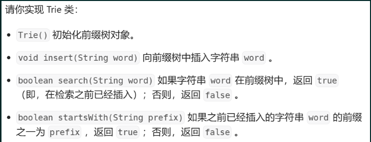

1. 使用类的方式进行实现：
   1. 需要定义节点类，包含pass,end,nexts[]三个成员变量。通过开固定长度的nexts[]来实现树的构建。x - 'a'实现偏移量。

```
class Trie {
    class TreeNode{
        public int pass;
        public int end;
        public TreeNode[] nexts;
        public TreeNode(){
            pass = 0;
            end = 0;
            nexts = new TreeNode[26];
        }
    }
    private TreeNode root;
    public Trie() {
        root = new TreeNode();
    }
  
    public void insert(String word) {
        TreeNode node = root;
        node.pass++;
        for(int i=0 ;i<word.length();i++){
            int path = word.charAt(i) - 'a';
            if(node.nexts[path] == null){
                node.nexts[path] = new TreeNode();
            }
            node = node.nexts[path];
            node.pass++;
        }
        node.end++;
    }
  
    public boolean search(String word) {
        TreeNode node = root;
        for(int i=0 ;i<word.length();i++){
            int path = word.charAt(i) - 'a';
            if(node.nexts[path] == null){
                return false;
            }
            node = node.nexts[path];
        }
        return node.end == 0 ? false : true;
    }
  
    public boolean startsWith(String word) {
        TreeNode node = root;
        for(int i=0 ;i<word.length();i++){
            int path = word.charAt(i) - 'a';
            if(node.nexts[path] == null){
                return false;
            }
            node = node.nexts[path];
        }
        return true;
    }
}
```

```
class Trie{
  private case class TreeNode (
    var pass:Int = 0,
    var end:Int = 0,
    var nexts:Array[Option[TreeNode]] = Array.fill(26)(None)
  )
  private val root = TreeNode()

  def insert(word:String): Unit = {
    var node = root
    node.pass += 1
    for(i<-word.indices){
      val path = word(i) - 'a'
      if(node.nexts(path).isEmpty) node.nexts(path) = Some(TreeNode())
      node = node.nexts(path).get
      node.pass += 1
    }
    node.end += 1
  }
  def search(word:String): Boolean = {
    var node = root
    @scala.annotation.tailrec
    def go(n:TreeNode, i:Int):Boolean = {
      if(i == word.length) return node.end != 0
      val path = word(i) - 'a'
      if(node.nexts(path).isEmpty) return false
      node = node.nexts(path).get
      go(node,i+1)
    }
    go(node,0)
  }

  def startsWith(word:String):Boolean = {
    var node = root
    @scala.annotation.tailrec
    def go(n:TreeNode, i:Int):Boolean = {
      if(i == word.length) return true
      val path = word(i) - 'a'
      if(node.nexts(path).isEmpty) return false
      node = node.nexts(path).get
      go(node,i+1)
    }
    go(node,0)
  }
}
```

1. 使用静态数组的方式实现。一次性开足足够的空间
   1. 假设树一共会开m个节点(m>实际节点数)，每个节点下有n个选择。则int[][] tree = new int[m][n];
   2. pass,end信息分别使用一维的数组；
   3. 假设从cnt=1下标的节点为(根节点)开始。使用cnt代表分配的节点，等价于new

```
    // 如果将来增加了数据量，就改大这个值
    public static int MAXN = 150001;

    public static int[][] tree = new int[MAXN][26];

    public static int[] end = new int[MAXN];

    public static int[] pass = new int[MAXN];

    public static int cnt;

    public static void build() {
        cnt = 1;
        for(int i=0; i<MAXN;i++){
            Arrays.fill(tree[i],0);
        }
        Arrays.fill(end,0);
        Arrays.fill(pass,0);
    }

    public static void insert(String word) {
        int cur = 1;
        pass[cur]++;
        for (int i = 0, path; i < word.length(); i++) {
            path = word.charAt(i) - 'a';
            if (tree[cur][path] == 0) {
                //使用cnt给他分配编号
                tree[cur][path] = ++cnt;
            }
            cur = tree[cur][path];
            pass[cur]++;
        }
        end[cur]++;
    }

    public static int search(String word) {
        int cur = 1;
        for (int i = 0, path; i < word.length(); i++) {
            path = word.charAt(i) - 'a';
            if (tree[cur][path] == 0) {
                return 0;
            }
            cur = tree[cur][path];
        }
        return end[cur];
    }

    public static int prefixNumber(String pre) {
        int cur = 1;
        for (int i = 0, path; i < pre.length(); i++) {
            path = pre.charAt(i) - 'a';
            if (tree[cur][path] == 0) {
                return 0;
            }
            cur = tree[cur][path];
        }
        return pass[cur];
    }
```

### 例题

1. [数组中两个数的最大异或值](https://leetcode.cn/problems/maximum-xor-of-two-numbers-in-an-array/)
   1. 暴力解法：2重for循环解决
   2. 前缀树解法：
      1. 将每个数使用二进制表示，如果数字有32位，也就是将32位字符串存入前缀树中。将数字存入前缀树中。
      2. 因为所有的数都是非负数，则补码表示都是以0开头(符号位)，根节点下面开始从最高位开始选择。如果要结果尽可能大，就需要从高位看起，1的出现的可能性需要最大。
      3. 。对于每个数，在前缀树中查询相应的最优解。
      4. 最后一定要clear，防止脏数据的影响。

```
class Solution {
    public static int MAXN = 3000001;
    public static int[][] tree = new int[MAXN][2];
    public static int[] pass = new int[MAXN];
    public static int[] end = new int[MAXN];
    public static int cnt;
    public int findMaximumXOR(int[] nums) {
        bulid(nums);
        int ans = 0;
        for(int item:nums){
            ans = Math.max(ans,maxXor(item));
        }
        clear();
        return ans;
    }
    public static void bulid(int[] nums){
        cnt = 1;
        for(int item : nums){
            insert(item);
        }
    }
    public static void insert(int num){
        int cur = 1;
        pass[cur]++;
        for(int i = 31;i>=0;i--){
            int path = (num >> i) & 1;
            if(tree[cur][path] == 0){
                tree[cur][path] = ++cnt;
            }
            cur = tree[cur][path];
            pass[cur]++;
        }
        end[cur]++;
    }

    public static int maxXor(int num){
        int cur = 1;
        int ans = 0;
        for(int i=31;i>=0;i--){
            //nums第i的状态
            int status = (num >> i) & 1;
            //想要的状态
            int want = status ^ 1;
            if(tree[cur][want] == 0){
                //如果没有，就只能往反方向走
                want = want ^ 1;
            }
            //如果status^want==1，则第i位就是1。和ans取大值(还是1)
            //如果status^want=0,则第i位就是0，如果ans是0，最终还是0,否则还是1
            ans |= (status ^ want) << i;
            cur = tree[cur][want];
        }
        return ans;
    }
    public static void clear() {
        for (int i = 1; i <= cnt; i++) {
            tree[i][0] = tree[i][1] = 0;
        }
    }
}
```

1. leetcode 14最长公共前缀

```
class Solution {
    public static int MAXN = 203;
    public static int[][] tree = new int[MAXN][26];
    public static int[] end = new int[MAXN];
    public static int[] pass = new int[MAXN];
    public static int cnt;
    public String longestCommonPrefix(String[] strs) {
        build();
        Arrays.sort(strs,(a,b)->(a.length()-b.length()));
        String word = strs[0];
        for(String item : strs){
            insert(item);
        }
        int v = strs.length;
        String ans = "";
        for(int i=1; i<=word.length();i++){
            String pre = word.substring(0,i);
            int cnt = prefix(pre);
            if(cnt == v){
                v = cnt;
                ans = pre;
            }
        }
        return ans;
    }
    public void build(){
        cnt = 1;
        for(int i=0; i<MAXN;i++){
            Arrays.fill(tree[i],0);
        }
        Arrays.fill(end,0);
        Arrays.fill(pass,0);
    }
    public void insert(String word){
        int cur = 1;
        pass[cur]++;
        for(int i=0,path; i<word.length();i++){
            path = word.charAt(i)-'a';
            //分配节点编号
            if(tree[cur][path] == 0){
                tree[cur][path] = ++cnt;
            }
            cur = tree[cur][path];
            pass[cur]++;
        }
        end[cur]++;
    }
    public int search(String word){
        int cur = 1;
        for(int i=0,path;i<word.length();i++){
            path = word.charAt(i)-'a';
            if(tree[cur][path] == 0){
                return 0;
            }
            cur = tree[cur][path];
        }
        return end[cur];
    }
    public int prefix(String pre){
        int cur = 1;
        for(int i=0,path;i<pre.length();i++){
            path = pre.charAt(i)-'a';
            if(tree[cur][path] == 0){
                return 0;
            }
            cur = tree[cur][path];
        }
        return pass[cur];
    }
}
```

## KMP算法

### 概念

核心概念：

1. 暴力方法每次都重新进行匹配，并没有利用之前操作的信息，而kmp算法会使用到之前匹配所提炼出的信息。
2. next数组的定义：

   1. next[i]：含义一：存储的是[0,i)的字符串的前缀和后缀的最大匹配长度。如果没有[0,i)位置的子串则规定为-1。终止位置的next值是整个字符串的前后缀匹配的最大长度。
   2. next[i]：含义二：另一个含义是pre向前跳的下一位下标，也就是比对的下一个下标。
   3. 字符串前缀：字符串首部。字符串真前缀：指的是除了s本身的子串。
   4. 字符串后缀：字符串尾部。字符串真后缀：指的是除了s本身的尾串。
   5. 前后缀可以交叉。
   6. 比如abab:则前缀和后缀匹配的最大长度是2(是ab)。
3. next数组的求解：
4. 前两项固定：next[0] = -1, next[1] = 0;
5. 如果对于i位置的next[i],
6. 如果s[i] = s[pre](使用的是next含义2)，则next[i] = ++pre(使用的是next含义1).
7. 如果s[i] !=s[pre] 并且如果pre>0,则pre = next[pre](next含义2)，也就是继续向左跳，直到找到一个可以满足条件的最大的值，此时返回到步骤一。
8. 如果都不满足，也就是pre<=0 了，pre不用再跳了，当前的next[i]也就没有最大的匹配长度，设置值为0.
9. 总结概括为不用跳，跳多次，以及边界处理的情况。


**🔔**

next[i]存储的就是每一次向前跳的下标。因为如果当前的‘x’和‘前’不等，则也就证明next[10]所提供的最长匹配前后缀无法使用全部，只能退而求其次，保留这里面的0-9的最长前缀以及 后一部分的最长后缀。又因为前后两个已经完全匹配，则可以转化为在0-9求最长前后缀匹配，也就是next[x]。这样如果‘下’和‘前’相等，则next[11]就得到结果了。

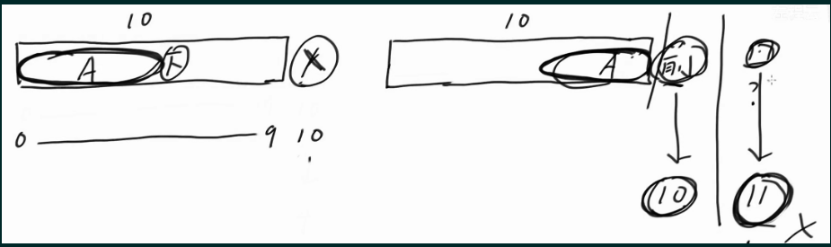

---


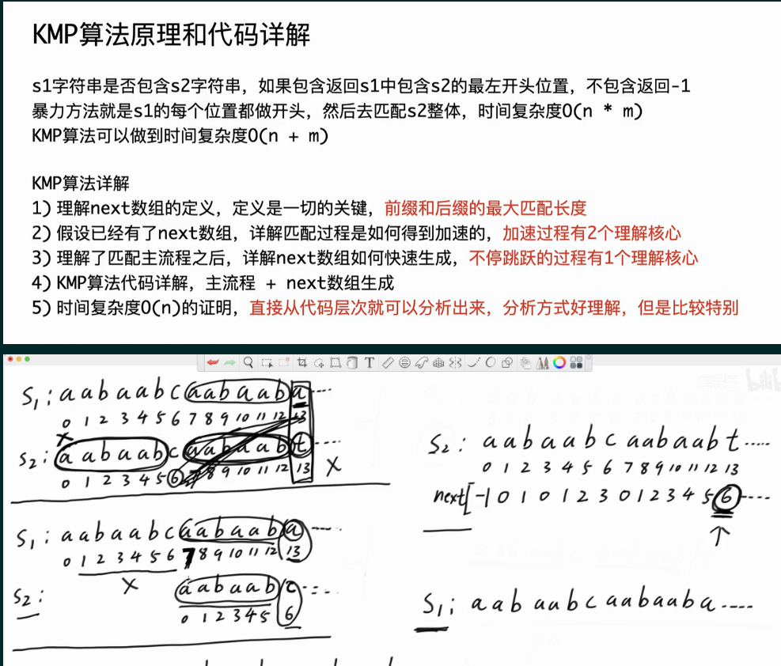

例子如上：在大串s1中使用匹配子串s2。

1. 先获得s2的next数组。
2. 进行匹配。如果遇到两个位置不匹配的数，比如如上的13位置的a与t。
3. 加速要点1：使用next数组
   1. 因为next[13] = 6,则[0,6]必然等于[7,13).
   2. 因为匹配的原因，则已经走过的子串必然是相等，则s1[6,13)==s2[6,13).
   3. 所以s1[6,13）== s2[0,6）
4. 加速要点2：为什么可以直接跳

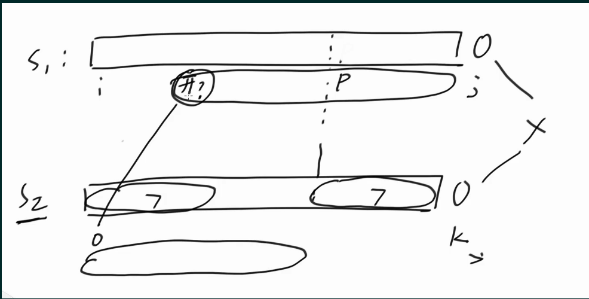

1. 假设s1[i,j)和s2[0,k)匹配已经匹配，并且s1[p,j)和s2的next[k]匹配。为什么不可以从p之前开始匹配呢？
2. 使用反证法，如果开头在p之前，则因为需要和s2去匹配，如果可以匹配，则证明s2有更大的前后缀最大匹配长度，显然和事实不符和。则可以直接跳到p位置。

**💡**

也就是任意匹配的前后缀都可以满足跳跃，但是最大前后缀匹配可以满足一次跳跃的长度最大，保证最大化利用信息。

1. 则下一次匹配s1[13]开始匹配s2[6].

### 例题

1. leetcode 28:模板题
   1. 时间复杂度：O(n+m)。暴力匹配是O(n\*m)

```
class Solution {
    public int strStr(String haystack, String needle) {
        return kmp(haystack.toCharArray(),needle.toCharArray());
    }
    public static int kmp(char[] s1, char[] s2){
        int m = s1.length, n = s2.length;
        int x = 0, y = 0;
        int[] next = nextArray(s2);
        while(x < m && y < n){
            if(s1[x] == s2[y]){
                x++;
                y++;
            }else{
                if(y == 0){
                    x++;
                }else{
                    y = next[y];
                }
            }
        }
        return y == n? x-y : -1;
    }
    public static int[] nextArray(char[] s){
        int m = s.length;
        if(m == 1) return new int[]{-1};
        int[] next = new int[m];
        next[0] = -1;
        next[1] = 0;
        int cur = 2, pre = 0;
        while(cur < m){
            if(s[cur-1] == s[pre]){
                next[cur++] = ++pre;
            }else{
                if(pre > 0){
                    pre = next[pre];
                }else{
                    next[cur++] = 0;
                }
            }
        }
        return next;
    }
}
```

### 简化版本

1. 前缀函数π

π数组：π[i]表示字符串第i个前缀的最长匹配真前后缀长度。

KMP只是前缀函数的子集或者说是一种应用。


1. 模式串和被搜索串的处理
   1. 将模式串和搜索串合并在一起，并对该字符串计算前缀函数。

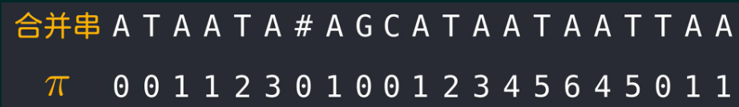

1. 如果有个π[i]等于模式串的长度，则说明匹配了模式串。而所匹配的串就是[i-π+1,i];

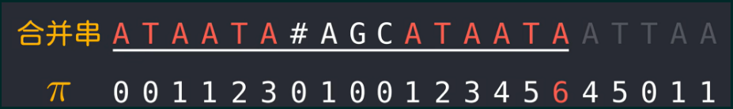

1. 则根据前缀函数，就可以直接计算是否匹配。并得到相应的下标。
2. 前缀函数的计算

   1. 当前计算π[i]。
   2. 则和kmp中计算next数组完全一致，进行比对，不同就使用π数组向前跳。


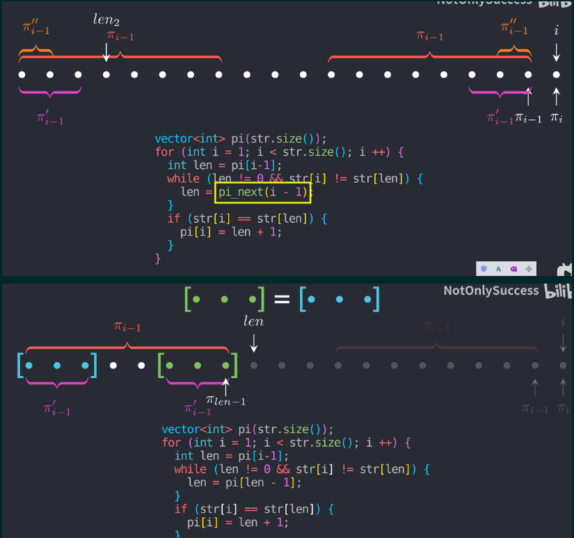

## 滑动窗口

### 原理

1. 通过L和R双指针来控制窗口滑动，有[L,R]以及[L,R)两种。
2. 关键：找到范围和答案指标之间的单调性关系，标志性就是while操作。
3. 单调性就是当右侧引入数字的时候，此时窗口满足某个性质(并且可以进行下一步操作，也就是使用while)。可以通过调整左侧窗口，使得窗口大小进行调整。
4. 注意L和R都是不回退的，所以称为滑动窗口
5. 时间复杂度：O(N)。时间复杂度是操作数与数据量的关系。while循环中的sum += num[r++]，以及sum -= nums[l]之和最多2n次，因为滑动窗口中指针不回退，遍历一遍就结束了。
6. 一般流程：就是每个子数组在开头或者结尾的情况，开头或者是结尾都可以。

### 例题

1. [累加和大于等于target的最短数组](https://leetcode.cn/problems/minimum-size-subarray-sum/)

给定一个含有 n 个正整数的数组和一个正整数 target 。找出该数组中满足其总和大于等于 target 的长度最小的 子数组[numsl, numsl+1, ..., numsr-1, numsr] ，并返回其长度。如果不存在符合条件的子数组，返回 0 。nums中全是正数。

1. 思路：使用滑动窗口进行流量控制
   1. 每进来一个数字，对于窗口中的sum进行条件检查，看是否另一侧可以调整。
   2. 单调性：维护的是sum.因为一个数字进来的时候，sum必然变大，则可以尝试将另一边进行缩小(此时sum必然减小而不是增加)
   3. 此处的调整是指让本题目的符合条件的子数组最小，也就是进行窗口的大小调整。

```

public static int minSubArrayLen(int target, int[] nums) {
    int ans = Integer.MAX_VALUE;
    for (int l = 0, r = 0, sum = 0; r < nums.length; r++) {
        sum += nums[r];
        while (sum - nums[l] >= target) {
            // sum : nums[l....r]
            // 如果l位置的数从窗口出去，还能继续达标，那就出去
            sum -= nums[l++];
        }
        //此处进行的特判是有必要的，保证数组只有满足sum>=target才可以进行更新
        if (sum >= target) {
            ans = Math.min(ans, r - l + 1);
        }
    }
    return ans == Integer.MAX_VALUE ? 0 : ans;
}
```

1. [无重复字符的最长字串](https://leetcode.cn/problems/longest-substring-without-repeating-characters/)
   1. 思路：对于以每个位置结束的子串，调整滑动窗口的大小，使得窗口中的字符始终保持要求的性质，也就是无重复性
   2. 核心的更新公式：
      1. 如果是f ....abdcf，则L = L，而不是回退，因为回退会导致之前的调整失效，重新引入重复字符。
      2. 单调性：维护的是重复性：也就是当右侧引入一个元素时候，左侧滑动必然会使得当前区间的性质不变(也就是不会引入新重复元素，重复性只会减小)
      3. 如果是 abfdf，则L = pos[f]+1,需要进行更新

```
class Solution {
    public int lengthOfLongestSubstring(String s) {
        char[] arr = s.toCharArray();
        int ans = 0;
        //每种字符出现的位置，将字符转换为0-255的整数
        int[] last = new int[256];
        Arrays.fill(last,-1);
  
        for(int l=0, r=0; r<arr.length; r++){
            l = Math.max(l, last[(int)arr[r]]+1);
            ans = Math.max(ans, r-l+1);
            last[arr[r]] = r;
        }
        return ans;
    }
}
```

1. [最小覆盖字串](https://leetcode.cn/problems/minimum-window-substring/)
   1. 题目含义：给你一个字符串 `<span>s</span>` 、一个字符串 `<span>t</span>` 。返回 `<span>s</span>` 中涵盖 `<span>t</span>` 所有字符的最小子串。如果 `<span>s</span>` 中不存在涵盖 `<span>t</span>` 所有字符的子串，则返回空字符串 `<span>""</span>`
   2. 核心思路：使用滑动窗口。对于以每个位置结束的子串，在滑动窗口中检查是否满足覆盖的性质。如果满足，则尝试调整大小，最终得到最小字串。
   3. 单调性：维护的是涵盖性：当左侧滑动的时候，涵盖性必然是减小或者不变。可以使用while直到性质不满足。
   4. 字符的出现次数，使用数组进行哈希表的实现。其中cnts[]代表的是t中每种元素的出现次数。然后当进行调整的时候，使用的debt就是指的t的所有种类的字符全都被满足了，也就是以当前字符结尾的子串满足了覆盖的性质。

```
class Solution {
    public String minWindow(String str, String ttr) {

        int[] cnts = new int[256];
        char[] s = str.toCharArray();
        char[] t = ttr.toCharArray();
        if(s.length < t.length) return "";
        for(char item : t){
            cnts[(int)item]--;
        }
        int len = Integer.MAX_VALUE;
        int start = 0;
        for(int l=0,r=0,debt=t.length; r<s.length;r++){
            if(cnts[s[r]] < 0){
                debt--;
            }
            cnts[s[r]]++;
            if(debt == 0){
                while(cnts[s[l]] > 0){
                    cnts[s[l]]--;
                    l++;
                }
                if(r-l+1 < len){
                    len = r-l+1;
                    start = l;
                }
            }
        }
        return len == Integer.MAX_VALUE ? "" : str.substring(start,start+len);  
    }

}
```

1. [加油站的出发点](https://leetcode.cn/problems/gas-station/)

```
class Solution {
    public int canCompleteCircuit(int[] gas, int[] cost) {
        int n = gas.length;

        for(int l=0,r=0,sum = 0, len = 0;l<n;l++){
            while(sum >= 0){
                if(len == n){
                    return l;
                }
                r = (l + len)%n;
                len++;
                sum += gas[r] -  cost[r];
            }
            len--;
            sum -= gas[l] - cost[l];
      
        }
        return -1;
    }
}
```

1. leetcode1984 数组中的k个元素的最小极差：
   1. 结论：如果要求任意k个元素的最小极差，需要进行排序，然后使用相邻的k个元素一组，使用滑动窗口进行遍历，窗口中元素的极差是nums[r]-nums[l]。

```
class Solution {
    public int minimumDifference(int[] nums, int k) {
        int ans = Integer.MAX_VALUE;
        int n = nums.length;
        Arrays.sort(nums);
        if(nums.length == 1){
            return 0;
        }
        for(int l=0,r = k-1; r<n;l++,r++){
            ans = Math.min(ans,nums[r]- nums[l]);
        }
        return ans;
    }
}
```

1. leetcode1652 拆炸弹：
   1. 你有一个炸弹需要拆除，时间紧迫！你的情报员会给你一个长度为 `<span class="color_font"><span>n</span></span>` 的 **循环** 数组 `<span class="color_font"><span>code</span></span>` 以及一个密钥 `<span class="color_font"><span>k</span></span>` 。

为了获得正确的密码，你需要替换掉每一个数字。所有数字会 **同时** 被替换。

* 如果 `<span class="color_font"><span>k > 0</span></span>` ，将第 `<span class="color_font"><span>i</span></span>` 个数字用 **接下来** `<span class="color_font"><span>k</span></span>` 个数字之和替换。
* 如果 `<span class="color_font"><span>k < 0</span></span>` ，将第 `<span class="color_font"><span>i</span></span>` 个数字用 **之前** `<span class="color_font"><span>k</span></span>` 个数字之和替换。
* 如果 `<span class="color_font"><span>k == 0</span></span>` ，将第 `<span class="color_font"><span>i</span></span>` 个数字用 `<span class="color_font"><span>0</span></span>` 替换。

由于 `<span class="color_font"><span>code</span></span>` 是循环的， `<span class="color_font"><span>code[n-1]</span></span>` 下一个元素是 `<span class="color_font"><span>code[0]</span></span>` ，且 `<span class="color_font"><span>code[0]</span></span>` 前一个元素是 `<span class="color_font"><span>code[n-1]</span></span>` 。

给你 **循环** 数组 `<span class="color_font"><span>code</span></span>` 和整数密钥 `<span class="color_font"><span>k</span></span>` ，请你返回解密后的结果来拆除炸弹！

1. 思路：每个位置的数i，对应的滑动窗口是其后面或者前面的定长数组。和加油站的题类似，复用sum。同时提前初始化base case,方便后续窗口滑动。

```
class Solution {
    public int[] decrypt(int[] code, int k) {
        int n = code.length;
        int[] ans = new int[n];
        Arrays.fill(ans, 0);
        if(k == 0) return ans;
        int cnt = 0;
        int sum = 0;
        int l = k>0 ? 1:(n+k)%n;
        int r = k>0 ? k%n:(n-1)%n;
        for (int i = l; i <=r; i++) {
            sum += code[i];
        }
        for(int i=0; i<n;i++){
            ans[i] = sum;
            sum -= code[(l++)%n];
            sum += code[(++r)%n];
        }
        return ans;
    }
}
```

## 单调栈

### 原理

### 例题

1. [求左右两边比自己小的数的位置](https://www.nowcoder.com/practice/2a2c00e7a88a498693568cef63a4b7bb)
   1. 题目：

给定一个可能含有重复值的数组 arr，找到每一个 i 位置左边和右边离 i 位置最近且值比 arr[i] 小的位置。返回所有位置相应的信息。

1. 思路：
   1. 暴力解法：对于每个位置，遍历左边和右边，找到对应位置。则时间复杂度O(n^2)
   2. 单调栈：
      1. 由值的性质，将下标入栈，方便进行索引。
      2. 保持栈中大压小的性质，也就是单调性。
      3. 如果下一个数字不满足(该侧的要求被满足(也就是小大小))，则进行元素出栈。
      4. 最后将栈中剩余的数组进行清算
      5. 时间复杂度：O(n)，因为每个元素只被操作两次，也就是进栈一次，出栈一次。
      6. 正确性证明：
         1. 如果栈中进入的数字是abc，则a<b<c
         2. 对于L: 则a的L不存在，b的L是a,c的L=b，
         3. 对于R: 并且abc此时都没有满足R。
         4. 如果出现了下一个数字d，并且d<c，则c的(L,R)找到，并且栈中剩余的元素的R必然不是c，并且d的(L,R)必然没有c，则c可以弹出。
      7. 重复值情况处理：如果有重复值，需要进行修正。关键就是重复值情况的处理。对于本题，就是利用后来的重复元素作暂时的R，最后复用后来的重复元素的R

```
public static void compute() {
        //r代表栈中的元素个数，也就是栈的长度
        r = 0;
        int cur;
        // 遍历阶段
        for (int i = 0; i < n; i++) {
            // i -> arr[i]
            while (r > 0 && arr[stack[r - 1]] >= arr[i]) {
                cur = stack[--r];
                // cur当前弹出的位置，左边最近且小
                ans[cur][0] = r > 0 ? stack[r - 1] : -1;
                ans[cur][1] = i;
            }
            stack[r++] = i;
        }
        // 清算阶段
        while (r > 0) {
            cur = stack[--r];
            ans[cur][0] = r > 0 ? stack[r - 1] : -1;
            ans[cur][1] = -1;
        }
        // 修正阶段
        // 左侧的答案不需要修正一定是正确的，只有右侧答案需要修正
        // 从右往左修正，n-1位置的右侧答案一定是-1，不需要修正
        for (int i = n - 2; i >= 0; i--) {
            if (ans[i][1] != -1 && arr[ans[i][1]] == arr[i]) {
                ans[i][1] = ans[ans[i][1]][1];
            }
        }
```

1. [每日温度](https://leetcode.cn/problems/daily-temperatures/)
   1. 给定一个整数数组 `<span>temperatures</span>` ，表示每天的温度，返回一个数组 `<span>answer</span>` ，其中 `<span>answer[i]</span>` 是指对于第 `<span>i</span>` 天，下一个更高温度出现在几天后。如果气温在这之后都不会升高，请在该位置用 `<span>0</span>` 来代替。

```
public static int[] dailyTemperatures(int[] nums) {
        int n = nums.length;
        int[] ans = new int[n];
        r = 0;
        for (int i = 0, cur; i < n; i++) {
            // 相等时候的处理，相等也加入单调栈
            while (r > 0 && nums[stack[r - 1]] < nums[i]) {
                cur = stack[--r];
                ans[cur] = i - cur;
            }
            stack[r++] = i;
        }
        return ans;
    }
```

1. 子数组的最小值之和
   1. 给定一个整数数组 `<span class="color_font"><span>arr</span></span>`，找到 `<span class="color_font"><span>min(b)</span></span>` 的总和，其中 `<span class="color_font"><span>b</span></span>` 的范围为 `<span class="color_font"><span>arr</span></span>` 的每个（连续）子数组。

由于答案可能很大，因此** 返回答案模 **`<span class="color_font"><strong><span>10^9 + 7</span></strong></span>` 。

1. 思路：
   1. 重点是求最小值，如果是暴力的话则时间复杂度是O(n\*logn\*n^2)。
   2. 对于一个数组中的值，找到左边和右边最近比它小的数(则范围内的数都比他大)，则它是在该范围内的所有包含该元素的数组的最小值。这些数组的个数总共有cnt = (cur-left)\*(i-cur)个。则这个部分和是cnt\*nums[cur]。
   3. 对于这里的重复值，不用进行修正，因为后面重复值进栈的时候自然会cover这个情况。

## 单调队列

### 原理

1. 最常用场景：维护每个窗口的最大值或者最小值
2. 通过数组实现双端队列

### 例题

1. [滑动窗口的最大值](https://leetcode.cn/problems/sliding-window-maximum/)
   1. 给你一个整数数组 `<span class="color_font"><span>nums</span></span>`，有一个大小为 `<span class="color_font"><span>k</span></span>` 的滑动窗口从数组的最左侧移动到数组的最右侧。你只可以看到在滑动窗口内的 `<span class="color_font"><span>k</span></span>` 个数字。滑动窗口每次只向右移动一位。

返回 *滑动窗口中的最大值 *。

1. 思路：
   1. 对于每一个窗口，更新相应的队列，
   2. 保证队列的头部始终是该窗口的答案，使用的是单调队列，使得最大值始终在head位置(可以看做是元素的状态维护)
   3. 当窗口的l位置与队列头部相等，由于下一步l++,则必须要将head出队列，因为它过期了。
2. 时间复杂度：O(1)，队列中数字只会进出一次
3. 由该性质维护的队列大小是<=进来的元素个数，所以如果下一个要进来，就应该将上一个头部出队列

```
class Solution {
    public static int MAXN = 100001;
    public static int[] deque = new int[MAXN];
    public static int h,t;
    public int[] maxSlidingWindow(int[] nums, int k) {
        int n = nums.length;
        int[] ans = new int[n-k+1];
        h = 0;
        t = 0;
        //初始化要维护的队列
        for(int i=0; i<k-1; i++){
            while(h<t && nums[i] > nums[deque[t-1]] ){
                t--;
            }
            deque[t++] = i;
        }
        //从第一组开始维护队列
        for(int l=0,r=k-1; r<n;l++,r++){
            while(h < t && nums[r]>nums[deque[t-1]]){
                t--;
            }
            deque[t++] = r;
            ans[l] = nums[deque[h]];
            if(deque[h] == l){
                h++;
            }
        }
        return ans;
    }
}
```

## 并查集

原理：

1. 定义：并查集是一种用于管理元素所属集合的数据结构，实现为一个森林，其中每棵树表示一个集合，树中的节点表示对应集合中的元素。顾名思义，并查集支持两种操作：

   * 合并（Union）：合并两个元素所属集合（合并对应的树）
   * 查询（Find）：查询某个元素所属集合（查询对应的树的根节点），这可以用于判断两个元素是否属于同一集合
2. 此处我们使用两个数组father和size数组，用来记录每个元素的数根节点以及集合的大小。
3. 节点所在集合合并(Union)：节点加入，则该节点对应的father位置改为父亲节点的下标。以后查找该节点所在的集合大小是father节点的对应的size。挂的时候是小的集合挂大的集合。
4. 查询：一直找该节点的父节点，递归查找直到根节点。
5. 路径压缩(扁平化):向上寻找的过程中，如果找到了根节点，就将该路径上的所有节点都直接指向该节点。
6. 经典优化手段：
7. 扁平化：路径压缩，使用栈(辅助数组来进行路径的收集)。可以不强制扁平化，而是遇到一定长度的链在进行扁平化
8. 小挂大
9. 时间复杂度(结论):单次调用就是O(1)
10. 区间并查集：
11. 基本思路：将目光放在边上，连接三点之间的两条边，就是将这两条边归为同一个集合中，初始集合数量最多，每次合并都会减少。
12. 一般不需要使用小挂大的优化，直接赋值father数组就可以。直接使用根节点，加速操作。

```
class Solution {
    public static int MAXN = 200010;
    public static int[] father = new int[MAXN];
    public static int[] size = new int[MAXN];
    public static int[] stack = new int[MAXN];
    public static int r;
    public int[] shortestDistanceAfterQueries(int n, int[][] queries) {
        build(n);
        int[] ans = new int[queries.length];
        int cnt = n-1;
        for(int q=0; q<queries.length;q++){
            //[0,2] -> [0,1],[1,2]
            int l = queries[q][0],r = queries[q][1]-1;
            int fr = find(r);
            // 将区间[l,r-1]上所有元素挂到r节点下面，成为一个连通块
            for(int i=find(l);i<r;i = find(i+1)){
                father[i] = fr;
                cnt--;
            }
            ans[q] = cnt;
        }
        return ans;

    }
    public static void build(int n) {
   
        for (int i = 0; i < n; i++) {
            father[i] = i;
            size[i] = 1;
        }
    }

    public static int find(int i) {
        int size = 0;
        while (i != father[i]) {
            stack[size++] = i;
            i = father[i];
        }
        while (size > 0) {
            father[stack[--size]] = i;
        }
        return i;
    }

    public static boolean isSameSet(int x, int y) {
        return find(x) == find(y);
    }
}
```

例题：

1. 板子题：

```
object Solution {
  val MAXN = 100007
  val father: Array[Int] = Array.fill(MAXN)(-1)
  val size: Array[Int] = Array.fill(MAXN)(-1)
  def countPairs(n: Int, edges: Array[Array[Int]]): Long = {
    build(n)
    for(e <- edges){
      union(e(0), e(1))
    }
    val fIndex=  (for(i <- 0 until n) yield find(i)).distinct
    var cnt = 0L
    for(i <- fIndex){
      cnt += size(i).toLong*(size(i)-1)/2
    }
    n.toLong*(n-1)/2 - cnt
  }
  def build(n: Int): Unit ={
    for(i <- 0 until n){
      father(i) = i
      size(i) = 1
    }
  }
  def find(x: Int): Int = {
    if(father(x) == x) return x
    father(x) = find(father(x))
    father(x)
  }
  def union(x: Int, y: Int): Unit = {
    val fx = find(x)
    val fy = find(y)
    if(fx == fy) return
    else{
      if(size(fx) >= size(fy)){
        size(fx) += size(fy)
        father(fy) = fx
      }else{
        size(fy) += size(fx)
        father(fx) = fy
      }
    }
  }
  def isSameSet(x: Int, y: Int):Boolean = {find(x) == find(y)}
}
```

```
import java.util.Scanner;
import java.io.*;

// 注意类名必须为 Main, 不要有任何 package xxx 信息
public class Main {
    public static int MAXN = 1000001;
    public static int[] father = new int[MAXN];
    public static int[] size = new int[MAXN];
    public static int[] stk = new int[MAXN];
    public static int r;
    public static int n;
    public static void main(String[] args) throws IOException {
        BufferedReader br = new BufferedReader(new InputStreamReader(System.in));
        StreamTokenizer in = new StreamTokenizer(br);
        PrintWriter out = new PrintWriter(new OutputStreamWriter(System.out));
        while (in.nextToken() != StreamTokenizer.TT_EOF) {
            n = (int) in.nval;
            build();
            in.nextToken();
            int m = (int) in.nval;
            for (int i = 0; i < m; i++) {
                in.nextToken();
                int op = (int) in.nval;
                in.nextToken();
                int x = (int) in.nval;
                in.nextToken();
                int y = (int) in.nval;
                if (op == 1) {
                    out.println(isSameSet(x, y) ? "Yes" : "No");
                } else {
                    union(x, y);
                }
            }
        }
        out.flush();
        out.close();
        br.close();
    }
    public static void build(){
        //
        for(int i=0;i<n; i++){
            father[i] = i;
            size[i] = 1;
        }
    }
    public static int find(int x){
        r = 0;
        while(x != father[x]){
            stk[r++] = father[x];
            x = father[x];
        }
        while(r > 0){
            r--;
            father[stk[r]] = x;
        }
        return x;
    }
    public static boolean isSameSet(int x, int y){
        return find(x) == find(y) ? true : false;
    }
    public static void union(int x, int y){
        int fx = find(x);
        int fy = find(y);
        if(fx == fy){
            return;
        }else{
            if (size[fx] >= size[fy]) {
                size[fx] += size[fy];
                father[fy] = fx;
            } else {
                size[fy] += size[fx];
                father[fx] = fy;
            }
        }
    }
}
```

1. leetcode 1971寻找图中是否存在路径
   1. 连通的图在一个集合中，可以被查找到。使用这个性质，进行查找

```
class Solution {
    public static int MAXN = 200010;
    public static int[] father = new int[MAXN];
    public static int[] size = new int[MAXN];
    public static int[] stack = new int[MAXN];
    public static int r;
    public boolean validPath(int n, int[][] edges, int source, int destination){ {
        build(n);
        for(int i=0;i<edges.length;i++){
            union(edges[i][0], edges[i][1]);
        }
        return find(source) == find(destination);
    }
    public static void build(int n) {
   
        for (int i = 0; i < n; i++) {
            father[i] = i;
            size[i] = 1;
        }
    }

    public static int find(int i) {
        int size = 0;
        while (i != father[i]) {
            stack[size++] = i;
            i = father[i];
        }
        while (size > 0) {
            father[stack[--size]] = i;
        }
        return i;
    }

    public static boolean isSameSet(int x, int y) {
        return find(x) == find(y);
    }

    public static void union(int x, int y) {
        int fx = find(x);
        int fy = find(y);
        if (fx != fy) {
            if (size[fx] >= size[fy]) {
                size[fx] += size[fy];
                father[fy] = fx;
            } else {
                size[fy] += size[fx];
                father[fx] = fy;
            }
        }
    }
}
```

## 图论

### 建图

1. 方式有3种：邻接矩阵，邻接表，链式前向星
2. 一般从有向图开始，因为无向图是双向的实现。
3. 一般使用边的序号从1开始:1,2,3,4....。力扣上点的编号是从0开始，注意审题

#### 邻接矩阵

1. 原理
   1. 下图是有向图以及邻接矩阵，如果是无向图则是关于对角线对称的矩阵
   2. 如果是带权图，则矩阵对应位置的数字是w权值
   3. 如果没有链接，可以设置为0或者正无穷(如果出现权值为0的就需要使用正无穷)
2. 使用场景：数据量较小的时候


#### 邻接表

1. 原理：
   1. 使用List<List<int[]>>的形式。都是动态列表。
      1. 如果是无权图：则是数组长度为1。如果是有权图，就是也就是每次存入的都是一个小数组，包含节点以及连接的权值，数组长度为2。
2. 使用场景：一般情况完全足够了
3. 无权图(左)以及有权图(右)

#### 链式前向星

1. 为了使用静态数组进行空间的优化，而不是使用动态结构
2. 实在固定数组上实现了邻接表
3. 例子：
   1. 假设n=4，m=6,也就是4个点，6条边的有向图
   2. head是一个长度为n+1的一维数组，index代表的是节点号，value是头边号
   3. next数组，长度取决于边的规模。index是边的编号，value是下一条边的编号
   4. to数组，index代表边的编号，value代表去往的点
   5. int cnt =1。用来记录边的编号的变量
   6. 如果是带权值的图，则再加一个w数组，index是边的编号，value是权值

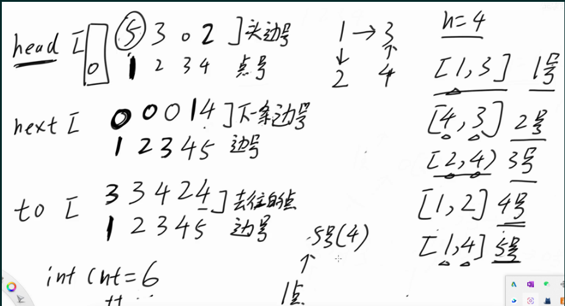

```
public class Code01_CreateGraph {

    // 点的最大数量
    public static int MAXN = 11;

    // 边的最大数量
    // 只有链式前向星方式建图需要这个数量
    // 注意如果无向图的最大数量是m条边，数量要准备m*2
    // 因为一条无向边要加两条有向边
    public static int MAXM = 21;

    // 邻接矩阵方式建图
    public static int[][] graph1 = new int[MAXN][MAXN];

    // 邻接表方式建图
    // public static ArrayList<ArrayList<Integer>> graph2 = new ArrayList<>();
    public static ArrayList<ArrayList<int[]>> graph2 = new ArrayList<>();

    // 链式前向星方式建图
    public static int[] head = new int[MAXN];

    public static int[] next = new int[MAXM];

    public static int[] to = new int[MAXM];

    // 如果边有权重，那么需要这个数组
    public static int[] weight = new int[MAXM];

    public static int cnt;

    public static void build(int n) {
        // 邻接矩阵清空
        for (int i = 1; i <= n; i++) {
            for (int j = 1; j <= n; j++) {
                graph1[i][j] = 0;
            }
        }
        // 邻接表清空和准备
        graph2.clear();
        // 下标需要支持1~n，所以加入n+1个列表，0下标准备但不用
        for (int i = 0; i <= n; i++) {
            graph2.add(new ArrayList<>());
        }
        // 链式前向星清空
        cnt = 1;
        Arrays.fill(head, 1, n + 1, 0);
    }

    // 链式前向星加边
    public static void addEdge(int u, int v, int w) {
        // u -> v , 边权重是w
        //变更顺序倒过来，依次是to,next,head
        to[cnt] = v;
        next[cnt] = head[u];
        head[u] = cnt++;
    }

    // 三种方式建立有向图带权图
    public static void directGraph(int[][] edges) {
        // 邻接矩阵建图
        for (int[] edge : edges) {
            graph1[edge[0]][edge[1]] = edge[2];
        }
        // 邻接表建图
        for (int[] edge : edges) {
            // graph2.get(edge[0]).add(edge[1]);
            graph2.get(edge[0]).add(new int[] { edge[1], edge[2] });
        }
        // 链式前向星建图
        for (int[] edge : edges) {
            addEdge(edge[0], edge[1], edge[2]);
        }
    }

    // 三种方式建立无向图带权图
    public static void undirectGraph(int[][] edges) {
        // 邻接矩阵建图
        for (int[] edge : edges) {
            graph1[edge[0]][edge[1]] = edge[2];
            graph1[edge[1]][edge[0]] = edge[2];
        }
        // 邻接表建图
        for (int[] edge : edges) {
            // graph2.get(edge[0]).add(edge[1]);
            // graph2.get(edge[1]).add(edge[0]);
            graph2.get(edge[0]).add(new int[] { edge[1], edge[2] });
            graph2.get(edge[1]).add(new int[] { edge[0], edge[2] });
        }
        // 链式前向星建图
        for (int[] edge : edges) {
            addEdge(edge[0], edge[1], edge[2]);
            addEdge(edge[1], edge[0], edge[2]);
        }
    }

    public static void traversal(int n) {
        System.out.println("邻接矩阵遍历 :");
        for (int i = 1; i <= n; i++) {
            for (int j = 1; j <= n; j++) {
                System.out.print(graph1[i][j] + " ");
            }
            System.out.println();
        }
        System.out.println("邻接表遍历 :");
        for (int i = 1; i <= n; i++) {
            System.out.print(i + "(邻居、边权) : ");
            for (int[] edge : graph2.get(i)) {
                System.out.print("(" + edge[0] + "," + edge[1] + ") ");
            }
            System.out.println();
        }
        System.out.println("链式前向星 :");
        for (int i = 1; i <= n; i++) {
            System.out.print(i + "(邻居、边权) : ");
            // 注意这个for循环，链式前向星的方式遍历
            for (int ei = head[i]; ei > 0; ei = next[ei]) {
                System.out.print("(" + to[ei] + "," + weight[ei] + ") ");
            }
            System.out.println();
        }
    }
```

### 拓扑排序

1. 要求：拓扑排序的目标是将所有节点排序，使得排在前面的节点不能依赖于排在后面的节点
2. 使用要求：有向无环图(DAG)，无向图不可以，因为无向图天然带环
3. 实际场景：工作流安排，编译的过程
4. 前置概念：

   1. 入度：有多少节点指向该节点
   2. 出度：该节点指向多少个节点
5. 过程(入度删除法)：
6. 找到一个入度为0的点(因为入度为0可能不止一个，孤立的点也是入度为0)
7. 消除掉该点对其他节点的影响(入度删除法)
8. 重复a,b步骤
9. 整个步骤会删除所有点，如果删除的个数和总结点个数不同，则出现了环(可以用于判断是否有环)
10. 时间复杂度：O(V+E)
11. 例题leetcode210：
12. 要注意题目所给的边是从0-n-1。
13. 如果使用链式前向星建图，可以将静态数组的初始状态全部设置为-1，防止和0混杂。在遍历的时候需要注意终止条件变为ei>=0即可，而不是>0。
14. 如果要字典序最小的结果，则将维护的队列换成小根堆就可以。

```
#使用邻接表存储
class Solution {
    //注意[a,b]和[b.a]的区别
    public int[] findOrder(int numCourses, int[][] prerequisites) {
        List<List<Integer>> graph = new ArrayList<>();
        int n = numCourses;
        //点从0开始
        for(int i=0;i<n;i++){
            graph.add(new ArrayList<>());
        }
        int[] indegree = new int[n];
        for(int[] edge : prerequisites){
            graph.get(edge[1]).add(edge[0]);
            indegree[edge[0]]++;
        }
        int[] queue = new int[n];
        int l = 0, r = 0;
        for(int i=0; i<n;i++){
            if(indegree[i] == 0){
                queue[r++] = i;
            }
        }
        int cnt = 0;
        while(l<r){
            int cur = queue[l++];
            cnt++;
            for(int next : graph.get(cur)){
                indegree[next]--;
                if(indegree[next] == 0){
                    queue[r++] = next;
                }
            }
        }

        return cnt == n? queue : new int[0];
    }
}
#使用链式前向星存储
class Solution {
    public static int MAXN = 2001;
    public static int[] head = new int[MAXN];
    public static int[] next = new int[MAXN*2];
    public static int[] to = new int[MAXN*2];
    public static int cnt;
    public int[] findOrder(int numCourses, int[][] prerequisites) {
        int n = numCourses;
        int[] queue = new int[n];
        int[] indegree = new int[n];
        int l = 0, r = 0;
        bulid(n);
        for(int[] edge : prerequisites){
            addEdge(edge[1], edge[0]);
            indegree[edge[0]]++;
        }
        l = 0;
        r = 0;
        for(int i=0; i<n; i++){
            if(indegree[i] == 0){
                queue[r++] = i;
            }
        }
        int len = 0;
        while(l<r){
            int cur = queue[l++];
            len++;
            for(int ei = head[cur]; ei >= 0; ei = next[ei]){
                indegree[to[ei]]--;
                if(indegree[to[ei]] == 0){
                    queue[r++] = to[ei];
                }
            }
        }
        return len == n? queue : new int[0];
    }
    public static void bulid(int n){
        cnt = 0;
        Arrays.fill(head, -1);
        Arrays.fill(next,-1);
        Arrays.fill(to, -1);
    }
    public static void addEdge(int u, int v){
        to[cnt] = v;
        next[cnt] = head[u];
        head[u] = cnt++;
    }
}
```

### 洪水填充

原理：类似于洪水蔓延的过程，用于网格搜索。通过设置路径信息，用于统计或者剪枝。看似暴力递归，其实时间复杂度很好。

1. leetcode 200岛屿数量

给你一个由 `<span class="color_font"><span>'1'</span></span>`（陆地）和 `<span class="color_font"><span>'0'</span></span>`（水）组成的的二维网格，请你计算网格中岛屿的数量。

岛屿总是被水包围，并且每座岛屿只能由水平方向和/或竖直方向上相邻的陆地连接形成。

1. 思路：使用洪水填充，感染过程就是dfs。从左往右，从上往下，进行检查。发现一个1，就把这一片的位置全部蔓延为2，相当于都遍历了，重复该过程。不用撤销修改信息，因为就是利用修改的副作用。
2. 时间复杂度：O(m\*n)，并且是最优解。每个位置最多被访问4次，并且修改的操作只用访问1次，代价是O(1)的。

```
class Solution {
    public static int[] move = new int[]{-1,0,1,0,-1};
    public int numIslands(char[][] grid) {
        int cnt = 0;
        int m = grid.length;
        int n = grid[0].length;
        for(int i=0; i<m;i++){
            for(int j=0; j<n;j++){
                if(grid[i][j] == '1') cnt++;
                dfs(grid, i, j);
            }
        }  
        return cnt;  
    }
    public static void dfs(char[][] grid, int i, int j){
        if(i<0 ||i>=grid.length || j<0 || j >= grid[0].length || grid[i][j] != '1'){
            return;
        }
        grid[i][j] = '0';
        for(int k=0; k<4;k++){
            int nx = i + move[k];
            int ny = j + move[k+1];
            dfs(grid,nx,ny);
        }
    }
}
```

1. leetcode  130 被围绕的区域
   1. 思路：先寻找边缘的联通区域，提前标记区别开来。然后可以将中间的闭合区域进行修改，最后将边缘区域恢复即可。
   2. 时间复杂度O(m\*n)

```
class Solution {
    public static int[] move = new int[]{-1,0,1,0,-1};
    public void solve(char[][] board) {
        int m = board.length;
        int n = board[0].length;
        for(int i=0; i<m;i++){
            for(int j=0; j<n;j++){
                if(i==0 || j == 0 || i==m-1 || j==n-1){
                    if(board[i][j] == 'O'){
                        dfs(board,i,j,'F');
                    }
                }
            }
        }
        for(int i=0; i<m;i++){
            for(int j=0; j<n;j++){
                if(board[i][j] == 'O') board[i][j] = 'X';
                if(board[i][j] == 'F') board[i][j] = 'O';
            }
        }
    }
    public static void dfs(char[][] board,int i, int j,char flag) {
        if (i < 0 || i == board.length|| j < 0 || j == board[0].length || board[i][j] != 'O') {
            return;
        }
        board[i][j] = flag;
        for(int k=0; k<4;k++){
            int nx = i + move[k];
            int ny = j + move[k+1];
            dfs(board,nx,ny,flag);
        }

    }
}
```

1. leetcode 827：最大人工岛

给你一个大小为 `<span class="color_font"><span>n x n</span></span>` 二进制矩阵 `<span class="color_font"><span>grid</span></span>` 。**最多** 只能将一格 `<span class="color_font"><span>0</span></span>` 变成 `<span class="color_font"><span>1</span></span>` 。

返回执行此操作后，`<span class="color_font"><span>grid</span></span>` 中最大的岛屿面积是多少

1. 思路：
   1. 通过进行二位遍历，然后进行蔓延。每片位置使用不同id进行填充。
   2. 然后对每个0进行枚举，对四个方向进行遍历。如果有区域，就增加相应数量。注意不要重复。


```
class Solution {
    public static int[] move = new int[] { -1, 0, 1, 0, -1 };

    public int largestIsland(int[][] grid) {
        int m = grid.length;
        int n = grid[0].length;
        int id = 2;
        for (int i = 0; i < m; i++) {
            for (int j = 0; j < n; j++) {
                if (grid[i][j] == 1) {
                    dfs(grid, i, j, id++);
                }
            }
        }
        int[] size = new int[id];
        int ans = 0;
        for (int i = 0; i < m; i++) {
            for (int j = 0; j < n; j++) {
                if (grid[i][j] > 1) {
                    size[grid[i][j]]++;
                    ans = Math.max(ans, size[grid[i][j]]);
                }
            }
        }
        // 讨论所有的0，变成1，能带来的最大岛的大小
        boolean[] visited = new boolean[id];
        int up, down, left, right, merge;
        for (int i = 0; i < n; i++) {
            for (int j = 0; j < m; j++) {
                if (grid[i][j] == 0) {
                    up = i > 0 ? grid[i - 1][j] : 0;
                    down = i + 1 < n ? grid[i + 1][j] : 0;
                    left = j > 0 ? grid[i][j - 1] : 0;
                    right = j + 1 < m ? grid[i][j + 1] : 0;
                    visited[up] = true;
                    merge = 1 + size[up];
                    if (!visited[down]) {
                        merge += size[down];
                        visited[down] = true;
                    }
                    if (!visited[left]) {
                        merge += size[left];
                        visited[left] = true;
                    }
                    if (!visited[right]) {
                        merge += size[right];
                        visited[right] = true;
                    }
                    ans = Math.max(ans, merge);
                    visited[up] = false;
                    visited[down] = false;
                    visited[left] = false;
                    visited[right] = false;
                }
            }
        }
        return ans;
    }
    public static void dfs(int[][] grid, int i, int j, int id) {
        if (i < 0 || i >= grid.length || j < 0 || j >= grid[0].length || grid[i][j] != 1) {
            return;
        }
        grid[i][j] = id;
        dfs(grid, i - 1, j, id);
        dfs(grid, i + 1, j, id);
        dfs(grid, i, j - 1, id);
        dfs(grid, i, j + 1, id);
    }
}
```

### 最小生成树

1. 定义：

   1. 生成树：一个连通无向图的生成子图，同时要求是树。也即在图的边集中选择n-1条边，将所有顶点联通。
   2. 最小生成树：边权最小的生成树
2. Kruskal算法
3. 最常用
4. 不需要建图。使用并查集即可
5. 思路：
6. 把所有的边按权值从小到大排序
7. 如果当前的边不会形成环(此处使用并查集进行判断)，就选择当前的边。否则就不要这条边
8. 考察完所有的边之后，就得到结果
9. 使用并查集进行判断：a----b,如果b已经和a在同一个结合中，此时要抛弃这条边，否则会成环。
10. 是基于贪心算法来使用的
11. 模板题：leetcode1584

给你一个`<span class="color_font"><span>points</span></span>` 数组，表示 2D 平面上的一些点，其中 `<span class="color_font"><span>points[i] = [x</span></span>``<sub><span class="color_font"><span>i</span></span></sub>``<span class="color_font"><span>, y</span></span>``<sub><span class="color_font"><span>i</span></span></sub>``<span class="color_font"><span>]</span></span>` 。

连接点 `<span class="color_font"><span>[x</span></span>``<sub><span class="color_font"><span>i</span></span></sub>``<span class="color_font"><span>, y</span></span>``<sub><span class="color_font"><span>i</span></span></sub>``<span class="color_font"><span>]</span></span>` 和点 `<span class="color_font"><span>[x</span></span>``<sub><span class="color_font"><span>j</span></span></sub>``<span class="color_font"><span>, y</span></span>``<sub><span class="color_font"><span>j</span></span></sub>``<span class="color_font"><span>]</span></span>` 的费用为它们之间的 **曼哈顿距离** ：`<span class="color_font"><span>|x</span></span>``<sub><span class="color_font"><span>i</span></span></sub>``<span class="color_font"><span> - x</span></span>``<sub><span class="color_font"><span>j</span></span></sub>``<span class="color_font"><span>| + |y</span></span>``<sub><span class="color_font"><span>i</span></span></sub>``<span class="color_font"><span> - y</span></span>``<sub><span class="color_font"><span>j</span></span></sub>``<span class="color_font"><span>|</span></span>` ，其中 `<span class="color_font"><span>|val|</span></span>` 表示 `<span class="color_font"><span>val</span></span>` 的绝对值。

请你返回将所有点连接的最小总费用。只有任意两点之间 **有且仅有** 一条简单路径时，才认为所有点都已连接。

```
class Solution {
    public static int MAXN = 1001;
    public static int[] father = new int[MAXN];
    public static int[] size = new int[MAXN];
    public static int[] stk = new int[MAXN];
    public static int r;
    public int minCostConnectPoints(int[][] points) {
        //点从0开始
        int n = points.length;
        build(n);
        List<int[]> edges = new ArrayList<>();
        //创建边集并排序
        for(int i=0 ;i<n;i++){
            for(int j=i+1; j<n; j++){
                edges.add(new int[]{i, j,dist(points,i,j)});
            }
        }
        Collections.sort(edges,(a,b)->a[2]-b[2]);
        //k算法
        int ans = 0;
        int cnt = 0;
        for(int[] edge : edges){
            if(union(edge[0], edge[1])){
                cnt++;
                ans += edge[2];
            }
        }
        return ans;

    }
    public static int dist(int[][] points, int x, int y){
        return Math.abs(points[x][0]-points[y][0]) + Math.abs(points[x][1]-points[y][1]);
    }
    public static void build(int n){
        for(int i=0; i<n; i++){
            father[i] = i;
            size[i] = 1;
        }
    }
    public static int find(int x){
        r = 0;
        while(x != father[x]){
            stk[r++] = x;
            x = father[x];
        }
        while(r>0){
            father[stk[--r]] = x;
        }
        return x;
    }
    //true代表需要合并
    public static boolean union(int x, int y) {
        int fx = find(x);
        int fy = find(y);
        if (fx != fy) {
            if (size[fx] >= size[fy]) {
                size[fx] += size[fy];
                father[fy] = fx;
            } else {
                size[fy] += size[fx];
                father[fx] = fy;
            }
            return true;
        }else{
            return false;
        }
    }
}
```

### BFS及其扩展

1. 理论：
   1. 定义：
      1. 是图上最基础、最重要的搜索算法之一。
      2. 所谓宽度优先。就是每次都尝试访问同一层的节点。 如果同一层都访问完了，再访问下一层。
      3. 这样做的结果是，BFS 算法找到的路径是从起点开始的 最短 合法路径。换言之，这条路径所包含的边数最小。
      4. 在 BFS 结束时，每个节点都是通过从起点到该点的最短路径访问的。
      5. 算法过程可以看做是图上火苗传播的过程：最开始只有起点着火了，在每一时刻，有火的节点都向它相邻的所有节点传播火苗。
      6. 可以单源进行BFS，也有多源BFS
   2. 例子：
   3. 每次外扩一层，都是源点距离本层的点距离+1。本层的点到源点的距离都相同。此处的距离都是曼哈顿距离。
   4. 需要有状态来记录节点是否被访问过。
   5. 处理方式：
   6. 单点处理方式：通过使用队列来存储每一层的(Node，distance)。上一层的一个节点出去，则如队对应的下一层节点。
   7. 一次处理一层：使用hashMap来记录每个节点对应的level值。


1. 例题：
   1. 模板题：多源BFS。结束之后的level就是最远的层数(距离)

```
class Solution {
    public static int MAXN = 101;
    public static int MAXM = 101;
    public static int[][] queue = new int[MAXN * MAXM][2];
    public static int l, r;
    public static boolean[][] visited = new boolean[MAXN][MAXM];
    public static int[] move = new int[]{-1,0,1,0,-1};
    public int maxDistance(int[][] grid) {
        int n = grid.length;
        int m = grid[0].length;
        l = 0;
        r = 0;
        int seas = 0;
        for(int i=0; i<n; i++){
            for(int j=0; j<m; j++){
                if(grid[i][j] == 1){
                    visited[i][j] = true;
                    queue[r][0] = i;
                    queue[r][1] = j;
                    r++;
                }else{
                    visited[i][j] = false;
                    seas++;
                }
            }
        }
        if(seas == 0 || seas == n*m){
            return -1;
        }

        int level = 0;
        while(l<r){
            level++;
            int size = r-l;
            for(int i=0; i<size; i++){
                int x = queue[l][0];
                int y = queue[l][1];
                l++;
                for(int j=0; j<4 ;j++){
                    int nx = x + move[j];
                    int ny = y + move[j+1];
                    if(nx >= 0 && nx < n && ny >= 0 && ny < m && grid[nx][ny]==0 &&!visited[nx][ny]){
                        visited[nx][ny] = true;
                        queue[r][0] = nx;
                        queue[r][1] = ny;
                        r++;
                    }
                }
            }
        }
        return level-1;
    }
}
```

1. leetcode200
   1. 每个节点进行处理的模板题：

```
class Solution {
    public static int MAXN = 100000;
    public static int MAXM = 301;
    public static int[][] queue = new int[MAXN][MAXM];
    public static int l, r;
    public static boolean[][] visited = new boolean[MAXN][MAXM];
    public static int[] move = new int[]{-1,0,1,0,-1};

    public int numIslands(char[][] grid) {
        for(int i=0 ;i<visited.length; i++){
            Arrays.fill(visited[i], false);
        }
        int n = grid.length;
        int m = grid[0].length;
        l = 0;
        r = 0;
        int num = 0;
        for(int i=0; i<n; i++){
            for(int j=0;j<m;j++){
                if(!visited[i][j] && grid[i][j] == '1'){
                    num++;
                    visited[i][j] = true;
                    queue[r][0] = i;
                    queue[r++][1] = j;

                    while(l<r){
                        int x = queue[l][0];
                        int y = queue[l][1];
                        l++;
                        for(int e=0; e<4;e++){
                            int nx = x + move[e];
                            int ny = y + move[e+1];
                            if(nx>=0 && nx<n && ny>=0 && ny<m && !visited[nx][ny] && grid[nx][ny] == '1'){
                                visited[nx][ny] = true;
                                queue[r][0] = nx;
                                queue[r][1] = ny;
                                r++;
                          
                            }
                        }
                    }
              
                }
            }
        }
        return num;
    }
}
```

1. 01BFS，也就是双端队列BFS
   1. 适用范围：边的权重只有0和1，求解最短距离
   2. 不能使用传统BFS，因为进行传统的BFS之后，进行下一层扩展之后，需要距离增加，而不是两个节点还是在同一层。
   3. 时间复杂度O(节点数 + 边数)
   4. 过程：
      1. diatance[i]代表从源点到i点的最短距离。初始的时候所有点的diatance设置为无穷大。
      2. 源点进入双端队列，distance[源点] = 0
      3. 双端队列头部弹出x
         1. 如果x是目标点，返回distance[x]
         2. 考察从x出发的每一条边，假设x->y,权重为w
            1. 如果distance[y] > diatance[x] + w,处理该边
            2. 处理的时候，更新distance[y] =distance[x] +w

如果w==0,y从头部进入双端队列，重复步骤III

如果w==1,y从尾部进入双端队列，重复步骤III

1. 直到队列为空
2. 性质：

   1. 在双端队列中同时存在的节点到源点的距离之差<=1。
   2. 其实w==0从头进入是进行的一次修正，将距离边的不变或者更小。
3. 模板题：leetcode2290

```
class Solution {
    public int minimumObstacles(int[][] grid) {
        int m = grid.length;
        int n = grid[0].length;

        int[] move = new int[]{-1,0,1,0,-1};
        Deque<int[]> deque = new ArrayDeque<>();
        int[][] distance = new int[m][n];
        for(int i=0 ;i<m;i++){
            Arrays.fill(distance[i],Integer.MAX_VALUE);
        }

        deque.offerFirst(new int[]{0,0});
        distance[0][0] = 0;
        while(!deque.isEmpty()){
            int[] cur = deque.pollFirst();
            int x = cur[0];
            int y = cur[1];
            if(x == m-1 && y == n-1) return distance[x][y];
            for(int i=0 ;i<4 ;i++){
                int nx = x + move[i];
                int ny = y + move[i+1];
                boolean bound = (nx>=0 && nx<m && ny>=0 && ny<n);
                if(bound && distance[nx][ny] > distance[x][y] + grid[nx][ny]){
                    int w = grid[nx][ny];
                    distance[nx][ny] = distance[x][y]+w;
                    if(w == 0){
                        deque.offerFirst(new int[]{nx,ny});
                    }else{
                        deque.offerLast(new int[]{nx,ny});
                    }
                }
            }
        }
        return -1;   
    }
}
```

1. 变形题：leetcode1368

因为每一个格子都有方向，并且可以用cost 1改方向.则假设该点原本指向的cost=0,其余三个方向都是cost=1。要求cost之和最小，就是计算最短路。所以转换为0-1BFS

### DijkStra算法

1. 作用：计算图中的单源最短路
2. 使用范围：有向图，无负权值
3. 实现种类：暴力，普通堆优化(最常用)，反向堆索引优化
4. 算法过程：


1. 时间复杂度：O(m\*logm),m为边数。
2. 模板题：leetcode743
   1. 使用链式前向星建图 + 堆优化
   2. 注意使用链式前向星建图调用函数build

```
class Solution {
    public static int MAXN = 102;
    public static int MAXM = 6002;
    public static int[] head = new int[MAXN];
    public static int[] next = new int[MAXM];
    public static int[] to = new int[MAXM];
    public static int[] w = new int[MAXM];
    public static int cnt;
    public int networkDelayTime(int[][] times, int n, int k) {
        //本题下标从1开始 
        build(n);
        for(int[] edge : times){
            addEdge(edge[0], edge[1], edge[2]);
        }
        int[] distance = new int[n+1];
        Arrays.fill(distance,Integer.MAX_VALUE);
        distance[k] = 0;
        boolean[] visited = new boolean[n+1];
        Arrays.fill(visited,false);
        PriorityQueue<int[]> heap = new PriorityQueue<>((a,b)->a[1]-b[1]);
        heap.add(new int[]{k,0});
        while(!heap.isEmpty()){
            int[] cur = heap.poll();
            int u = cur[0];
            System.out.println("u:"+ u);
            if(visited[u]){
                continue;
            }
            visited[u] = true;
            for(int ei = head[u]; ei>0; ei = next[ei]){
                int y = to[ei];
                int weight = w[ei];
                System.out.println("y:" + y + " " + "w:" + weight);
                if(!visited[y] && distance[u] + weight < distance[y]){
                    distance[y] = distance[u] + weight;
                    //System.out.println("distance:" + distance[y]);
                    heap.add(new int[]{y,distance[y]});
                }
            }
        }
        int ans = Integer.MIN_VALUE;
        for(int i=1; i<=n; i++){
            if(distance[i] == Integer.MAX_VALUE){
                return -1;
            }
            ans = Math.max(ans,distance[i]);
        }
        return ans;  
    }
    public static void build(int n){
        cnt = 1;
        Arrays.fill(head,0);
        Arrays.fill(next,0);
        Arrays.fill(to,0);
    }
    public static void addEdge(int u, int v, int weight){
        w[cnt] = weight;
        to[cnt] = v;
        next[cnt] = head[u];
        head[u] = cnt++;
    }
}
```

```
//scala模板
object Solution {
  def findSafeWalk(grid: List[List[Int]], health: Int): Boolean = {
    val move = Array(-1,0,1,0,-1)
    val m = grid.length
    val n = grid(0).length
    val dis = Array.fill[Int](m, n)(Int.MaxValue)
    val vis = Array.fill[Boolean](m, n)(false)
    import scala.collection.mutable
    implicit val myOrd: Ordering[(Int, Int, Int)] = Ordering.by((x: (Int, Int, Int)) => x._3)(Ordering[Int].reverse)
    val heap = mutable.PriorityQueue[(Int,Int,Int)]()

    dis(0)(0) = grid(0)(0)
    heap.enqueue((0,0,0))
    while(heap.nonEmpty){
      val (x,y,d) = heap.dequeue()
      if(!vis(x)(y)){
        vis(x)(y) = true
        for(k <- 0 until 4){
          val nx = x + move(k)
          val ny = y + move(k+1)
          if(nx >= 0 && nx < m && ny >= 0 && ny < n && !vis(nx)(ny) && dis(x)(y) + grid(nx)(ny) <= dis(nx)(ny)){
            dis(nx)(ny) = dis(x)(y) + grid(nx)(ny)
            heap.enqueue((nx,ny,dis(nx)(ny)))
          }
        }
      }
    }
    dis(m-1)(n-1) < health
  }
}
```

### A\*算法

1. 不同点：

DijkStra是解决一个源点到所有目标点的最短距离

A\*算法解决的是从一个源点到一个目标点之间的距离

1. 特点：
   1. 在堆中存放的数据，不再只是(y,distance(y))。
   2. 对于BFS，就是每次扩充一层。这样的话最后会访问大量的无用节点
   3. 对于DijkStra，每次也都是扩充一层(与BFS一致)，还引入了堆，优点就是可以解决所有节点。
   4. 它属于图遍历（英文：Graph traversal）和最佳优先搜索算法（英文：Best-first search），亦是 BFS 的改进

### Floyd算法

1. 全能算法，只要没有负环的最短路(保证最短路存在)都可以求。所求的结果是每两点之间的最短距离
2. 复杂度：
   1. 时间复杂度是O(n^3)。所以使用的时候要先估计数据量，如果时间复杂度大于10^9就会超时。
   2. 空间复杂度是O(n^2)。
3. 代码模板：

```
public class Code02_Floyd {

    public static int MAXN = 101;
    public static int[][] distance = new int[MAXN][MAXN];

    public static int n, m, ans;

    // 初始时设置任意两点之间的最短距离为无穷大，表示任何路不存在
    public static void build() {
        for (int i = 0; i < n; i++) {
            for (int j = 0; j < n; j++) {
                distance[i][j] = Integer.MAX_VALUE;
            }
        }
    }
    public static void floyd() {
        // O(N^3)的过程
        // 枚举每个跳板
        // 注意，跳板要最先枚举！跳板要最先枚举！跳板要最先枚举！
        for (int bridge = 0; bridge < n; bridge++) { // 跳板
            for (int i = 0; i < n; i++) {
                for (int j = 0; j < n; j++) {
                    // i -> .....bridge .... -> j
                    // distance[i][j]能不能缩短
                    // distance[i][j] = min ( distance[i][j] , distance[i][bridge] + distance[bridge][j])
                    //如果跳板能到达，则可以进行更新
                    boolean check = distance[i][bridge] != Integer.MAX_VALUE && distance[bridge][j] != Integer.MAX_VALUE;
                    if(check) distance[i][j] = Math.min(distance[i][j], distance[i][bridge] + distance[bridge][j]);
                }
            }
        }
    }
}
```

## 动态规划

### 一维动态规划

1. 算法类型：

   1. 知道怎么计算的算法，比如图论中的DijkStra算法
   2. 知道怎么尝试的算法，比如递归
2. 递归与动态规划：
3. 有些递归在调用的时候，总是重复调用同一个问题的解，则转换为动态规划很有收益。
4. 如果每次展开都是不同的解，就没有必要变为动态规划。
5. 任何动态规划问题一定对应着有重复调用动作的的递归。
6. 但是递归不一定可以改为动态规划，因为递归中可能改变子问题的环境，从而不可以使用动态规划
7. 斐波那契数列：
8. **斐波那契数** （通常用 `<span>F(n)</span>` 表示）形成的序列称为 **斐波那契数列** 。该数列由 `<span>0</span>` 和 `<span>1</span>` 开始，后面的每一项数字都是前面两项数字的和。给定n，请计算F(n)
9. 暴力递归：
10. 时间复杂度：O(2^n)。因为暴力递归成一个二叉树，这颗二叉树一共有n层。
11. 可以改进的点：递归中有重复的子过程被多次计算，比如F(5)。可以通过缓存将其保存下来。则时间复杂度就变为了O(n)

```
class Solution {
    public int fib(int n) {
        if(n == 0 || n == 1){
            return n;
        }
        return fib(n-1) + fib(n-2);
    }
}
```

1. 记忆化搜索解法：
   1. 求F(n)，则准备0-n项的缓存表就可以，长度为n+1.
   2. 每次计算的结果存入缓存表中。
   3. 时间复杂度：O(n)

```
class Solution {
  
    public int fib(int n) {
        int[] dp = new int[n+1];
        Arrays.fill(dp,-1);
        return f2(n,dp);
    }
    public int f2(int n, int[] dp){
        if(n == 0 || n == 1){
            return n;
        }
        if(dp[n] != -1){
            return dp[n];
        }
        int ans = fib(n-1) + fib(n-2);
        dp[n] = ans;
        return ans;
    }
}
```

1. 动态规划：
   1. 从顶到底，是递归
   2. 从底到顶，变为动态规划
   3. 时间复杂度为O(n)

```
class Solution {
    public int fib(int n) {
        if(n == 0 || n == 1){
            return n;
        }
        int[] dp = new int[n+1];
        dp[0] = 0;
        dp[1] = 1;
        for(int i=2; i<=n ;i++){
            dp[i] = dp[i-1] + dp[i-2];
        }
        return dp[n];
    }
}
```

1. leetcode983最低票价

在一个火车旅行很受欢迎的国度，你提前一年计划了一些火车旅行。在接下来的一年里，你要旅行的日子将以一个名为 `<span class="color_font"><span>days</span></span>` 的数组给出。每一项是一个从 `<span class="color_font"><span>1</span></span>` 到 `<span class="color_font"><span>365</span></span>` 的整数。

火车票有 **三种不同的销售方式** ：

* 一张 **为期一天** 的通行证售价为 `<span class="color_font"><span>costs[0]</span></span>` 美元；
* 一张 **为期七天** 的通行证售价为 `<span class="color_font"><span>costs[1]</span></span>` 美元；
* 一张 **为期三十天** 的通行证售价为 `<span class="color_font"><span>costs[2]</span></span>` 美元。

通行证允许数天无限制的旅行。 例如，如果我们在第 `<span class="color_font"><span>2</span></span>` 天获得一张 **为期 7 天** 的通行证，那么我们可以连着旅行 7 天：第 `<span class="color_font"><span>2</span></span>` 天、第 `<span class="color_font"><span>3</span></span>` 天、第 `<span class="color_font"><span>4</span></span>` 天、第 `<span class="color_font"><span>5</span></span>` 天、第 `<span class="color_font"><span>6</span></span>` 天、第 `<span class="color_font"><span>7</span></span>` 天和第 `<span class="color_font"><span>8</span></span>` 天。

返回 *你想要完成在给定的列表 *`<span class="color_font"><i><span>days</span></i></span>`* 中列出的每一天的旅行所需要的最低消费 *。

```
//暴力递归，会超时。递归思路：总最小花费 = min(当前消费+后续的最小消费)
class Solution {
    public static int[] duration = new int[]{1,7,30};
    public int mincostTickets(int[] days, int[] costs) {
        return f1(days,costs,0);
    }
    public int f1(int[] days, int[] costs, int i){
        if(i == days.length){
            return 0;
        }
        int ans = Integer.MAX_VALUE;
        for(int k=0, j=i; k<3; k++){
            while(j <days.length && days[i] +duration[k] > days[j]){
                j++;
            }
            ans = Math.min(ans,costs[k] + f1(days, costs, j));
        }
        return ans;
    }
}
//记忆化搜索，使用cache缓存每次函数调用的结果:cache[i] = f(i)，时间复杂度O(n)
class Solution {
    public static int[] duration = new int[]{1,7,30};
    public int mincostTickets(int[] days, int[] costs) {
        int[] cache = new int[days.length+1];
        Arrays.fill(cache,-1);
        return f1(days,costs,0,cache);
    }
    public int f1(int[] days, int[] costs, int i,int[] cache){
        if(i == days.length){
            return 0;
        }
        int ans = Integer.MAX_VALUE;
        if(cache[i] != -1){
            return cache[i];
        }
        for(int k=0, j=i; k<3; k++){
            while(j <days.length && days[i] +duration[k] > days[j]){
                j++;
            }
            ans = Math.min(ans,costs[k] + f1(days, costs, j,cache)); 
        }
        cache[i] = ans;
        return ans;
    }
}
//动态规划。从最后一天开始，则前面的状态依赖于后面的状态叠加，从右往左。
//动态规划的base case就是递归方法中结束的base case
class Solution {
    public static int[] duration = new int[]{1,7,30};
    public int mincostTickets(int[] days, int[] costs) {
        int n = days.length;
        int[] dp = new int[n+1];
        Arrays.fill(dp,Integer.MAX_VALUE);
        dp[n] = 0;
        for(int i=n-1; i>=0 ;i--){
            for(int k=0; k<3; k++){
                int j = i;
                while(j<n && days[i] + duration[k]>days[j]){
                    j++;
                }
                dp[i] = Math.min(dp[i],costs[k] + dp[j]);
            }
        }
        return dp[0];
    }
}
```

1. leetcode91解码方法：
   1. 思路：以11106为例子。1开头划分，以及11开头划分，然后递归。递归终止结果是以最后一个字符开头必然只有1种方式。
   2. 对于变形题的解码方法，要注意\*的讨论，也就是(a,b),(a,\*),(\*,b),(\*,\*)

```
//记忆化搜索
class Solution {
    public int numDecodings(String s) {
        char[] c = s.toCharArray();
        int n = c.length;
        int[] cache = new int[n+1];
        Arrays.fill(cache,-1);
        cache[n] = 1;
        return f1(c,0,cache);
    }
    public int f1(char[] c, int i,int[] cache){
        //以最后一个字母开头的有多少种
        if(i == c.length){
            return 1;
        }
        if(cache[i] != -1){
            return cache[i];
        }
        int ans = 0;
        if(c[i] == '0'){
            ans = 0;
        }else{
            //1开头，和11开头
            ans = f1(c, i+1,cache);
            if(i+1 < c.length && (c[i]-'0')*10 + (c[i+1]-'0')*1 <= 26){
                ans += f1(c,i+2,cache);
            }
        }
        cache[i] = ans;
        return ans;
    }
}
//动态规划
class Solution {
    public int numDecodings(String s) {
        char[ ] c = s.toCharArray();
        int n = c.length;
        int[] dp = new int[n+1];
        Arrays.fill(dp,-1);
        dp[n] = 1;
        for(int i=n-1; i>=0; i--){
            if(c[i] == '0'){
                dp[i] = 0;
            }else{
                dp[i] = dp[i+1];
                if(i+1<n && (c[i]-'0')*10+(c[i+1]-'0')<=26){
                    dp[i] += dp[i+2];
                }
            }
        }
        return dp[0];
    }
}
```

1. 丑数问题：
   1. 给你一个整数 `<span class="color_font"><span>n</span></span>` ，请你找出并返回第 `<span class="color_font"><span>n</span></span>` 个 **丑数** 。

**丑数 **就是质因子只包含 `<span class="color_font"><span>2</span></span>`、`<span class="color_font"><span>3</span></span>` 和 `<span class="color_font"><span>5</span></span>` 的正整数。默认第一个丑数是1

1. 思路：
   1. 丑数的性质：因为质数因子只有2,3,5.则后面的数都是由前面某个数\*2，\*3，\*5得到的。可以通过第一项来计算出所有丑数。
   2. 具体算法：使用三个指针，指向
   3. 暴力解法：一个一个验证。但是当到第n个丑数的时候，可能已经遍历序列很长的序列。
   4. 三指针+动态规划：
      1. 思路：

丑数一定是通过乘2、3、5得到的，当我们得到这样一串丑数 `<span class="color_font"><span>1, 2, 3, 4, 5, 6, 8, 9, 10, 12</span></span>`，想知道下一个丑数的话，暴力方法就是用2、3、5分别把每一个数都乘一遍，拿到第一个比 12 大的就好。

但是分别乘 2 的时候，像 2 \* 1，2 \* 2、2 \* 3、2 \* 4、2 \* 5、2 \* 6 已经在这个列表里了，如果要乘以 2 的话，从 8 开始乘就可以了。

类似的乘以 3 的话，从 5 开始，乘 5 的话，从 3 开始，由于是求最小的，所以只需要算 2 \* 8， 3 \* 5， 5 \* 3，求一个最小值就可以了。

求出来是 15，那么下一个丑数就是 15，同时下一次乘 3 就要从 6 开始，乘5 要从 4 开始，乘 2不变，还是从 8 开始。所以要用的三个指针，分别对应的是 2、3、5 乘哪个数可能会得到下一个丑数。

```
    // dp 0 1 2 ...  n
        //      1 2 ...  ?
        int[] dp = new int[n + 1];
        dp[1] = 1;
        for (int i = 2, i2 = 1, i3 = 1, i5 = 1, a, b, c, cur; i <= n; i++) {
            a = dp[i2] * 2;
            b = dp[i3] * 3;
            c = dp[i5] * 5;
            cur = Math.min(Math.min(a, b), c);
            if (cur == a) {
                i2++;
            }
            if (cur == b) {
                i3++;
            }
            if (cur == c) {
                i5++;
            }
            dp[i] = cur;
        }
        return dp[n];
    }
```

1. 有效括号：
   1. 给你一个只包含 `<span class="color_font"><span>'('</span></span>` 和 `<span class="color_font"><span>')'</span></span>` 的字符串，找出最长有效（格式正确且连续）括号子串的长度。
   2. 思路：
      1. 可以计算以每个位置结尾的情况(从左到右)，最后递推到以最后一个位置结尾。
      2. 也可以计算以每个位置开头的情况(从右到左)，最后递推到第一个位置结束。

```
//从右到左
class Solution {
    public int longestValidParentheses(String s) {
        char[] c = s.toCharArray();
        int n = c.length;
        int[] dp = new int[n+1];
        Arrays.fill(dp,0);
        int ans = 0;
        //以每个位置结束的情况
        for(int i=n-2; i>=0; i--){
            if(c[i] == '('){
                int p = i + dp[i+1]+1;
                if(p<=n-1 && c[p]==')'){
                    dp[i] = dp[i+1] + 2 + (p+1<=n? dp[p+1]:0);
                }
            }
            ans = Math.max(ans, dp[i]);
        }
        return ans;
    }
}
//从左到右
public static int longestValidParentheses(String str) {
        char[] s = str.toCharArray();
        // dp[0...n-1]
        // dp[i] : 子串必须以i位置的字符结尾的情况下，往左整体有效的最大长度
        int[] dp = new int[s.length];
        int ans = 0;
        for (int i = 1, p; i < s.length; i++) {
            if (s[i] == ')') {
                p = i - dp[i - 1] - 1;
                //  ?         )
                //  p         i
                if (p >= 0 && s[p] == '(') {
                    dp[i] = dp[i - 1] + 2 + (p - 1 >= 0 ? dp[p - 1] : 0);
                }
            }
            ans = Math.max(ans, dp[i]);
        }
        return ans;
    }
```

### 二维动态规划

1. 能改成动态规划的递归，一般是参数比较简单，一般不会比int更复杂。带路径的递归就不可以改为动态规划。
2. leetcode64最小路径和
   1. 给定一个包含非负整数的 `<i><span>m</span></i>``<span> x </span>``<i><span>n</span></i>` 网格 `<span>grid</span>` ，请找出一条从左上角到右下角的路径，使得路径上的数字总和为最小。
   2. 思路：
      1. 暴力递归：从头位置开始，结果等于down和right最小值再加自身
      2. 记忆化搜索：会有格子的f1结果重复计算，将其缓存，提高速度
      3. 动态规划：dp[i][j]代表从（0,0）到i,j最小路径和是多少。也可以分解为以(i,j)开头的问题，也可以分解为以(i,j)结尾的问题。
   3. 时间复杂度：动态规划表的大小\*枚举每个格子的代价（二层for循环）

```
    int n = grid.length;
        int m = grid[0].length;
        int[][] dp = new int[n][m];
        dp[0][0] = grid[0][0];
        for (int i = 1; i < n; i++) {
            dp[i][0] = dp[i - 1][0] + grid[i][0];
        }
        for (int j = 1; j < m; j++) {
            dp[0][j] = dp[0][j - 1] + grid[0][j];
        }
        for (int i = 1; i < n; i++) {
            for (int j = 1; j < m; j++) {
                dp[i][j] = Math.min(dp[i - 1][j], dp[i][j - 1]) + grid[i][j];
            }
        }
        return dp[n - 1][m - 1];
```

1. 带路径的不可以改动态规划的递归：
   1. leetcode49
      1. 路径部分体现为递归过程中修改了board的状态来防止重复。
      2. 这就是返回值的决定因素不止取决于i,j等简单参数了

```
class Solution {
    public static int[] move = new int[]{-1,0,1,0,-1};
    public boolean exist(char[][] board, String word) {
        int m = board.length;
        int n = board[0].length;
        char[] c = word.toCharArray();
        if(n*m == 1){
            if(c.length == 1 && c[0] == board[0][0]){
                return true;
            }else{
                return false;
            }
        }
        boolean flag = false;
        for(int i=0 ;i<m;i++){
            for(int j=0; j<n;j++){
                if(board[i][j] == c[0]){
                    flag = flag || f1(board, i,j,c,0);
                }
            }
        }
        return flag;

    }
    public boolean f1(char[][] board, int i, int j, char[] word, int cnt){
        int m = board.length;
        int n = board[0].length;
        if(cnt == word.length){
            return true;
        }
        if(board[i][j] != word[cnt]){
            return false;
        }
        char temp = board[i][j];
        board[i][j] = 0;
        boolean ans = false;
        for(int k=0; k<4;k++){
            int nx = i + move[k];
            int ny = j + move[k+1];
            boolean bound = nx>=0 && nx<m && ny>=0 && ny<n;
            if(bound){
                ans = ans || f1(board,nx,ny,word,cnt+1);
            }
        }
        board[i][j] = temp;
        return ans;
    }
}
```

1. LCS问题：
   1. 给定两个字符串 `<span class="color_font"><span>text1</span></span>` 和 `<span class="color_font"><span>text2</span></span>`，返回这两个字符串的最长 **公共子序列** 的长度。如果不存在 **公共子序列** ，返回 `<span class="color_font"><span>0</span></span>` 。

一个字符串的 **子序列** 是指这样一个新的字符串：它是由原字符串在不改变字符的相对顺序的情况下删除某些字符（也可以不删除任何字符）后组成的新字符串。

* 例如，`<span class="color_font"><span>"ace"</span></span>` 是 `<span class="color_font"><span>"abcde"</span></span>` 的子序列，但 `<span class="color_font"><span>"aec"</span></span>` 不是 `<span class="color_font"><span>"abcde"</span></span>` 的子序列。

两个字符串的 **公共子序列** 是这两个字符串所共同拥有的子序列。

1. 暴力递归：从头开始(以i,j开头)和从尾部开始(以i,j结尾)

```
class Solution {
    public int longestCommonSubsequence(String text1, String text2) {
        char[] c1 = text1.toCharArray();
        char[] c2 = text2.toCharArray();
        int[][] cache = new int[c1.length][c2.length];
        for(int i=0; i<c1.length; i++){
            Arrays.fill(cache[i],-1);
        }
        return f1(c1,c2,0,0,cache);
    }
    public int f1(char[] c1, char[] c2,int i, int j,int[][] cache){
        int n1 = c1.length;
        int n2 = c2.length;
        if(i == n1 || j == n2){
            return 0;
        }
        if(cache[i][j] != -1){
            return cache[i][j];
        }
        int a = f1(c1,c2,i+1,j+1,cache);
        int b = f1(c1,c2,i+1,j,cache);
        int c = f1(c1,c2,i,j+1,cache);
        int d = c1[i] == c2[j]? a+1 : 0;
        cache[i][j] = Math.max(Math.max(Math.max(a,b),c),d);
        return cache[i][j];
    }
}
```

1. 变形：最长回文子序列：
   1. 思路一：可以通过LCR问题通过str以及逆序的str求最小公共子序列来求出答案。
   2. 思路二：对于一个数组，通过使用区间dp进行求解
2. leetcode 552:学生出勤记录
3. 思路：先进行问题分解，构建字符串，使用递归，枚举每一位的情况，注意之前递归所带来的信息。之后改为记忆化搜索

```
class Solution {
    public static int MAXN = 100007;
    public static int MOD = 1000000007;
    public static int[][][] cache = new int[MAXN][3][3];
    public int checkRecord(int n) {
        build();
        return dfs(n,0,0,cache);
    }
    public void build(){
        for(int i=0; i<MAXN;i++){
            for(int j=0; j<3;j++){
                Arrays.fill(cache[i][j],Integer.MIN_VALUE);
            }
        }
    }
    //从左往右
    public int dfs(int i, int j, int k,int[][][] cache){
        if(i == 0) return 1;
        if(cache[i][j][k] != Integer.MIN_VALUE) return cache[i][j][k];
        //每次都只能填一个字符，所以三选一
        long p = 0, a = 0, l = 0;
        p = dfs(i-1,j,0,cache);
        if(j == 0){
            a = dfs(i-1,1,0,cache);
        }
        if(k<2){
            l = dfs(i-1,j,k+1,cache);
        }
        cache[i][j][k] = (int)((p + a + l)%MOD);
        return cache[i][j][k];
    }
}
```

1. leetcode 3145 到达第k个台阶的方案数
   1. 思路：常规记忆化搜索，注意使用将稀疏数据映射为自增id缩小空间。

```
class Solution {
    public static int[][][] cache = new int[64][2][32];
    public int waysToReachStair(int k) {
        build();
        return dfs(1,0,0,k,0);
    }
    public static void build(){
        for(int i=0; i<cache.length;i++){
            for(int j=0; j<cache[i].length;j++){
                Arrays.fill(cache[i][j],Integer.MIN_VALUE);
            }
        }
    }
    public int dfs(int i, int flag, int jump,int k,int id){
        if(i >= k+2) return 0;
        if(cache[id][flag][jump] != Integer.MIN_VALUE) return cache[id][flag][jump];
        int up = 0, down = 0;
        int cnt = i == k? 1 : 0;
        if(flag == 0 && i > 0) down = dfs(i-1,1,jump,k,id+1);
        up = dfs(i + (1<<jump),0,jump+1,k,id+1);
        cache[id][flag][jump] = up + down + cnt;
        return up + down + cnt;
    }
}
```

### 子数组累加和与扩展专题

1. 子数组累加和问题(MSA)：
   1. leetcode 53:最大子数组和
   2. 思路：动态规划，枚举从n-1作为开头的结果，递推到以0开头的结果。
   3. 状态转移：dp[i]，nums[i]和dp[i+1]+nums[i]中的最大值。

```
class Solution {
    public int maxSubArray(int[] nums) {
        int n = nums.length;
        int tail = nums[n-1];
        int ans = tail;
        for(int i=n-2; i>=0; i--){
            //子数组必须以i位置开头的情况
            tail = Math.max(nums[i],tail+nums[i]);
            ans = Math.max(ans,tail);
        }
        return ans; 
    }
}
//扩展模板：返回最大子数组的left,right,以及sum
// 子数组中找到拥有最大累加和的子数组
    // 并返回如下三个信息:
    // 1) 最大累加和子数组的开头left
    // 2) 最大累加和子数组的结尾right
    // 3) 最大累加和子数组的累加和sum
    // 如果不止一个子数组拥有最大累加和，那么找到哪一个都可以
    public static int left;
    public static int right;
    public static int sum;

    public static void extra(int[] nums) {
        sum = Integer.MIN_VALUE;
        //l:保留的开头位置。r:当前位置，pre：前一个dp值
        //这个是以i位置结尾的dp，是从左到右
        for (int l = 0, r = 0, pre = Integer.MIN_VALUE; r < nums.length; r++) {
            if (pre >= 0) {
                // 吸收前面的累加和有利可图
                // 那就不换开头
                pre += nums[r];
            } else {
                // 吸收前面的累加和已经无利可图
                // 那就换开头
                pre = nums[r];
                l = r;
            }
            //更新最后的ans部分
            if (pre > sum) {
                sum = pre;
                left = l;
                right = r;
            }
        }
    }
```

1. 抢劫问题：
   1. 不能打劫相邻的两家
   2. 思路：同样是从n-1开头开始枚举。dp[i]就是只能在[i-n-1]范围任意选数字，但是不能连续。
   3. 状态转移：dp[i]：是nums[i]+dp[i+2]，nums[i]，和dp[i+1]中的最大值。也就是只打劫第i家，打劫i，i+2家，或者只打劫第i+1家。

```
class Solution {
    public int rob(int[] nums) {
        int n = nums.length;
        if(n == 1){
            return nums[0];
        }
        int[] dp = new int[n+1];
        Arrays.fill(dp,0);
        dp[n-1] = nums[n-1];
        int ans = dp[n-1];
        for(int i=n-2; i>=0; i--){
            dp[i] = Math.max(Math.max(dp[i+2]+nums[i],nums[i]),dp[i+1]);
            ans = Math.max(ans,dp[i]);
        }
        return ans;
    }
}
```

1. 环形数组的最大子数组累加和
   1. 思路：考虑可能性：
      1. 子数组没有越界，就是正常的maxSubArray
      2. 子数组越界，考虑minSubArray+剩下数组之和=定值，则求剩下的最小和即可
      3. 特殊情况：要求是非空子数组，所以在处理minSubArray的时候，不能使得它全部占有整个数组，因为这就代表着正常要求的是一个空数组。

```
class Solution {
    public int maxSubarraySumCircular(int[] nums) {
        int n = nums.length;
        int sum = 0;
        for (int i = 0; i < n; i++) {
            sum += nums[i];
        }
        int a = minSubArray(nums);
        int b = maxSubArray(nums);
        //使用
        int ans = a==sum? b : Math.max(b, (sum - a));
        return ans;
    }
    public int minSubArray(int[] nums){
        int n = nums.length;
        int tail = nums[n-1];
        int ans = tail;
        for(int i=n-2;i>=0;i--){
            tail = Math.min(nums[i], tail+nums[i]);
            ans = Math.min(ans,tail);
        }
        return ans;

    }
    public int maxSubArray(int[] nums) {
        int n = nums.length;
        int tail = nums[n - 1];
        int ans = tail;
        for (int i = n - 2; i >= 0; i--) {
            // 子数组必须以i位置开头的情况
            tail = Math.max(nums[i], tail + nums[i]);
            ans = Math.max(ans, tail);
        }
        return ans;
    }
}
```

1. 环形数组抢劫：
   1. 思路：影响因素就是nums[0]和nums[n-1]
      1. 只要0
      2. 只要n-1
      3. 都不要

```
class Solution {
    public int rob(int[] nums) {
        int n = nums.length;
        if(n == 1){
            return nums[0];
        }
        int[] nums1 = Arrays.copyOfRange(nums, 1, n);
        int[] nums2 = Arrays.copyOfRange(nums, 0, n-1);
        int[] nums3 = Arrays.copyOfRange(nums, 1, n-1);
        int a = f1(nums1);
        int b = f1(nums2);
        int c = nums3.length == 0 ? 0 : f1(nums3);
        return Math.max(Math.max(a,b),c);
    }

    public int f1(int[] nums) {
        int n = nums.length;
        if (n == 1) {
            return nums[0];
        }
        int[] dp = new int[n + 1];
        Arrays.fill(dp, 0);
        dp[n - 1] = nums[n - 1];
        int ans = dp[n - 1];
        for (int i = n - 2; i >= 0; i--) {
            dp[i] = Math.max(Math.max(dp[i + 2] + nums[i], nums[i]), dp[i + 1]);
            ans = Math.max(ans, dp[i]);
        }
        return ans;
    }
}
```

1. 最大子矩阵：
   1. 求子矩阵中元素和最大的矩阵的对角位置
   2. 思路：
      1. 枚举从每一结束开始的子矩阵，与之前的结果进行压缩，压缩成一维，然后进行一维的maxSubArray。
      2. for(i<-0 to n-1;j <- 0 to n-1)
      3. 时间复杂度是O(m^2 \* n)
      4. 使用了子数组累加和的确定left以及right的模板

```
class Solution {
    public int[] getMaxMatrix(int[][] matrix) {
        int m = matrix.length;
        int n = matrix[0].length;

        int ans = Integer.MIN_VALUE;
        int a = 0, b = 0, c = 0, d = 0;
        int[] nums = new int[n];

        for (int i = 0; i < m; i++) {
            Arrays.fill(nums, 0);
            for (int j = i; j < m; j++) {
                for (int r = 0; r < n; r++) {
                    nums[r] += matrix[j][r];
                }
                int pre = Integer.MIN_VALUE;
                for (int l = 0, r = 0; r < n; r++) {
                    if (pre >= 0) {
                        pre += nums[r];
                    } else {
                        pre = nums[r];
                        l = r;
                    }
                    if (pre > ans) {
                        a = i;
                        b = l;
                        c = j;
                        d = r;
                        ans = pre;
                    }
                }
            }
        }

        return new int[]{a,b,c,d};
    }
}
```

1. 乘积最大子数组
   1. 每一步都需要维护i-1结尾的时候的min和max，因为存在负数，所以维护每一步的max[i]和min[i]。也就是相乘的时候，假设负号在dp[i]上，则最大值可能变为最小值，最小值可能变为最大值。
   2. 每一步：

int a = nums[i]\*max[i-1];

int b = nums[i]\*min[i-1];

int c = nums[i];
1. 求a,b,c的最大值和最小值来求出当前的max[i]和min[i]

```
class Solution {
    public int maxProduct(int[] nums) {
        int n = nums.length;
        int[] max = new int[n];
        int[] min = new int[n];
        max[0] = nums[0];
        min[0] = nums[0];
        int ans = Math.max(max[0],min[0]);
        for(int i=1; i<n; i++){
            int a = nums[i]*max[i-1];
            int b = nums[i]*min[i-1];
            int c = nums[i];
            max[i] = Math.max(Math.max(a,b),c);
            min[i] = Math.min(Math.min(a,b),c);
            ans = Math.max(ans,max[i]);
        }
        if (ans == 1981284352) return 1000000000;
        return ans;
    }
}
```
1. 三个无重叠子数组的最大和
   1. 要求每个子数组长度固定是k
   2. 要求互不重叠
   3. 此处的字典序是指的下标的位置，越靠后则字典序越大。要让字典序最小，就让结果尽量往左边汇聚。
   4. 思路：
      1. 使用三个辅助信息
         1. sum[i]，以i开头长度为k的sum。思路是使用固定长度的滑动窗口
         2. prefix[i]:以i结尾的范围上的长度为k的 MSA的开头在哪里
         3. suffix[i]:以i开头的范围上的长度为k的MSA的开头在哪里
         4. 模板：

```
//[0,i]，以i结尾
prefix[k-1] = 0;
for(int r=k;r<n;r++){
    int cur = r-k+1;
    prefix[r] = sums[cur] > sums[prefix[r-1]] ? cur : prefix[r-1];  
}

//[i~n-1]以i开头
suffix[n-k] = n-k;
for(int r=n-k-1; r>=0; r--){
    int cur = r;
    suffix[r] = sums[cur] >= sums[suffix[r+1]] ? cur : suffix[r+1];  
}
```
1. 假设来到了[i,j]，长度为k。i的范围可以是[k-1,n-k]
   1. 从prefix[i]获得[0\~i-1]范围的MSA的开头p
   2. 从suffix[i]获得[j\~n-1]范围的MSA的开头s
   3. 则此时的累加和是sum[p]+prefix[i]+suffix[s]
   4. 不断更新ans，并记录答案

```
class Solution {
    public int[] maxSumOfThreeSubarrays(int[] nums, int k) {
        int n = nums.length;
        int[] sums = getSum(nums, k);
        int[] prefix = new int[n];
        int[] suffix = new int[n];
  
        prefix[k-1] = 0;
        for(int r=k;r<n;r++){
            int cur = r-k+1;
            prefix[r] = sums[cur] > sums[prefix[r-1]] ? cur : prefix[r-1];  
        }

        //[i~n-1]
        suffix[n-k] = n-k;
        for(int r=n-k-1; r>=0; r--){
            int cur = r;
            suffix[r] = sums[cur] >= sums[suffix[r+1]] ? cur : suffix[r+1];  
        }
        int a = 0, b = 0, c = 0, max = 0;

        for (int p, s, i = k, j = 2 * k - 1, sum; j < n - k; i++, j++) {
            // 0.....i-1 i.....j j+1.....n-1
            p = prefix[i - 1];
            s = suffix[j + 1];
            sum = sums[p] + sums[i] + sums[s];
            if (sum > max) {
                max = sum;
                a = p;
                b = i;
                c = s;
            }
        }
        return new int[] { a, b, c };
    }

    public int[] getSum(int[] nums,int k) {
        // 使用滑动窗口解决
        int n = nums.length;
        int sum = 0;
        int[] ans = new int[n];
        for (int l = 0, r = 0; r < n; r++) {
            sum += nums[r];
            if (r - l + 1 == k) {
                ans[l] = sum;
                sum -= nums[l];
                l++;
            }
        }
        return ans;
    }
}
```
### 子序列问题

1. 子序列判断问题：给定字符串 **s** 和 **t** ，判断 **s** 是否为 **t** 的子序列。字符串的一个子序列是原始字符串删除一些（也可以不删除）字符而不改变剩余字符相对位置形成的新字符串。

思路：使用双指针，一个枚举s,一个枚举t。如果t可以完全cover s，则s就是t的子序列

时间复杂度O(m+m)，空间复杂度O(1)

也可以使用尾递归进行

```
class Solution {
    public boolean isSubsequence(String s, String t) {
        int m = s.length();
        int n = t.length();
        if(m>n) return false;
        if(m == 0) return true;
        for(int i=0; i<n;i++){
            int j=0;
            for(int k=i;k<n;k++){
                if(t.charAt(k) == s.charAt(j)){
                    if(j == m-1) return true;
                    j++;
                }
            }
        }
        return false;
    }
}

object Solution {
    import scala.annotation.tailrec
    @tailrec def isSubsequence(s: String, t: String): Boolean = {
      if(s == "") return true;
      return t.find(_ == s.head) match {
        case Some(x) => {
          if (s.length == 1)
            true
          else
            isSubsequence(s.tail, t.drop(t.indexOf(x) + 1))
        }
        case None => {
          false
        }
      }
    }
}
```
1. 最长递增子序列(LIS)：
   1. 普通dp做法：
      1. dp[i]代表以i位置结尾的LIS是什么。
      2. 时间复杂度是O(n^2)

```
class Solution {
    public int lengthOfLIS(int[] nums) {
        int n = nums.length;
        int[] dp = new int[n];
        int ans = 1;
        //dp[i]最小值是1，代表是以自身为LIS
        Arrays.fill(dp,1);
        for(int i=0;i<n;i++){
            for(int j=0; j<i;j++){
                if(nums[j] < nums[i]){
                    dp[i] = Math.max(dp[i],dp[j]+1);
                }
            }
            ans = Math.max(ans,dp[i]);
        }
        return ans;
    }
}
```
1. 优化做法:贪心+二分
   1. 引入ends数组：作为结果数组
   2. 思路：
      1. 二分当前的ends数组，找到>=当前的最小位置
      2. 如果找到，就将该位置更新为当前位置
      3. 如果没有找到，就说明应该加入ends数组的当前位置。

```
class Solution {
    public int lengthOfLIS(int[] nums) {
        int n = nums.length;
        int[] ends = new int[n];
        int len = 0;
        for (int i = 0, find; i < n; i++) {
            find = bs1(ends, len, nums[i]);
            if (find == -1) {
                //没有就增加
                ends[len++] = nums[i];
            } else {
                //有了就覆盖
                ends[find] = nums[i];
            }
        }
        return len;
    }
    public static int bs1(int[] ends, int len, int num) {
        int l = 0, r = len - 1, m, ans = -1;
        while (l <= r) {
            m = (l + r) / 2;
            if (ends[m] >= num) {
                ans = m;
                r = m - 1;
            } else {
                l = m + 1;
            }
        }
        return ans;
    }
}
```
1. 求非负数组的和为t的子序列的数量
   1. 思路：背包问题
   2. dp[i][j]：前i个数字的子序列，和为j的种类 。注意dp[0][0]初始化为1，代表空数组也可以满足和为0.

```
public int subSum(int[] nums, int t){
        if(t<0) return 0;
        //dp[i][j]：前i个数字的序列的，sum=j的种类
        int n = nums.length;
        int[][] dp = new int[n+1][t+1];
        //初始化
        dp[0][0] = 1;
        //递推
        for(int i=1; i<=n;i++){
            for(int j=0; j<=t; j++){
                dp[i][j] = dp[i-1][j];
                if(j-nums[i-1] >= 0){
                    dp[i][j] += dp[i-1][j-nums[i-1]];
                }
            }
        }
        return dp[n][t];
    }
```
### 01背包

**📌**

所有的背包问题都没有超出二维dp的范畴

1. 要求：给定一个正数t，代表背包的容量。有m个货物，每个货物可以选择一次。每个货物有自己的体积cost[i]以及价值value[i]。问不超过容量的情况下，怎么让货物价值最大，返回最大价值
2. 模板：
   1. 子问题：dp[i][j]：前i个物品中选择，总花费不超过j的最大值。假设下标从1开始。所以最后所要的是dp[n][m]
   2. 问题规模：n\*m
   3. 初始化:dp[0][......]  =0
   4. 到第i个物品面临的选择：
      1. 不要i物品：则dp[i][j] = dp[i-1][j]
      2. 要i物品：则dp[i][j] = dp[i-1][j-cost[i]] + value[i]。
      3. 两种可能性求最大值
      4. 如果本身cost[i]<j，则就没有第二种可能性，只有第一种可能性
   5. 优化：第i行的格子只依赖于i-1行的格子，并且是左上方和正上方。所以可以使用一个一维数组，从右边往左边进行更新。并且当j-cost[i]小于0的时候，dp[i][j]只能等于dp[i-1][j]，就不用进行覆盖了

```
//普通dp  
public static int compute1() {
        int[][] dp = new int[n + 1][t + 1];
        for (int i = 1; i <= n; i++) {
            for (int j = 0; j <= t; j++) {
                // 不要i号物品
                dp[i][j] = dp[i - 1][j];
                if (j - cost[i] >= 0) {
                    // 要i号物品
                    dp[i][j] = Math.max(dp[i][j], dp[i - 1][j - cost[i]] + val[i]);
                }
            }
        }
        return dp[n][t];
    }

// 空间压缩
public static int compute() {
    Arrays.fill(dp, 0, t + 1, 0);
    for (int i = 1; i <= n; i++) {
        for (int j = t; j >= cost[i]; j--) {
            dp[j] = Math.max(dp[j], dp[j - cost[i]] + val[i]);
        }
    }
    return dp[t];
}
```
1. 变形：
   1. 某公司游戏平台的夏季特惠开始了，你决定入手一些游戏。现在你一共有X元的预算，该平台上所有的 n 个游戏均有折扣，标号为 i 的游戏的原价 *ai* 元，现价只要 *bi*元（也就是说该游戏可以优惠 *ai*−*bi* 元）并且你购买该游戏能获得快乐值为 *wi*。由于优惠的存在，你可能做出一些冲动消费导致最终买游戏的总费用超过预算，但只要满足获得的总优惠金额不低于超过预算的总金额，那在心理上就不会觉得吃亏。现在你希望在心理上不觉得吃亏的前提下，获得尽可能多的快乐值。
   2. 分析：只要总优惠>超过的总预算，也就是,其中ci=ai-bi，X为总预算。经过变形，可以分析得出就可以继续获得快乐值。所以只要ci-bi>0就一定可以买。对于ci-bi<0的物品，每个可以看做是cost[i] = -(ci-bi)的商品，总共的可花费的钱是。可以转换为0-1背包问题。或者可以看做每次获得一个Well>0的东西,就是增加了可用的余额。
   3. 卡数据量

```
import java.util.*;
import java.io.*;
class Main{
    public static int MAXN = 5001;
    public static int MAXX = 60001;
    public static int[] cost = new int[MAXN];
    public static long[] val = new long[MAXN];
    public static long[] dp = new long[MAXX];
    public static int n,X,m;
    public static void main(String[] args){

        Scanner sc = new Scanner(System.in);
        n = sc.nextInt();
        X = sc.nextInt();
        //[1~n];
        long ans = 0;
        long happy = 0;
        m = 1;
        for(int i=1,pre,cur; i<=n; i++){
            pre = sc.nextInt();
            cur = sc.nextInt();
            happy = sc.nextLong();
            int well = pre-cur-cur;
            if(well >= 0){
                ans += happy;
                X += well;
            }else{
                cost[m] = -well;
                val[m++] = happy;
            }
        }
        ans += compute();
        System.out.println(ans);
  
    }
    //[0,1背包]
    public static long compute() {
        Arrays.fill(dp, 0, X + 1, 0);
        for (int i = 1; i <= m; i++) {
            for (int j = X; j >= cost[i]; j--) {
                dp[j] = Math.max(dp[j], dp[j - cost[i]] + val[i]);
            }
        }
        return dp[X];
    }
}
```
1. 例题leetcode494目标和
   1. 给你一个非负整数数组 `<span class="color_font"><span>nums</span></span>` 和一个整数 `<span class="color_font"><span>target</span></span>` 。

向数组中的每个整数前添加 `<span class="color_font"><span>'+'</span></span>` 或 `<span class="color_font"><span>'-'</span></span>` ，然后串联起所有整数，可以构造一个 **表达式** ：

* 例如，`<span class="color_font"><span>nums = [2, 1]</span></span>` ，可以在 `<span class="color_font"><span>2</span></span>` 之前添加 `<span class="color_font"><span>'+'</span></span>` ，在 `<span class="color_font"><span>1</span></span>` 之前添加 `<span class="color_font"><span>'-'</span></span>` ，然后串联起来得到表达式 `<span class="color_font"><span>"+2-1"</span></span>` 。

返回可以通过上述方法构造的、运算结果等于 `<span class="color_font"><span>target</span></span>` 的不同 **表达式** 的数目。

1. 思路：
   1. 记忆化搜索：
      1. 通过使用二级缓存来确定i,j参数决定的，带负数的缓存，实现是两层map

```
class Solution {
    public static int cnt;
    public int findTargetSumWays(int[] nums, int target) {
        //使用二级缓存,可以缓存的内容由i和cur共同决定
        HashMap<Integer,HashMap<Integer,Integer>> cache = new HashMap<>();
        int ans = f1(nums,0,0,target,cache);
        System.out.println(cnt);
        return ans;
    }
    public int f1(int[] nums, int i ,int cur,int target,HashMap<Integer, HashMap<Integer, Integer>> cache){
        int n = nums.length;
        if(i == n){
            if(cur == target){
                return 1;
            }else{
                return 0;
            }
        }
        if(cache.containsKey(i) && cache.get(i).containsKey(cur)){
            return cache.get(i).get(cur);
        }
        int a=  f1(nums,i+1,cur+nums[i],target,cache);
        int b = f1(nums,i+1,cur-nums[i],target,cache);
        int ans = a+b;
        cache.putIfAbsent(i,new HashMap<>());
        cache.get(i).put(cur,ans);
        return ans;
    }
}
```
1. 普通动态规划：

   1. 思路：由于i,j中j有负数，所以考虑将j位置下标进行平移，补成正数
2. 01背包dp
3. 思路：
4. nums中如果有负数，比如：{-1,-2,-3}，其结果和{1,2,3}是完全一样的。
5. 如果target大于所有数累加和sum，则可以直接返回0
6. 不管符号，题目中的sum的奇偶性不会改变，如果奇偶性不同，直接返回0
7. 转换为0-1背包问题，也就是求非负数组中有多少个累加和为t的子序列

```
class Solution {
    public int findTargetSumWays(int[] nums, int target) {
        int sum = 0;
        for (int i : nums) {
            sum += i;
        }
        if(target > sum || (target&1) != (sum&1)){
            return 0;
        }
        return subSum(nums,(target+sum)/2);
    }
    public int subSum(int[] nums, int t){
        if(t<0) return 0;
        //dp[i][j]：前i个数字的序列的，sum=j的种类
        int n = nums.length;
        int[][] dp = new int[n+1][t+1];
        //初始化
        dp[0][0] = 1;
        //递推
        for(int i=1; i<=n;i++){
            for(int j=0; j<=t; j++){
                dp[i][j] = dp[i-1][j];
                if(j-nums[i-1] >= 0){
                    dp[i][j] += dp[i-1][j-nums[i-1]];
                }
            }
        }
        return dp[n][t];
    }
}
```
### 分组背包

1. 和01背包区别：商品进行分组，每组最多只能取一件商品(01)
2. 模版：
   1. 状态转移方程：
      1. dp[i][j]：代表的是[1,i]组的情况下，每组只能选一件商品，消耗最多为j的情况下的最大价值。
      2. 不要i组商品：dp[i-1][j]
      3. 要i组商品：在i组内，尝试所有可能性
      4. 最终dp[i][j]是II和III的max。

```
public class Code01_PartitionedKnapsack {

    public static int MAXN = 1001;

    public static int MAXM = 1001;

    // arr[i][0] i号物品的体积
    // arr[i][1] i号物品的价值
    // arr[i][2] i号物品的组号
    public static int[][] arr = new int[MAXN][3];

    public static int[] dp = new int[MAXM];

    public static int m, n;

    public static void main(String[] args) throws IOException {
        BufferedReader br = new BufferedReader(new InputStreamReader(System.in));
        StreamTokenizer in = new StreamTokenizer(br);
        PrintWriter out = new PrintWriter(new OutputStreamWriter(System.out));
        while (in.nextToken() != StreamTokenizer.TT_EOF) {
            m = (int) in.nval;
            in.nextToken();
            n = (int) in.nval;
            for (int i = 1; i <= n; i++) {
                in.nextToken();
                arr[i][0] = (int) in.nval;
                in.nextToken();
                arr[i][1] = (int) in.nval;
                in.nextToken();
                arr[i][2] = (int) in.nval;
            }
            Arrays.sort(arr, 1, n + 1, (a, b) -> a[2] - b[2]);
            out.println(compute1());
        }
        out.flush();
        out.close();
        br.close();
    }

    // 严格位置依赖的动态规划
    public static int compute1() {
        //计算组的数量
        int teams = 1;
        for (int i = 2; i <= n; i++) {
            if (arr[i - 1][2] != arr[i][2]) {
                teams++;
            }
        }
        // 组的编号1~teams
        // dp[i][j] : 1~i是组的范围，每个组的物品挑一件，容量不超过j的情况下，最大收益
        int[][] dp = new int[teams + 1][m + 1];
        // dp[0][....] = 0
        for (int start = 1, end = 2, i = 1; start <= n; i++) {
            while (end <= n && arr[end][2] == arr[start][2]) {
                end++;
            }
            // start ... end-1 -> i组
            for (int j = 0; j <= m; j++) {
                // arr[start...end-1]是当前组，组号一样
                // 其中的每一件商品枚举一遍
                dp[i][j] = dp[i - 1][j];
                for (int k = start; k < end; k++) {
                    // k是组内的一个商品编号
                    if (j - arr[k][0] >= 0) {
                        dp[i][j] = Math.max(dp[i][j], dp[i - 1][j - arr[k][0]] + arr[k][1]);
                    }
                }
            }
            // start去往下一组的第一个物品
            // 继续处理剩下的组
            start = end++;
        }
        return dp[teams][m];
    }
}
```
1. 时间复杂度：假设物品总个数是n,背包容量是m,则时间复杂度是O(m\*k1 + m\*k2 +... m\*kn),其中ki是第i组的个数。k1+k2+..+kn = n;所以是M(m\*n);

### 完全背包

1. 和01背包的区别：每种商品可以选择无限次。
2. 模板：
   1. 还是[1,n]号商品
   2. dp[i][j]：[1,i]商品，背包容量是j的情况下，返回的最大价值
      1. 这次不要i商品：dp[i][j] = dp[i-1][j]
      2. 这次选择i商品：dp[i][j] = dp[i][j-cost[i]]+val[i]；注意后面还是i
      3. 也就是还是在i商品处选择，但是容量减小，也就是可以多次选择。

```

public class Code03_UnboundedKnapsack {

    public static int MAXM = 10001;

    public static int MAXT = 10000001;

    public static int[] cost = new int[MAXM];

    public static int[] val = new int[MAXM];

    public static long[] dp = new long[MAXT];

    public static int t, m;

    public static void main(String[] args) throws IOException {
        BufferedReader br = new BufferedReader(new InputStreamReader(System.in));
        StreamTokenizer in = new StreamTokenizer(br);
        PrintWriter out = new PrintWriter(new OutputStreamWriter(System.out));
        while (in.nextToken() != StreamTokenizer.TT_EOF) {
            t = (int) in.nval;
            in.nextToken();
            m = (int) in.nval;
            for (int i = 1; i <= m; i++) {
                in.nextToken();
                cost[i] = (int) in.nval;
                in.nextToken();
                val[i] = (int) in.nval;
            }
            out.println(compute2());
        }
        out.flush();
        out.close();
        br.close();
    }

    // 严格位置依赖的动态规划
    // 会空间不够，导致无法通过全部测试用例
    public static long compute1() {
        // dp[0][.....] = 0
        int[][] dp = new int[m + 1][t + 1];
        for (int i = 1; i <= m; i++) {
            for (int j = 0; j <= t; j++) {
                dp[i][j] = dp[i - 1][j];
                if (j - cost[i] >= 0) {
                    dp[i][j] = Math.max(dp[i][j], dp[i][j - cost[i]] + val[i]);
                }
            }
        }
        return dp[m][t];
    }
```
### 数位DP

数位DP的实现统一采用记忆化搜索。

例题

1. leetcode 357统计各位数字都不同的数
   1. 思路：使用递归解决。

```
class Solution {
    public int countNumbersWithUniqueDigits(int n) {
        if(n == 0){
            return 1;
        }
        int ans = 10;
        for(int i=2;i<=n;i++){
            ans += dfs(i,1,9);
        }
        return ans;
    }
    public int dfs(int n,int cnt,int pre){
        int cur = cnt == 1 || cnt == 2? 9 : pre-1;
        if(cnt == n) return cur;
        return cur*dfs(n,cnt+1,cur);
    }
}
```
1. leetcode 902[**最大为 N 的数字组合**](https://leetcode.cn/problems/numbers-at-most-n-given-digit-set/)
   1. 思路：
      1. 对于数字的选择，有一些限制。
      2. 两种情况：
         1. 位数少，则每一位可以随便选。
         2. 位数相同，
            1. 如果前一位比目标小，则可以随便选
            2. 如果数字前一位和目标一致，则下一位只能<=

```
//记忆化搜索
class Solution {
    public static int MAXN = 16;
    public static int[][][] cache = new int[MAXN][2][2];
    public int atMostNGivenDigitSet(String[] digits, int n) {
        build();
        int temp = n / 10;
        int len = 1;
        int offset = 1;
        while (temp > 0) {
            temp = temp / 10;
            len++;
            offset = offset * 10;
        }
        System.out.println(len);
        int m = digits.length;
        int[] nums = new int[m];
        for (int i = 0; i < m; i++) {
            nums[i] = Integer.parseInt(digits[i]);
        }
        return dfs(nums, n, offset, len, 1, 1,cache);
    }

    public static void build(){
        for(int i=0; i<MAXN;i++){
            for(int j=0; j<2;j++){
                Arrays.fill(cache[i][j],Integer.MIN_VALUE);
            }
        }
    }

    public int dfs(int[] nums, int n, int offset, int len, int quit, int same,int[][][] cache) {
        if (len == 0) {
            return quit==1 ? 0 : 1;
        }

        int ans = 0;
        if(cache[len][quit][same] != Integer.MIN_VALUE) return cache[len][quit][same];
        int cur = (n / offset) % 10;
        // 1.如果是第一个或者前面也舍弃了，舍弃当前位
        if (quit==1)
            ans += dfs(nums, n, offset / 10, len - 1, 1, 0,cache);
        // 2.前面的选择
        if (same==1) {
            for (int i : nums) {
                if (i < cur) {
                    ans += dfs(nums, n, offset / 10, len - 1, 0, 0,cache);
                } else if (i == cur){
                    ans += dfs(nums, n, offset / 10, len - 1, 0, 1,cache);
                } else {
                    break;
                }
            }
        } else {
            ans += nums.length * dfs(nums, n, offset / 10, len - 1, 0, 0,cache);
        }
        cache[len][quit][same] = ans;
        return ans;
    }
}

//更精简模板，挂缓存部分完全一致
class Solution {
    public int atMostNGivenDigitSet(String[] digits, int n) {
        char[] c = Integer.toString(n).toCharArray();
        int m = digits.length;
        int[] num = new int[m];
        for(int i=0; i<m;i++){
            num[i] = Integer.parseInt(digits[i]);
        }
        return dfs(num, c, 0, true, true);
    }
    public int dfs(int[] num, char[] c, int i, boolean limit,boolean quit){
        if(i == c.length){
            return quit? 0 : 1;
        }
        int ans = 0;
        int up = limit ? c[i]-'0' : 9;
        if(quit) ans += dfs(num, c, i+1, false, true);
        for(int item : num){
            if(item > up) break;
            ans += dfs(num, c, i+1, limit && item == up, false);
        }
        return ans;
    }
}
```
1. leetcode 233数字一的个数
   1. 给定一个整数 `<span>n</span>`，计算所有小于等于 `<span>n</span>` 的非负整数中数字 `<span>1</span>` 出现的个数。

```
class Solution {
    public static int MAXN = 16;
    public static int[][][] cache = new int[MAXN][MAXN][2];
    public int countDigitOne(int n) {
        build();
        char[] c = Integer.toString(n).toCharArray();
        return dfs(c, 0, 1, 0,cache);
    }
    public static void build(){
        for(int i=0; i<cache.length;i++){
            for(int j=0; j<cache[i].length;j++){
               Arrays.fill(cache[i][j],Integer.MIN_VALUE); 
            }
        }
    }
    public int dfs(char[] c, int i,int limit, int acc,int[][][] cache){
        if( i == c.length) return acc;
        if(cache[i][acc][limit] != Integer.MIN_VALUE) return cache[i][acc][limit];
        int up = limit == 1? c[i]-'0' : 9;
        int ans = 0;
        for(int k=0; k<=up; k++){
            ans += dfs(c, i+1, ((limit==1) && (k==up))?1 : 0, acc+(k==1? 1 : 0),cache);
        }
        cache[i][acc][limit] = ans;
        return ans;
    }
}
```
### 树形DP

树是一个头节点没有父节点，其余节点都有一个父节点的有向无环图

在树上做动态规划，拆解的子问题比一般的DP问题更清晰，绝大部分都是父节点依赖子节点

树形DP套路：

1. 分析父树得到答案需要子树的什么信息
2. 把子树信息的全集定义为递归返回值
3. 通过递归让子树返回全集信息
4. 整合子树的全集信息，得到父树的全集信息并返回
5. 例题：给定一个二叉树，找到其中最大的二叉搜索树（BST）子树，并返回该子树的大小

   1. 思路：以x为根节点的树
      1. 子树的类型：
         1. 不包含x节点，则结果是max(左最大BST，右最大BST)。则需要子树的最大二叉搜索子树的信息
         2. 包含x节点，这个需要判断带x节点是否是BST。如果左子树，右子树都是BST，则需要子树提供min,max信息来和x节点进行比较，如果判断成立，则结果是maxl + maxr + 1
      2. 最终的结果就是将x设置为root，便可以得到整体的最大BST
   2. 时间复杂度：信息的整合是O(1)的。整棵树每个节点遍历一遍，整合一次，则时间复杂度是O(n)

```
    public static int largestBSTSubtree(TreeNode root) {
        return f(root).maxBstSize;
    }
    //信息类
    public static class Info {
        //整体设置为long类型，同样是防止递归终止条件的设置干扰判断。节点值的范围是int类型的值域范围
        public long max;
        public long min;
        public boolean isBst;
        public int maxBstSize;

        public Info(long a, long b, boolean c, int d) {
            max = a;
            min = b;
            isBst = c;
            //以x节点为根节点的树中包含的最大BST子树      
            maxBstSize = d;
        }
    }
    public static Info f(TreeNode x) {
        // 递归终止条件：x==null的时候，需要终止递归，并且返回不干扰上面的判断的信息
        if (x == null) {
            return new Info(Long.MIN_VALUE, Long.MAX_VALUE, true, 0);
        }
        Info infol = f(x.left);
        Info infor = f(x.right);
        // 左 4信息
        // 右 4信息
        // x 整合出4信息返回
        long max = Math.max(x.val, Math.max(infol.max, infor.max));
        long min = Math.min(x.val, Math.min(infol.min, infor.min));
        boolean isBst = infol.isBst && infor.isBst && infol.max < x.val && x.val < infor.min;
        int maxBSTSize;
        if (isBst) {
            maxBSTSize = infol.maxBstSize + infor.maxBstSize + 1;
        } else {
            maxBSTSize = Math.max(infol.maxBstSize, infor.maxBstSize);
        }
        return new Info(max, min, isBst, maxBSTSize);
    }
```
1. [**二叉搜索子树的最大键值和**](https://leetcode.cn/problems/maximum-sum-bst-in-binary-tree/)
   1. 这次是寻找树中具有最大累加和的二叉搜索子树
      1. 思路：以x为根的树
         1. 如果不包含x，则是max(左ans,右ans)。需要子树的maxBSTSum
         2. 如果包含x，则是左右侧必须要是BST，则结果是max(左，右，整体) 需要子树的iSBST，min，max，子树整体的sum

```
 case class info(max:Int, min:Int, sum:Int,maxBSTSum:Int,isBST:Boolean)
  def maxSumBST(root: TreeNode): Int = {
    dfs(root).maxBSTSum
  }
  private def dfs(x: TreeNode):info = {
    if(x eq null) info(Int.MinValue,Int.MaxValue,0,0,true)
    val infol = dfs(x.left)
    val infor = dfs(x.right)
    val max =x.value.max(infol.max).max(infor.max)
    val min = x.value.min(infol.min).min(infor.min)
    val isBST = infol.isBST && infor.isBST && x.value > infol.max && x.value < infor.min
    val sum = x.value + infol.sum + infor.sum
    val maxSum = if(isBST) sum.max(infol.maxBSTSum).max(infor.maxBSTSum) else infol.maxBSTSum.max(infor.maxBSTSum)
    info(max,min,sum,maxSum,isBST)
  }
```
1. [二叉树的直径](https://leetcode.cn/problems/diameter-of-binary-tree/)
   1. ！走的边不能重复
   2. 思路：以x为根的树
      1. 不要x：则是max(左ans,右ans)。需要子树的最大直径信息
      2. 要x：则是x的左子树高度 + 右子树高度 (树的高度是用节点数量来计算的，n个节点n-1条边。而通过图形画出来的路径长度是2\*(n-1) + 2\*1),也就是左右子树的节点到根节点还各加了一条边，所以最终结果是2n

```
object Solution {
  case class info(diameter:Int,height:Int)
  def diameterOfBinaryTree(root: TreeNode): Int = {
    dfs(root).diameter
  }
  private def dfs(x:TreeNode):info = {
    if(x eq null) return info(0,0)
    val infol = dfs(x.left)
    val infor = dfs(x.right)
    val withX = infol.height+infor.height
    val outX = infol.diameter.max(infor.diameter)
    val height = infol.height.max(infor.height) + 1
    return info(withX.max(outX),height)
  }
}
```
1. leetcode 979在二叉树上分配硬币
   1. 思路：以x为根结点的整棵树的调整次数
      1. 第一部分：左树的调整次数 + 右树调整次数
      2. 第二部分：左右子树调整完之后，必然会有一侧多余硬币，一次少硬币。则需要通过父节点进行中转，调整次数是(左节点-左硬币数量)绝对值 + (右节点 - 右硬币数量)绝对值。需要注意的是，这部分可能是根节点往外送，也可能是左侧送往右侧这种情况，但是总次数都是上述的计算。
      3. 需要的信息：子树的调整次数，子树的硬币数量，子树的节点数量


```
object Solution {
  case class info(node:Int,coin:Int,move:Int)
  def distributeCoins(root: TreeNode): Int = {
    dfs(root).move
  }
  private def dfs(x:TreeNode):info = {
    if(x eq null) return info(0,0,0)
    val infol = dfs(x.left)
    val infor = dfs(x.right)
    val coin = x.value + infol.coin + infor.coin
    val node = infol.node + infor.node + 1
    val move = (infol.node-infol.coin).abs + (infor.node-infor.coin).abs + infol.move + infor.move
    return info(node,coin,move)
  }
}
```
## 贪心

1. 基本思想：每一步都是局部最优，而最后得到的可能是全局最优
2. leetcode179 最大数
   1. 基本技巧：字符串拼接，要求字典序最小。
   2. 按照字典序排序的方法：则基本规则是Arrays.sort(str,(a,b)->(b+a).compareTo(a+b))，这样排序下来是字典序大的在前面。
   3. 贪心：排序完之后是单词按照字典序排序，谁大谁在前面。然后将单词依次拼接就行。

```
class Solution {
    public String largestNumber(int[] nums) {
        int n = nums.length;
        String[] str = new String[n];
        for(int i=0; i<n; i++){
            str[i] = String.valueOf(nums[i]);
        }
        Arrays.sort(str,(a,b)->(b+a).compareTo(a+b));
        if(str[0].equals("0")){
            return "0";
        } 
        StringBuilder ans = new StringBuilder();
        for(String num : str){
            ans.append(num);
        }
        return ans.toString();
    }
}
```
## 数据结构设计

### setAll功能的哈希表

哈希表常见的三个操作时put、get和containsKey，而且这三个操作的时间复杂度为O(1)。现在想加一个setAll功能，就是把所有记录value都设成统一的值。请设计并实现这种有setAll功能的哈希表，并且put、get、containsKey和setAll四个操作的时间复杂度都为O(1)。

1. 核心思路：使用时间戳。在scala并发容器设计也用到了时间戳技术。
2. 原理：
   1. 每次操作，记录数据修改，以及相应的自增时间戳。
   2. 当使用到setAll的时候，直接修改setAllValue字段就可以，同样自增时间戳。
   3. 如果要进行get方法，取最新的时间戳为最新有效的数据。

```
import java.util.*;
import java.io.*;

class Main {
    public static HashMap<Integer,int[]> map = new HashMap<>();
    public static int timeStamp;
    public static int setAllValue;
    public static int setAllTime;
    public static void main(String[] args) throws IOException {

        BufferedReader br = new BufferedReader(new InputStreamReader(System.in));
        StreamTokenizer in = new StreamTokenizer(br);
        PrintWriter out = new PrintWriter(new OutputStreamWriter(System.out));
        int N = 0;
        build();
        while (in.nextToken() != StreamTokenizer.TT_EOF) {
            N = (int)in.nval;
            for(int i=0, op=0; i<N;i++){          
                in.nextToken();op = (int)in.nval;
                if(op == 1){
                    in.nextToken();int x = (int)in.nval;
                    in.nextToken();int y = (int)in.nval;
                    //put
                    put(x,y);
                }else if(op == 2){
                    in.nextToken();int x = (int)in.nval;
                    //get
                    out.println(get(x));
                }else {
                    //setAll
                    in.nextToken();int x = (int)in.nval;
                    setAll(x);
                }
            }
        }
        out.flush();
        br.close();
        out.close();
    }
    public static void build(){
        timeStamp = 0;
        setAllValue = 0;
        setAllTime = -1;
    }
    public static void put(int k, int v){
        if(map.containsKey(k)){
            int[] value = map.get(k);
            value[0] = v;
            value[1] = timeStamp++;
        }else{
            map.put(k,new int[]{v,timeStamp++});
        }
    }
    public static void setAll(int v){
        setAllValue = v;
        setAllTime = timeStamp++;
    }
    public static int get(int k){
        if(map.containsKey(k)){
            int[] record = map.get(k);
            if(record[1] < setAllTime){
                return setAllValue;
            }else{
                return record[0];
            }
        }
        return -1;
    }
}
```
### 实现LRU缓存

LRU是Least Recently Used的缩写，即最近最少使用，是一种常用的[页面置换算法](https://baike.baidu.com/item/%E9%A1%B5%E9%9D%A2%E7%BD%AE%E6%8D%A2%E7%AE%97%E6%B3%95/7626091?fromModule=lemma_inlink)，选择最近最久未使用的页面予以淘汰。该算法赋予每个[页面](https://baike.baidu.com/item/%E9%A1%B5%E9%9D%A2/5544813?fromModule=lemma_inlink)一个访问字段，用来记录一个页面自上次被访问以来所经历的时间 t，当须淘汰一个页面时，选择现有页面中其 t 值最大的，即最近最少使用的页面予以淘汰。

思路：双向链表+哈希表

1. 数据结构：
   * 哈希表：
     * key:存放对应的关键字
     * value:是链表节点的引用，一个链表节点中存放的是关键字与对应的缓存值。
   * 双向链表
   * 头部表示最早的数据，尾部表示最近的数据。
2. 操作：

* get：
* 可以通过哈希表直接获得对应的链表节点的引用，从而获得的值也是O(1)
* 然后将该节点移动到尾部
* put：
* 将该节点重新放入尾部。
* remove:
* 删除链表头部的节点
* 全部操作没有遍历，时间复杂度都是O(1)

```
class LRUCache {
    class DoubleNode{
        int key;
        int value;
        DoubleNode last;
        DoubleNode next;
        public DoubleNode(int k, int v){
            this.key = k;
            this.value = v;
        }
    }
    class DoubleList{
        DoubleNode head;
        DoubleNode tail;
        public DoubleList(){
            this.head = null;
            this.tail = null;
        }
        public void addNode(DoubleNode newNode){
            if(newNode == null) return;
            if(head == null){
                head = newNode;
                tail = newNode;
            }else{
                newNode.last = tail;
                tail.next = newNode;
                tail = newNode;
            }
        }
        public void moveToTail(DoubleNode node){
            if(tail ==node) return;
            if(head == node){
                head = head.next;
                head.last = null;
            }else{
                node.last.next = node.next;
                node.next.last = node.last;
            }
            node.last = tail;
            tail.next = node;
            tail = node;
        }
        public DoubleNode removeHead(){
            if(head == null) return null;
            DoubleNode ans = null;
            ans = head;
            if(head == tail){
                head = null;
                tail = null;
            }else{
                head = ans.next;
                head.last = null;
                ans.next = null;
            }
            return ans;
        }
    }
    private HashMap<Integer,DoubleNode> map;
    private DoubleList nodeList;
    private int cap;
    public LRUCache(int capacity) {
        map = new HashMap<>();
        nodeList = new DoubleList();
        cap = capacity;
    }
  
    public int get(int key) {
        if(map.containsKey(key)){
            DoubleNode node = map.get(key);
            int v = node.value;
            nodeList.moveToTail(node);
            return v;
        }
        return -1;
    }
  
    public void put(int key, int value) {
        if(map.containsKey(key)){
            DoubleNode node = map.get(key);
            node.value = value;
            nodeList.moveToTail(node);
        }else{
            if(map.size() == cap){
                DoubleNode oldNode =  nodeList.removeHead();
                map.remove(oldNode.key);
            }
            DoubleNode newNode = new DoubleNode(key, value);
            map.put(key,newNode);
            nodeList.addNode(newNode);
        }
    }
}
```
