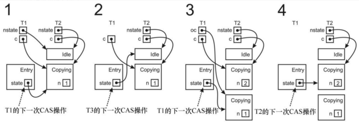
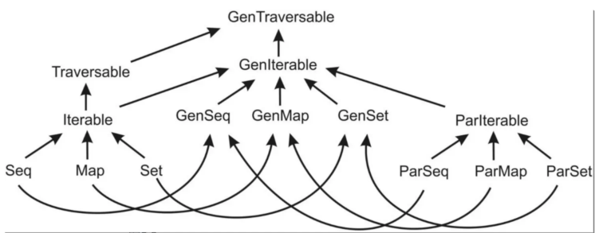

# JUC-SUC

> 部分目录缺失

## 并发简介

### 1.1 线程的创建

1. 创建方法：
   1. 继承Thread类：
      1. 继承Thread类，并重写run()方法，run就是新线程要执行的事情。
      2. 创建Thread子类的实例，也就是创建线程对象，并调用start()方法启动线程。

```
package com.atguigu.thread;

//自定义线程类
public class MyThread extends Thread {
     //定义指定线程名称的构造方法
     public MyThread(String name) {
         //调用父类的 String 参数的构造方法，指定线程的名称
         super(name);
     }
     /**
     * 重写 run 方法，完成该线程执行的逻辑
     */
     @Override
     public void run() {
         for (int i = 0; i < 10; i++) {
         System.out.println(getName()+"：正在执行！"+i);
         }
     }
}

//测试类
package com.atguigu.thread;
public class TestMyThread {
 public static void main(String[] args) {
     //创建自定义线程对象 1
     MyThread mt1 = new MyThread("子线程 1");
     //开启子线程 1
     mt1.start();
   
     //创建自定义线程对象 2
     MyThread mt2 = new MyThread("子线程 2");
     //开启子线程 2
     mt2.start();
   
     //在主方法中执行 for 循环
     for (int i = 0; i < 10; i++) {
         System.out.println("main 线程！"+i);
     }
 }
}
```

1. 实现Runnable接口：
   1. 背景：Java有单继承限制，当无法继承Thread类的时候，可以实现Runnable接口
   2. 步骤：
      1. 实现Runnable接口，并重写run方法，该run方法就是线程的执行体。
      2. 创建Runnable接口实现类的实例，并作为target参数传人Thread类的实例(线程对象)
      3. 启动线程对象的start方法

**📌**

线程对象一直都是Thread对象。

1. 如果可以直接继承，并重写run方法，就可以直接提供线程执行体
2. 如果不可以继承Thread，就需用一个实现Runnable接口的对象作为参数，传入Thread对象中，作为线程执行体。

```
package com.atguigu.thread;
public class MyRunnable implements Runnable {
     @Override
     public void run() {
         for (int i = 0; i < 20; i++) {
             System.out.println(Thread.currentThread().getName() + " "
            + i);
         }
     }
}
测试类：
package com.atguigu.thread;
public class TestMyRunnable {
     public static void main(String[] args) {
         //创建自定义类对象 线程任务对象
         MyRunnable mr = new MyRunnable();
         //创建线程对象
         Thread t = new Thread(mr, "长江");
         t.start();
         for (int i = 0; i < 20; i++) {
             System.out.println("黄河 " + i);
         }
     }
}
```

### 1.2并发基础

1. 操作系统多进程的原因：
   1. 资源利用率：通过进程切换来高效利用CPU
   2. 公平性：通过时间分片等方法，每一个进程可以共享CPU，而不是从头到尾的串行
   3. 便利性(线程)：
      1. 通过在进程中加入线程，使得单个进程中可以同时存在多个程序控制流。多个线程共享堆区域和代码区，以及文件句柄等资源，
      2. 但是又有各自的程序计数器，栈区。同一个进程的多个线程客可以被同时调度到多个CPU上执行。
      3. 线程是程序调度的基本单位。
2. 多线程的优势：
3. 发挥多处理器的性能：由于调度的基本单位是线程，而多线程就可以同时调度在多个核上。就算只有一个处理器，多线程也可以在一个线程进行IO的时候，切换到另一个线程执行，提高CPU利用率，而不是等待阻塞的返回。
4. 建模简单：可以为模型中每每种任务的都分配一个线程，形成串行执行的假象。多线程可以将复杂且异步的工作流进一步分解为一组简单并且同步的工作流，不同的工作流在特定位置交互。
5. 异步事件的简化处理：服务器程序在接收多个客户端的Socket请求的时候，如果为每一个请求都分配单独的线程并且使用同步IO,就会降低开发难度

**🔔**

同步和异步(是消息的通知机制)：

同步IO：在同步IO中，一个进程发出IO请求之后，必须等待IO操作完成，才可以执行下一个步骤。

异步IO：在异步IO中，一个进程发出IO请求之后，可以立即执行下一步操作。当IO完成之后，会通过某种方式通知(比如回调函数)通知进程。

阻塞和非阻塞(是程序在等待消息(无所谓同步异步)时候的状态)：

阻塞IO：在阻塞IO中，一个进程发起IO操作，如果数据没有准备好，就会被阻塞，直到数据准备好为止。

非阻塞IO：进程发出请求之后立即返回

四者之间没有绝对关系。

例如，我们可以有一个阻塞的异步IO模型：进程发起一个IO操作后，不需要等待IO操作的完成，但如果数据还没有准备好，进程就会被挂起，直到数据准备好为止。

同步/异步与阻塞/非阻塞是两组不同的概念，它们可以共存组合，而很多人之所以把同步和阻塞混淆，我想也是因为没有区分这两个概念，比如在进程阻塞的 read/write 操作中，其实是把消息通知和处理消息结合在了一起，在这里所关注的消息就是 fd 是否可读/写，而处理消息则是对 fd 读/写，当我们将这个 fd 设置为非阻塞的时候，read/write 操作就不会在等待消息通知这里阻塞，如果 fd 不可读/写则操作立即返回。

1. 多线程的风险：
   1. 安全性问题：
      1. 案例：非线程安全的数值序列生成器：
         1. 如下面的方法getNext，其中value是成员变量进程内线程共享。
         2. 在单线程调用的时候，没有问题。但是在多线程中，value++的操作实际上是内存->寄存器，value+1，将value再返回内存区域。操作并不是原子的，可能会导致错误情况。
         3. 该案例说明的是常见的竞态条件(race condition)，也就是多个线程同时访问一个共享内存区域。
         4. 改正：使用synchronized关键字，race condition部分实现顺序执行，防止交替执行的情况发生。

```
# 非线程安全
public class unsafeSequence {
    private int value;

    public int getNext() {
        return value++;
    }
}

#修正！线程安全：
@ThreadSafe
public class Sequence {
    private int value;
    public synchronized int getNext(){
        return value++;
    }
}
```

1. 安全性问题：
   1. 无限循环，造成资源浪费。
   2. 死锁，饥饿，活锁
2. 性能问题：
3. 上下文切换引发的消耗，会使得程序丢失局部性，并且CPU花费过多时间在调度上。
4. 同步机制，可能会阻止编译器优化。

## 2 . 线程安全

### 2.1 线程安全

1. 当多线程访问同一个可变变量的时候，处理方法：
   1. 不在线程之间共享该变量
   2. 将变量改为不可变类型
   3. 在访问状态变量的时候使用同步变量
2. 线程安全性：
3. 定义：某个类的行为与其规范完全一致。良好的规范包括各种不变条件来约束对象的状态，以及定义各种后验条件来描述对象操作的结果。当多个线程访问某个类的时候，该类始终可以表现正确的行为，而且主调函数不用使用额外的同步或者协调，该类就是线程安全性的。
4. 例子：
5. Servlet:Servlet（Server Applet）是Java Servlet的简称，称为小服务程序或服务连接器，泛指用 **Java编写的服务器端程序**。在编程过程中也指一切 **实现了Servlet接口的类**（约定以Servlet结尾命名）。
6. 下面的Servlet从请求中提取出数值，进行因式分解，然后将数据封装进入该Servlet的相应中。
7. 安全性：由于该类是无状态的，它既不包含任何成员变量，也不包含对其他类的成员变量的引用。计算过程中的临时状态只存在于线程栈上的局部变量中，而线程栈是私有的。不会导致多个线程之间有共享的状态。所以线程访问无状态对象并不会影响其他线程。
8. 无状态对象一定是线程安全的。

```
public class StatelessFactorizer extends GenericServlet implements Servlet {

    public void service(ServletRequest req, ServletResponse resp) {
        BigInteger i = extractFromRequest(req);
        BigInteger[] factors = factor(i);
        encodeIntoResponse(resp, factors);
    }

    void encodeIntoResponse(ServletResponse resp, BigInteger[] factors) {
    }

    BigInteger extractFromRequest(ServletRequest req) {
        return new BigInteger("7");
    }

    BigInteger[] factor(BigInteger i) {
        // Doesn't really factor
        return new BigInteger[] { i };
    }
}
```

### 2.2 原子性

1. 假设在无状态对象中增加一个状态
2. 下述例子中，增加一个命中计数器的成员属性来统计请求次数。
3. 由于操作不是原子操作，而是一个操作序列，并且依赖于之前的状态
4. 该情况称为竞态条件。

**👋**

最常见的竞态条件：先检查后执行

本质是先观察到某个条件，然后基于观察的结果进行相应的动作。但是实际上在观察到采取动作之间，之前的观察结果可能已经无效，从而会导致各种问题。

竞态条件并不等于数据竞争！

```
public class UnsafeCountingFactorizer extends GenericServlet implements Servlet {
    private long count = 0;

    public long getCount() {
        return count;
    }

    public void service(ServletRequest req, ServletResponse resp) {
        BigInteger i = extractFromRequest(req);
        BigInteger[] factors = factor(i);
        //该操作并非原子操作，而是一个读取-修改-写入的操作序列。
        ++count;
        encodeIntoResponse(resp, factors);
    }

    void encodeIntoResponse(ServletResponse res, BigInteger[] factors) {
    }

    BigInteger extractFromRequest(ServletRequest req) {
        return new BigInteger("7");
    }

    BigInteger[] factor(BigInteger i) {
        // Doesn't really factor
        return new BigInteger[] { i };
    }
}
```

1. 典型情况：延迟初始化
   1. 操作本意：将对象的初始化延迟到实际被使用的时候。
   2. 竞态条件：
      1. A看到instance为null，因此创建了ExpensiveObject实例。
      2. 如果当A正在进行创建对象的时候，此时B线程进入，判断instance仍然为空，也进行创建对象。
      3. 则两次调用getInstance方法返回的其实是两次new的示例，而不是单例模式。如果该类被用于注册信息等场景，必然会导致信息丢失。
      4.

```
public class LazyInitRace {
    private ExpensiveObject instance = null;

    public ExpensiveObject getInstance() {
        if (instance == null)
            instance = new ExpensiveObject();
        return instance;
    }
}

class ExpensiveObject { }
```

1. 上述的两种情况都属于复合操作(非原子)操作导致的竞态条件。
2. 解决办法：
   1. 通过安全类来管理向无状态类中引入的状态，此时仍然是线程安全的。

引入线程安全类:AtomicLong来管理计数器的状态。

但是当状态变量的数量不再是一个的时候，就不再适用，因为无法保证多个变量之间的约束可以同步发生变化。

```
public class CountingFactorizer extends GenericServlet implements Servlet {
    private final AtomicLong count = new AtomicLong(0);

    public long getCount() { return count.get(); }

    public void service(ServletRequest req, ServletResponse resp) {
        BigInteger i = extractFromRequest(req);
        BigInteger[] factors = factor(i);
        count.incrementAndGet();
        encodeIntoResponse(resp, factors);
    }

    void encodeIntoResponse(ServletResponse res, BigInteger[] factors) {}
    BigInteger extractFromRequest(ServletRequest req) {return null; }
    BigInteger[] factor(BigInteger i) { return null; }
}
```

1. 通过加锁机制，来保证原子性。

### 2.3 内置锁

1. 同步代码块：
   1. 组成：
      1. 锁的对象引用：一般是方法调用所在的对象。静态的synchronized方法以Class对象作为锁。
      2. 由该锁保护的代码块
   2. Java的内置锁，是一种互斥锁，同时最多只能有一个线程持有该锁。
2. 例子：下面的类通过使用内置锁，实现了同步机制。但是同时并发度大大降低，使得性能难以接受

```
public class SynchronizedFactorizer extends GenericServlet implements Servlet {
    @GuardedBy("this") private BigInteger lastNumber;
    @GuardedBy("this") private BigInteger[] lastFactors;

    public synchronized void service(ServletRequest req,
                                     ServletResponse resp) {
        BigInteger i = extractFromRequest(req);
        if (i.equals(lastNumber))
            encodeIntoResponse(resp, lastFactors);
        else {
            BigInteger[] factors = factor(i);
            lastNumber = i;
            lastFactors = factors;
            encodeIntoResponse(resp, factors);
        }
    }

    void encodeIntoResponse(ServletResponse resp, BigInteger[] factors) {
    }

    BigInteger extractFromRequest(ServletRequest req) {
        return new BigInteger("7");
    }

    BigInteger[] factor(BigInteger i) {
        // Doesn't really factor
        return new BigInteger[] { i };
    }
}
```

1. 重入：
   1. 背景：当某个线程请求一个由其他线程持有的锁的时候，发出请求的线程就会阻塞。但是由于内置锁是可以重入的，如果某个线程获取它自己持有的锁，则会成功。
   2. 重入的意义：意味着获取锁的操作的粒度是线程，而不是调用。而pthread里面互斥锁的获取操作是以调用为粒度的。
   3. 实现方法：
      1. 为每个锁关联一个获取计数值，以及所有者线程。
      2. 当计数值为0的时候，该锁就被认为是没有被任何线程持有。
      3. 当线程请求一个未被持有的锁的时候，JVM就会将该线程标记为该锁的所有者线程，并将获取计数值设置为1。如果同一个线程再次获得该锁，则将计数值递增。当线程退出同步代码块的时候，计数器会递减，当计数值为0的时候，锁被释放。
   4. 例子：
   5. 子类重写了父类的synchronized方法，然后调用父类中的方法。

**🔔**

子类中的super和this居然是同一个引用，而且父类的this也是。所以才会说锁住的是同一个对象。也就是super本身仍然是子类的引用，只不过它可以调用到父类的方法或变量。

1. 如果没有可重入的锁，则该代码会产生死锁
2. 子类在进入doSomething方法的时候，会获得Wight的锁。但是在其中，如果在调用super的时候，没有可重入的锁，则会陷入死锁(因为调用super时候也获取的是Wight的锁).

```
public class  LoggingWidget extends Widget{
    @Override
    public synchronized void doSomething(){
        System.out.println("calling to doSomething");
        super.doSomething();
    }
}

class Widget{
    public synchronized void doSomething(){

    }
}
```

### 2.4 使用锁来保护状态

1. 对象的内置锁和状态变量的关系：

   1. 对象的内置锁由对象决定。
   2. 对象的成员属性并不是只能靠对象的内置锁来限制，也可以通过其他锁来限制
   3. 线程在获得某个锁的时候，并不能阻止其他线程获取其他的锁。
   4. 建议：每个共享与可变变量只通过一个锁来保护。
2. 常见约定：
3. 将所有可变状态封装在对象内部，通过对象的内置锁来对所有访问可变状态的路径进行同步。
4. 多个同步方法的组合并不一定是原子的
5. 尽可能对较短的代码块进行加锁，降低性能影响。
6. 当进行较长时间计算，或者进行IO的时候，不要持有锁。

```
public class CachedFactorizer extends GenericServlet implements Servlet {
     private BigInteger lastNumber;
     private BigInteger[] lastFactors;
     private long hits;
     private long cacheHits;

    public synchronized long getHits() {
        return hits;
    }

    public synchronized double getCacheHitRatio() {
        return (double) cacheHits / (double) hits;
    }

    public void service(ServletRequest req, ServletResponse resp) {
        BigInteger i = extractFromRequest(req);
        BigInteger[] factors = null;
        synchronized (this) {
            ++hits;
            if (i.equals(lastNumber)) {
                ++cacheHits;
                factors = lastFactors.clone();
            }
        }
        if (factors == null) {
            factors = factor(i);
            synchronized (this) {
                lastNumber = i;
                lastFactors = factors.clone();
            }
        }
        encodeIntoResponse(resp, factors);
    }

    void encodeIntoResponse(ServletResponse resp, BigInteger[] factors) {
    }

    BigInteger extractFromRequest(ServletRequest req) {
        return new BigInteger("7");
    }

    BigInteger[] factor(BigInteger i) {
        // Doesn't really factor
        return new BigInteger[]{i};
    }
}
```

## 3 .对象的共享

### 3.1 可见性

1. 背景：并发编程的实现，不仅在于对于共享变量的可变状态进行正常管理，同时，也需要对内存可见性进行管理，防止更新但是没有同步所导致的错误
2. 例子：
   1. 下面的代码说明了当多个线程在没有同步的情况下共享数据时候出现的错误。
   2. 在代码中，主线程和子线程都会读取共享变量number和ready。
   3. 主线程启动reader线程之后，将number=42,ready=true。正常情况下reader线程会等到ready线程为true之后，输出number的值，正常是输出42
   4. 代码可能会一值持续循环下去，因为reader线程可能永远都看不到ready值。一种更奇怪的现象是，代码输出为0。因为reader线程可能会看到写入的ready值，但是没有看到写入的number的值，称为重排序(reordering)。当主线程首先写入number，在没有同步的情况下写入ready，那么ready线程看到的数据可能与写入的数据完全相反。

**👋**

结论：只要线程之间有数据交换，就进行同步

```
public class NoVisibility {
    private static boolean ready;
    private static int number;

    private static class ReaderThread extends Thread {
        public void run() {
            while (!ready)
                Thread.yield();
            System.out.println(number);
        }
    }

    public static void main(String[] args) {
        new ReaderThread().start();
        number = 42;
        ready = true;
    }
}
```

1. 失效的数据：
   1. 例子：
      1. 对于如下这个共享对象。如果一个线程调用了set，一个线程调用了get，则该线程的get不一定会看到被更新的value值。

```
public class MutableInteger {
    private int value;
  
    public int get(){
        return value;
    }
  
    public void set(int value){
        this.value=value;
    }
}
```

1. 修改之后的线程安全类：

```
public class SynchronizedInteger {

    private int value;

    public synchronized int get() {
        return value;
    }

    public synchronized void set(int value) {
        this.value = value;
    }

}
```

1. 非原子操作的64位操作

   1. 最低安全性：当线程在没有同步的情况下，可能会得到一个失效值，但是这个值肯定是由某个线程设置的值，而不是一个随机值。
   2. 非volatile类型的64位数值变量(double,long)。JVM对于这个类型变量的读写，允许两个32位操作。当读取一个非volatile类型的long变量的时候，如果对该变量的读写操作在不同的线程中执行，那么很可能读取到一个值的高32位和一个值的低32位。因此，long和double类型的变量需要使用volatile变量来声明他们，或者用锁保护。
2. 加锁和可见性
3. 如果线程A先lock M，再执行代码块，再unlock M,。而B线程紧接着lock M，此时B线程执行的代码块一定可以看见A在其代码块的所有操作结果。如果没有同步机制，则无法保证
4. 加锁可以保证互斥性，同时可以保证内存可见性。
5. volatile变量：
6. 作用：来确保将变量的更新操作通知到其他线程。volatile类型的变量编译器在运行的时候会注意到该变量是共享的。就不会将其和其他操作进行重排序。在读取volatile变量的时候，返回的总是最新写入的值。
7. 可以将volatile看做SynchronizedInteger,但是更轻量级(不会加锁)
8. volatile变量只能保证可见性，不能保证原子性
9. 使用范围：
10. 确保变量自身的可见性
11. 确保所引用对象的可见性
12. 标识重要的程序生命周期事件的发生，常用来做flag
13. 使用条件：
14. 对变量的写入操作不依赖变量的当前值
15. 该变量不会和其他状态变量一起纳入不变性条件中
16. 在访问对象的时候不需要加锁

```
//典型例子
//检查某个状态标记以判断是否退出循环(用锁也可以)
//如果不是volatile类型，则如果asleep被修改，另一个线程可能看不到
volatile boolean asleep;

    while(!asleep){
        countSomeSleep();
    }
```

### 3.2 发布和逸出

1. 发布(publish)：

   1. 定义：发布一个对象是指使得对象在当前作用域之外的代码中使用。
   2. 例子：
      1. 将一个指向该对象的引用保存到其他代码可以访问的地方。
      2. 或者是某一个私有方法中返回该引用。
      3. 或者是将引用传递到其他类的方法中。
2. 逸出(escape)：
3. 定义：某些不该被publish的对象被发布
4. 例子：
5. 破坏封装性：publish内部状态
6. 破坏线程安全性：在对象创建之前就返回引用
7. 发布一个对象：
8. 最常见的方法：将对象的引用定义为public static。则任何类和线程都可以看见该对象引用。
9. 当发布一个对象的引用，可能会间接发布其他对象(比如集合中包含的其他对象)。

```
public static Set<Secret> knownSecrets;

public void init(){
    knownSecrets = new HashSet<Secret>();
}
```

1. 逸出：
   1. 如下代码将内部状态(私有变量)的引用逸出。
   2. 则states已经逸出其作用域

```
public class UnsafeStates {
    private String[] states = new String[]{"hello"};
  
    public String[] getStates(){
        return states;
    }
}
```

1. 如下：当ThisEscape在进行发布内部类EventListener的时候，也隐含地发布了ThisEscape实例本身。这样会使得this引用逸出。这是因为从对象的构造函数中就返回对象的引用(this),这是不正确的。
2. 常见错误情况：在构造函数中启动一个线程。则此时this引用都会被新创建的线程共享。

```
public class ThisEscape {
    public ThisEscape(EventSource source) {
        //发布内部类，将其传入到source实例的方法中
        source.registerListener(new EventListener() {
            public void onEvent(Event e) {
                doSomething(e);
            }
        });
    }

    void doSomething(Event e) {
    }


    interface EventSource {
        void registerListener(EventListener e);
    }

    interface EventListener {
        void onEvent(Event e);
    }

    interface Event {
    }
}
```

1. 可以通过使用私有构造器+公共工厂方法来防止this引用在构造过程中逸出
   1. 原理：在构造方法中创建内部类，并将内部类发布出去，这两者不能同时发生。
   2. 办法：
      1. 首先私有构造器，在其中创建内部类
      2. 然后通过公共的工厂方法来发布 内部类

```
public class SafeListener {
    private final EventListener listener;
  
    //私有构造器
    private SafeListener() {
        listener = new EventListener() {
            public void onEvent(Event e) {
                doSomething(e);
            }
        };
    }
    //公共的工厂方法
    public static SafeListener newInstance(EventSource source) {
        SafeListener safe = new SafeListener();
        //发布内部类
        source.registerListener(safe.listener);
        return safe;
    }

    void doSomething(Event e) {
    }


    interface EventSource {
        void registerListener(EventListener e);
    }

    interface EventListener {
        void onEvent(Event e);
    }

    interface Event {
    }
}
```

### 3.3 线程封闭

1. 定义：一种避免同步的方法就是不共享数据，只在单线程中访问数据，这就是线程封闭。它是实现线程安全性的最简单的一种方式。
2. 应用场景：

   1. Swing：Swing中的可视化组件和数据模型对象都不是线程安全的。Swing将他们封闭在Swing的事件分发线程中访问，来实现线程安全性。在除了事件线程之外的其他线程就不能访问这些对象，否则可能出错
   2. JDBC：JDBC中的Connection对象不一定是线程安全的。大多数请求都是使用单线程进行处理，并且在Connection对象返回之前，不会将它分配给其他线程。
3. Java自带的线程封闭：
4. 局部变量：因为局部变量是线程私有栈中，所以必然是线程封闭的。
5. ThreadLocal类
6. 具体分类：
7. ad-hoc线程封闭：
8. 定义：维护线程封闭性的职责完全由程序来承担，不使用任何的语言特性。
9. 如果可以确保只有单个线程对共享的volatile变量执行写入操作，那么就相当于将volatile变量进行了线程封闭。而且还能保证其他线程可以读取该变量的值。
10. 栈封闭：
11. 定义：在栈封闭中，只有通过局部变量才可访问对象。因为保存在线程私有的栈中，所以不会被其他线程访问。
12. 例子：
13. 下面的方法中，对于TreeSet对象的引用，只有一个animals局部变量。这就保证了它不会被发布。

```
   public int loadTheArk(Collection<Animal> candidates) {
        SortedSet<Animal> animals;
        int numPairs = 0;
        Animal candidate = null;

        // animals confined to method, don't let them escape!
        animals = new TreeSet<Animal>(new SpeciesGenderComparator());
        animals.addAll(candidates);
        for (Animal a : animals) {
            if (candidate == null || !candidate.isPotentialMate(a))
                candidate = a;
            else {
                ark.load(new AnimalPair(candidate, a));
                ++numPairs;
                candidate = null;
            }
        }
        return numPairs;
    }
```

1. ThreadLocal类：
   1. 作用：ThreadLocal对象通常用于防止对可变的单例对象或者全局变量进行共享操作。
   2. 方法：get和set方法总是为每个使用该变量的值都保存一份独立的副本，因此get方法总是返回由当前执行线程在调用set的时候设置的值
   3. 例子：下面中在单线程程序中创建了全局的数据库连接(DriverManager.getConnection).由于JDBC的Connection对象不一定是线程安全的，所以如果有多线程，就需要将JDBC的连接操作保存到ThreadLocal对象中。则在调用get方法的时候，每个线程都会获得属于自己的连接。
   4. 例子：当某个频繁的操作需要一个临时对象，比如缓冲区的时候，而又希望避免每次都重新分配该临时对象，则就可以使用ThreadLocal。比如Integer.toString()会使用ThreadLocal的缓冲区。
   5. 当某个线程初次调用ThreadLocal.get方法的时候，就会调用initialValue方法来获取初始值。可以将ThreadLocal<Connection>看做Map<Thread,Connection>。
   6. 将单线程程序变换为多线程的时候，通过将共享的全局变量改为ThreadLocal，可以保证线程安全性。

```
public class ConnectionDispenser {
    static String DB_URL = "jdbc:mysql://localhost/javalab";

    private ThreadLocal<Connection> connectionHolder
            = new ThreadLocal<Connection>() {
        public Connection initialValue() {
            try {
                //全局的数据库连接
                return DriverManager.getConnection(DB_URL);
            } catch (SQLException e) {
                throw new RuntimeException("Unable to acquire Connection, e");
            }
        };
    };

    public Connection getConnection() {
        return connectionHolder.get();
    }
}
```

### 3.4 不可变对象

1. 定义：某个对象在创建之后就不能改变
2. 线程安全：不可变对象一定是线程安全的，它们的状态只能通过构造函数来改变。

**🔔**

不可变对象不等于把所有field都加上final。因为final的变量可能保存的是可变对象的引用。

1. 条件：

   1. 对象创建之后就不能修改
   2. 对象的所有field都是final类型
   3. 对象的创建(构造函数)没有this逸出。
2. final
3. 定义：final可以视为C++中的const机制的受限制版本，用于构建不可变对象
4. 性质：
5. final类型的field是不可以被修改的
6. final可以保证初始化过程的安全性，从而可以不受限制的访问不可变对象，并且在共享这些对象的时候无须同步
7. 除非需要更高可见性，否则一般将field声明为private. 同样，如果不需要改变，则一般将field声明为final
8. 使用Volatile来发布不可变对象
9. 步骤：
10. 更新缓存的结果
11. 判断需求是否在缓存中
12. 性质：
13. 当访问和更新多个变量的时候出现了竞争条件问题，就可以通过将这些变量全部保存在一个不可变对象中来消除，而不是像可变对象一样使用锁。
14. 则该变量在赋值过后就不能改变。
15. 当使用volatile的时候，则如果一个线程改变缓存，则该改变对于所有线程可见。

```
public class OneValueCache {
    private final BigInteger lastNumber;
    private final BigInteger[] lastFactors;

    public OneValueCache(BigInteger i,
                         BigInteger[] factors) {
        lastNumber = i;
        lastFactors = Arrays.copyOf(factors, factors.length);
    }

    public BigInteger[] getFactors(BigInteger i) {
        if (lastNumber == null || !lastNumber.equals(i))
            return null;
        else
            return Arrays.copyOf(lastFactors, lastFactors.length);
    }
}
```

1. 安全发布：
   1. 概念：某些情况下我们希望在多个线程之间共享对象，此时必须确保安全进行共享。
   2. 不正确的情况：
      1. 完全使用public来进行发布
      2. 如下，如果该Holder类使用public方式进行发布，则可能其他线程通过StuffIntoPublic来看见Holder的不同状态

```
//发布
public class StuffIntoPublic {
    public Holder holder;

    public  void init(){
        holder = new Holder(42);
    }
}

//Holder定义
class Holder {
    private int n;
  
    //初始化构造器
    public Holder(int n) {
        this.n = n;
    }

    public void assertSanity() {
        if (n != n)
            throw new AssertionError("This statement is false.");
    }
}
```

1. 安全发布的常用模式：

   1. 方法：
      1. 在静态初始化函数中初始化一个对象引用
      2. 将对象的引用保存到volatile类型的field
      3. 将对象的引用保存到某个正确构造的对象的final类型field中
      4. 将对象的引用保存到一个由锁保护的域中
   2. 常见情况：
   3. 将对象放入某个线程安全的容器中
   4. 使用静态的初始化器
2. 事实不可变对象：
3. 定义：定义为可变对象，但是实际上一直没有改变，程序只需要把它们视为不可变对象就可以。
4. 可变对象：
5. 安全发布只能保证对象构建的时候的安全性。
6. 可变对象必须本身是线程安全的，或要通过锁等来保证是线程安全的

## 4 .对象的组合

### 4.1 设计线程安全的类

1. 基本要素：
   1. 找出构成对象状态的所有变量
   2. 找出约束状态变量的不变性条件
   3. 建立对象状态的并发访问管理策略
2. 例子：
3. 一个类的所有基本类型的成员变量构成了该类的状态，比如下面的域就只有一个value成员变量
4. 一个包含了引用类型的类，其状态也包含其引用对象的状态。比如链表的状态就包括其中所有结点的状态。

```
public final class Counter {
    @GuardedBy("this") private long value = 0;

    public synchronized long getValue() {
        return value;
    }

    public synchronized long increment() {
        if (value == Long.MAX_VALUE)
            throw new IllegalStateException("counter overflow");
        return ++value;
    }
}
```

1. 同步策略：定义了如何在不违背对象不变条件或者后验条件下对于其状态的访问操作进行协同。
2. 收集同步需求：

   1. 状态空间：对象和变量所有取值的组合。所以final 的field越多，则状态空间越小，越可以简化分析过程。
   2. 不可变条件：

      1. 定义：在类中体现，用于判断状态是有效还是无效。
   3. 例子：Counter中的Value域
   4. Value域是Long.MIN\_VALUE到Long.MAX\_VALUE类型。但是Value隐含着>=0
   5. 后验条件：比如如果Counter的状态目前是17,那么下一个有效状态只能是18。则该操作是复合操作。
   6. 必须了解对象的不变性条件和后验条件，才能确保线程安全性。要满足在状态变量的有效值或者状态转换上的各种约束条件，就必须借助原子性和封装性。
3. 依赖状态的操作：
4. 定义：如果某个操作包含有基于状态的先验性条件，则该操作被称为依赖状态的操作。
5. 例子：比如不能从空队列中移除一个元素
6. 单线程情况：如果先验条件不满足，则必然失败
7. 多线程情况：先验条件可能会受其他线程的影响，需要等到先验条件为真再执行。比如一个消费者线程，可以在生产者生产之后，进行消费。可以通过阻塞队列或者信号量来实现。
8. 状态的所有权：
9. Java中由于GC的存在，则使得所有权的考虑较少。
10. 对象对它所封装的状态拥有所有权。
11. 如果发布了某个可变对象的引用，则不在独享该对象的控制权。

### 4.2 实例封闭：

1. 实例封闭
   1. 定义：当一个对象被封闭到另一个对象中的时候，能够访问被封装对象的所有代码路径都是已知的。与对象被放到整个程序中的访问情况相比，可以确保以线程安全的方式进行使用该对象。
   2. 范围：

      1. 对象可以被封闭到一个类的实例中
      2. 可以被封闭到一个作用域内(比如作为一个局部变量)
      3. 可以被封装到线程内
   3. 例子：
   4. 下面的PersonSet的状态包含HashSet的状态，而HashSet并非线程安全。
   5. 将HashSet封闭到PersonSet中，通过私有变量实现。
   6. 唯一能访问mySet就是addPerson和containsPerson，在执行他们的时候都获得了PersonSet的锁。
   7. 因此PersonSet的状态完全由内置锁来保护，所以是线程安全的类。
   8. 更多例子：比如Java的容器类中ArrayList就不是线程安全的。但是通过包装器工厂方法，使用装饰器把非线程安全的类封闭在一个同步的对象中。所有对底层对象的访问都通过包装器来进行。

```
public class PersonSet {
    @GuardedBy("this") private final Set<Person> mySet = new HashSet<Person>();

    public synchronized void addPerson(Person p) {
        mySet.add(p);
    }

    public synchronized boolean containsPerson(Person p) {
        return mySet.contains(p);
    }

    interface Person {
    }
}
```

1. Java监视器模式：
   1. 定义：遵循Java监视器模式的对象会把对象的所有可变状态都给封装起来，并由自己的内置锁来保护。
   2. 例子：
      1. 如下的类通过私有锁来保护状态，而不是内置锁。
      2. 优点：可以将锁变为私有，使得客户代码无法得到锁，只能通过公有方法获得锁。

```
public class PrivateLock {
    private final Object myLock = new Object();
    @GuardedBy("myLock") Widget widget;

    void someMethod() {
        synchronized (myLock) {
            // Access or modify the state of widget
        }
    }
}
```

# SUC

## 1.概述

### 练习题总结：

1. 实现一个具有如下类型声明的compose方法。此方法必须返回一个函数h，它是输入函数f和g的组合。

```
  def compose[A, B, C](f: B => C, g: A => B): A => C = {
    // A => C
    a => f(g(a))
  }
```

1. 实现一个具有如下类型声明的fuse方法，若a和b都非空，则返回的Option对象应该包含Option对象a和b中的值的二元组（使用for推导式）。

```
  def fuse[A, B](a: Option[A], b: Option[B]): Option[(A, B)] = {
    val ans = for {
      x <- a
      y <- b
    } yield {
      (x, y)
    }
    ans
  }
```

1. 实现一个check方法，其参数是类型为T的值的序列和类型为T => Boolean的函数，当且仅当 pred 函数对 xs 中所有的值都为真，并且不会抛出异常时，check才返回真

```
  def check[T](xs: List[T])(p: T => Boolean): Boolean = {
    import scala.util.{Try, Success, Failure}
    var flag = false
    xs.foreach(
      item => {
        flag = Try(p(item)) match {
          case Success(value) => value
          case Failure(exception) => false
        }
      }
    )
    flag
  }
```

1. 实现一个combinations函数，输入是一个元素序列，输出是长度为n的所有可能组合的遍历器。组合指的是从一个元素集合中选出一个子集的方式，每个元素只被选择一次，只不过不关心元素子集中的次序。比如，给定序列 Seq(1, 4, 9, 16)，长度为2的组合包括Seq(1, 4)、Seq(1, 9)、Seq(1,16)、Seq(4, 9)、Seq(4, 16)和 Seq(9, 16)。combinations函数的定义声明如下（参见标准库文档中Iterator的API）。

```
  def myCombinations(i: Int, ints: List[Int]): List[List[Int]] = {
    if (i == 0) {
      List(List())
    } else {
      ints.flatMap(
        item => {
          val ans = myCombinations(i - 1, ints.filter(_ != item))
          ans.map(
            list => {
              if(list.nonEmpty && list.head < item) list :+ item
              else if(list.isEmpty) list :+ item
              else List()
            }
          )
        }
      ).filter(_.nonEmpty)
    }
  }
```

1. 假设读者和同事们同处一个办公室，各自有一个隔间，大家互相看不见对方，且不能说话（会吵到别人）。因为都被限制在隔间中，所以每个人都无法确认传递聚会消息的纸条是否已经到达目的地。在某一时刻，其中一人被叫到老板办公室，被永久“扣留”在那里。请设计一个算法，使大家能够确定何时能够聚会。除被老板叫走的那位之外，所有人都需要同时做出决定。如果有些纸条被递到目的地时发生随机性失误，则该如何改进算法？

```
import SUC.chapter01.Person.peopleMap

import scala.collection.mutable.Queue
import scala.collection.concurrent.TrieMap
import scala.util.Random

sealed trait PartyStatus
case object NotDecided extends PartyStatus
case object CanParty extends PartyStatus
case object CannotParty extends PartyStatus

object Person{
  def apply(name: String, status: PartyStatus = NotDecided): Person = {
    new Person(name, status)
  }
  // 假设有一个全局的线程安全的people映射，用于根据名字快速查找Person实例
  private val peopleMap: TrieMap[String, Person] = TrieMap[String, Person]()
}
class Person(val name: String, var status: PartyStatus = NotDecided) {
  // 使用线程安全的队列
  private val queue = Queue[(String, PartyStatus)]()

  def this(name: String, status: PartyStatus, peopleMap: TrieMap[String, Person]) = {
    this(name, status)
    peopleMap += (this.name -> this)
  }

  def sendNote(to: String, note: PartyStatus): Unit = {
    queue.enqueue((to, note))
  }

  // 优化查找人的逻辑
  def receiveNote(from: String, note: PartyStatus): Unit = {
    peopleMap.get(from) match {
      case Some(person) =>
        if (note == CannotParty) status = CannotParty
        else if (status == NotDecided) status = note
      case None => // 如果找不到人，可以在这里记录错误或者采取其他措施
    }
  }

  def updateStatus(): Unit = {
    while (queue.nonEmpty) {
      val (to, note) = queue.dequeue()
      peopleMap.get(to) match {
        case Some(person) => person.receiveNote(name, note)
        case None => // 同样的，这里可以处理接收到不存在的人的note的情况
      }
    }
  }
}

object PartyAlgorithm {
  def main(args: Array[String]): Unit = {
    // 初始化peopleMap
    val peopleMap = TrieMap[String, Person]()
    List("Alice", "Bob", "Charlie").foreach(name => new Person(name, CanParty, peopleMap))
    new Person("David", CannotParty, peopleMap) // David is detained

    val maxRounds = 5
    for (round <- 1 to maxRounds) {
      peopleMap.values.foreach(_.updateStatus())
      if (peopleMap.values.forall(_.status == CannotParty)) {
        println("Everyone knows that someone is detained.")
        return
      } else if (peopleMap.values.forall(_.status == CanParty)) {
        println("Everyone can party!")
        return
      }
      if (round == maxRounds) {
        println("No consensus reached after " + maxRounds + " rounds.")
        return
      }
    }
    println("Reached maximum rounds without consensus.")
  }
}
```

## 2.JVM与JVM的并发性

### 2.1 线程和进程

创建一个JVM实例，总是会创建一个新的JVM进程。在这个进程中运行着很多线程。JVM进程将这些线程表现为java.lang.Thread类。每一个JVM线程都被直接映射为操作系统线程。Scala重用了Java中的线程中的API，是出于兼容性的考虑。

#### 线程的创建和执行

每次创建JVM的进程的时候，会默认创建几个线程

1. main线程
   1. 下面的代码输出结果是main
   2. 静态的currentThread方法来获得当前线程对象的引用

```
object ThreadsMain extends App {
  val t: Thread = Thread.currentThread
  val name = t.getName
  println(s"I am the thread $name")
}
```

1. 启动一个独立的线程
   1. 创建Thread对象
   2. 调用该对象的start方法，start会进一步调用该线程对象的run方法
   3. join方法：会让本线程进入waiting状态，直到fork出的线程执行结束

```
object ThreadsCreation extends App {
  class MyThread extends Thread {
    override def run():Unit = {
      val name = Thread.currentThread.getName
      println(s"i am the thread ${name}")
    }
  }
  val name = Thread.currentThread.getName
  println(s"i am the thread ${name}")
  val t = new MyThread
  t.start()
  t.join()
  println("New thread joined.")
}
```

1. 设计线程创建公用函数以及公用日志打印函数

```
//线程创建函数  
def thread(body: => Unit): Thread = {
    val t = new Thread{
      override def run(): Unit = body
    }
    t.start()
    t
  }
//日志打印函数
package object SUC {
  def log(msg: String): Unit = {
    println(s"${Thread.currentThread.getName}: $msg")
  }
}
```

#### 原子执行

1. join
   1. 调用的特点：当一个线程被调用join方法时，它所有的内存写操作都会在join返回之前发生，而且这些写操作对调用join的那个线程是可见的
   2. 缺点：只能单向通信，也就是使用线程结果进行通信的模式

```
object ThreadsCommunicate extends App {
  var result: String = null
  val t = thread { result = "\nTitle\n" + "=" * 5 }
  t.join()
  //result不会为空，因为thread中内存写操作总是会在join之前完成
  log(result)
}
```

1. synchronized
   1. JVM中创建的每个对象都有内置锁(监控器)，其作用是确保同时只有一个线程在该对象上执行某个synchronized代码块。当一个线程开始执行synchronized代码块时，我们称该线程获得了x的监控器的所有权，换句话说，获得了x的监控权。
   2. JVM保证了一个线程在某个对象x上执行synchronized语句时，该线程是x对象上唯一在执行synchronized语句的线程。如果线程T要在x上调用synchronized语句，而另一个线程S正在x上调用其他synchronized语句，那么线程T会进入阻塞（blocked）状态。

```
object ThreadsUnprotectedUid extends App {
  var uidCount = 0L
  //this.synchronized是用ThreadsUnprotectedUid作为锁
  def getUniqueId(): Long = this.synchronized {
    val freshUid = uidCount + 1
    uidCount = freshUid
    freshUid
  }

  def printUniqueIds(n: Int): Unit = {

    val uids = for (i <- 0 until n) yield getUniqueId()
    log(s"Generated uids: ${uids}")
  }

  val t = thread {
    printUniqueIds(5)
  }
  Thread.sleep(10)
  printUniqueIds(5)
  t.join()
}
```

#### 重排序

1. 原因： JMM 规范上，如果在某个特定的线程内代码语句的顺序不影响程序的串行语义，那么执行过程中JVM是允许这类重排序的。这时候可见性就会发生变化
2. 例子：
   1. 如下代码，执行多次会出现x和y都为1的情况
   2. 但是因为a,b的赋值理论上必有一个在if之前发生，所以必然是JVM上发生了重排序。此外，程序并不需要将所有的更新立即写到主存中，而是会将它们临时保存在处理器的寄存器中。
   3. 解决办法：刚才犯的错来自一个假设，就是一个线程的写操作会立刻反映到内存中并对另一个线程可见，但这种同步并不会自然而然发生(可能暂时在寄存器中)。synchronized语句就是实现正确的同步的基本方式。在对象x上执行 synchronized 语句产生的写操作不仅是原子性的，而且对所有在 x 上执行synchronized语句的线程而言都是可见的。

```
object ThreadSharedStateAccessReordering extends App {
  for (i <- 0 until 100000) {
    var a = false
    var b = false
    var x = -1
    var y = -1
    val t1 = thread {
      this.synchronized{
        a = true
        y = if (b) 0 else 1
      }
    }
    val t2 = thread {
      this.synchronized{
        b = true
        x = if (a) 0 else 1
      }
    }
    t1.join()
    t2.join()

    assert(!(x == 1 && y == 1), s"x = $x, y = $y")
  }
}
```

### 2.2监控器和同步

#### 监视器

1. 监控器：当一个线程访问对象x上的synchronized语句时，若没有其他线程拥有x上的监控器，那么它就会获得此监控器。否则，该线程会等待监控器被释放。在获得监控器的同时，该线程也能看到释放该监控器的前一线程的所有内存写操作。
2. 监视器是基于对象的，一个线程可以拥有属于不同对象的多个监视器。
3. 例子：银行系统：
   1. 有一个存取日志记录方法，使用ArrayBuffer对象存储。使用内置锁，防止对象更新出错
   2. 有一个Account类，用于创建用户账户。使用内置锁，防止t1,t3线程同时更新账户

```
object SynchronizedNesting extends App {
  import scala.collection._
  private val transfers = mutable.ArrayBuffer[String]()
  def logTransfer(name: String, n: Int) = transfers.synchronized {
    transfers += s"transfer to account '$name' = $n"
  }
  class Account(val name: String, var money: Int){
    def add(account: Account, n: Int):Unit = account.synchronized {
      account.money += n
      if (n > 10) logTransfer(account.name, n)
    }
  }
  // 银行系统示例代码（续）
  val jane = new Account("Jane", 100)
  val john = new Account("John", 200)
  val t1 = thread { jane.add(jane, 5) }
  val t2 = thread { john.add(john, 50) }
  val t3 = thread { jane.add(jane, 70) }
  t1.join(); t2.join(); t3.join()
  log(s"--- accounts ---\n${jane.money}\n${john.money}")
  log(s"--- transfers ---\n$transfers")
}
```

#### 死锁

1. 定义：在并发编程中，两个线程同时获得两个不同的监控器，然后尝试获得对方的监控器时，死锁就发生了。双方都不释放自己的监控器，于是这两个线程进入阻塞状态，直到其中一个监控器被释放。
2. 打破死锁的必要条件：规定资源访问顺序，打破潜在的死循环
3. 例子：

```
object SynchronizedDeadlock extends App {
  import SynchronizedNesting.Account
  def send(a: Account, b: Account, n: Int) = a.synchronized {
    Thread.sleep(10)
    b.synchronized {
      a.money -= n
      b.money += n
    }
  }
  val a = new Account("Jack", 1000)
  val b = new Account("Jill", 2000)
  val t1 = thread { for (i<- 0 until 100) send(a, b, 1) }
  val t2 = thread { for (i<- 0 until 100) send(b, a, 1) }
  t1.join(); t2.join()
  log(s"a = ${a.money}, b = ${b.money}")
}
```

1. 修改：

```
object SynchronizedDeadlock extends App {
  import ThreadsUnprotectedUid.getUniqueId
  class Account(val name: String, var money: Int) {
    val uid = getUniqueId()
  }
  def send(a1: Account, a2: Account, n: Int) {
    def adjust() {
      log(s"money is ${n}")
      a1.money -= n
      a2.money += n
    }
    if (a1.uid < a2.uid)
      a1.synchronized { a2.synchronized { adjust() } }
    else a2.synchronized { a1.synchronized { adjust() } }
  }
  val a = new Account("Jack", 1000)
  val b = new Account("Jill", 2000)
  log(s"a.uid = ${a.uid}, b.uid = ${b.uid}")
  //a,b的uid全局有序，则获得的锁是有序的，没有抢到的就阻塞，而不是乱去获得其他锁
  val t1 = thread { for (i<- 0 until 100) send(a, b, 10) }
  val t2 = thread { for (i<- 0 until 100) send(b, a, 1) }
  t1.join(); t2.join()
  log(s"a = ${a.money}, b = ${b.money}")
}  
```

#### 保护块

1. 线程池：创建新线程的代价比创建 Account 之类的轻量级对象要大得多。同一线程应该能够被多个请求重用，这种可重用的线程的集合通常称为线程池

忙等待：worker线程在启动之前被设置为守护线程。一般而言，JVM进程并不会在主线程终止时结束，而是会等所有守护线程全部结束。等到worker线程完成任务，它会继续检查队列中是否有任务。我们称worker线程这样的状态为忙等待。这是一种浪费资源的行为，大部分情况需要避免忙等待

```
import scala.collection._
object SynchronizedBadPool extends App {
  private val tasks = mutable.Queue[() => Unit]()
  val worker = new Thread {
    def poll(): Option[() => Unit] = tasks.synchronized {
      if (tasks.nonEmpty) Some(tasks.dequeue()) else None
    }
    override def run() = while (true) poll() match {
      case Some(task) => task()
      case None =>
    }
  }
  worker.setName("Worker")
  //设置为守护线程
  worker.setDaemon(true)
  worker.start()

  def asynchronous(body: => Unit) = tasks.synchronized {
    tasks.enqueue(() => body)
  }
  asynchronous { log("Hello") }
  asynchronous { log(" world!")}
  Thread.sleep(5000)
}
```

1. 忙等待的优化：让worker线程休眠，只有在task队列不为空，再被唤醒
   1. wait与notify:也是基于锁对象的操作。当线程T调用某对象的wait方法时，它会释放x的监控器，然后进入休眠状态，直到另一线程S调用同一对象的notify方法。
   2. 例子：无论哪个线程先执行sychronized方法，最终都会输出hello信息

```
object SynchronizedGuardedBlocks extends App {
  //AnyRef <=> java.lang.Object
  val lock = new AnyRef
  var message: Option[String] = None
  val greeter = thread {
    //1.greeter线程进入，发现为None，被阻塞，释放锁
    lock.synchronized {
      //必须使用while，使用if可能会引起虚假唤醒。
      while (message == None) lock.wait()
      //3.在同一个锁中，并且main给message在log之前，所以保证可见性
      log(message.get)
    }
  }
  //2.main线程进入，发现不为None，设置message,释放锁，并唤醒greeter线程
  lock.synchronized {
    message = Some("Hello!")
    lock.notify()
  }
  greeter.join()
}
```

1. wait的一个重要性质是它会引起虚假唤醒。有时候，JVM允许在没有调用notify的情况下唤醒一个执行了wait的休眠线程。为了防止出现这种情况，需要用一个while循环反复检查状态，然后结合 wait使用，如上面代码所示。使用一个 if 语句是不够的，因为即使message的值为None，一个虚假唤醒也将允许线程执行message.get。保证是由其他线程将其notify唤醒。
2. 保护块：若synchronized语句在调用wait之前反复检查条件，那这个synchronized语句称为保护块。通常以while loop的形式出现。

```
object SynchronizedPool extends App {
  import scala.collection._
  private val tasks = mutable.Queue[() => Unit]()
  object Worker extends Thread {
    setDaemon(true)
    def poll() = tasks.synchronized {
      //保护块，当队列为空，会释放锁并被阻塞等待被唤醒
      while (tasks.isEmpty) tasks.wait()
      tasks.dequeue()
    }
    override def run() = while (true) {
      val task = poll()
      task()
    }
  }
  Worker.start()
  def asynchronous(body: =>Unit) = tasks.synchronized {
    tasks.enqueue(() => body)
    tasks.notify()
  }
  asynchronous { log("Hello ") }
  asynchronous { log("World!") }
  Thread.sleep(500)
}
```

#### 线程中断与平滑关闭

worker线程优化：即使是守护线程，出于休眠状态，但是所占据的栈空间一直都在。如果休眠线程太多，内存就会被用完。

结束休眠线程的方法：

1. 中断线程：当一个线程等待或计时等待时，调用其 interrupt 方法会抛出一个 InterruptedExption异常。此异常可以被捕获和处理，但在这里，它的作用是终止线程Worker。不过，如果对运行中的线程调用这个方法，这个异常就不会产生，而是设置线程的interrupt 标志。对于不阻塞的线程必须周期性地用isInterrupted 方法查询interrupt标志。
2. 平滑关闭：在平滑关闭中，一个线程设置终止条件，然后调用notify来唤醒工作线程。然后，工作线程会释放它所有的资源，并顺利地结束。
3. 两者的选择：如果notify不能再次唤醒线程，就要使用主动中断的方式。

```
object SynchronizedPool extends App {

  import scala.collection._

  private val tasks = mutable.Queue[() => Unit]()

  object Worker extends Thread {
    var terminated = false
    def poll(): Option[() => Unit] = tasks.synchronized {
      while (tasks.isEmpty && !terminated) tasks.wait()
      if (!terminated) Some(tasks.dequeue()) else None
    }
    import scala.annotation.tailrec
    @tailrec override def run() = poll() match {
      //在poll返回Some时，会继续执行run，直到返回None
      //使用了尾递归优化
      case Some(task) => task(); run()
      case None =>
    }
    def shutdown() = tasks.synchronized {
      terminated = true
      tasks.notify()
    }
  }

  Worker.start()

  def asynchronous(body: => Unit) = tasks.synchronized {
    tasks.enqueue(() => body)
    tasks.notify()
  }

  asynchronous {
    log("Hello ")
  }
  asynchronous {
    log("World!")
  }
  Thread.sleep(500)
  Worker.shutdown()
}
```

### 2.3易失(volatile)变量

1. 定义：JVM还提供了一种比synchronized代码块更轻量级的同步形式，称为易失变量。易失变量可供于原子性读写，常用于表示状态标志。比如，标记某个计算是否完成、是否取消。这种方法有两个好处，第一是单个线程中易失变量的读操作和写操作不会重排序，第二是易失变量的写操作对其他线程是立即可见的。如果对一个易失变量v进行写操作W，这被另一个线程通过对变量v的读操作R观察，那么在W之前该变量的所有写操作都可以在R之后观察到。
2. Scala的volatile变量性质

和Java不一样，Scala支持声明局部（本示例指的是for循环的闭包）易失变量。对于闭包或嵌套类中的每个局部易失变量，Scala都会创建一个带易失字段的堆对象。于是，可以称这些局部易失变量被提升为对象。

```
class Page(val txt: String, var position: Int)
object Volatile extends App {
  val pages = for (i<- 1 to 5) yield
    new Page("Na" * (100 - 20 * i) + " Batman!", -1)
  @volatile var found = false
  for (p <- pages) yield thread {
    var i = 0
    while (i < p.txt.length && !found)
      if (p.txt(i) == '!') {
        p.position = i
        found = true
      } else i += 1
  }
  while (!found) {}
  log(s"results: ${pages.map(_.position)}")
}
```

### 2.4 JMM

1. 定义：一个语言的内存模型指的是一种规范，它描述了变量的写操作在什么情况下对其他线程可见。Scala 继承了 JVM 的内存模型，该内存模型定义了一系列程序中各种行为的前发生（happens-before）关系。在JVM上。这些行为中如果一个行为A发生于行为B之前，则行为B可以发现行为A的内存写操作。程序员需要自己保证一个变量的写操作与所有此变量的新值的读操作构成前发生关系。
2. 行为种类：
   1. 程序指令顺序：线程中的程序指令顺序决定了各个行为的先后发生顺序
   2. 监控器锁定：对一个监控器的解锁发生在被此监控器后续被锁定之前
   3. volatile字段：该字段的写操作发生在读操作之后
   4. 线程启动：线程的start方法发生在该线程所有行为之前
   5. 线程终止：一个线程中的任意行为发生在另一个线程完成其join方法之前
   6. 传递性：如果行为A发生在行为B之前，而行为B发生在行为C之前，则行为A发生在行为C之前。
3. 前发生关系的其他性质：

● 非易失读操作不能通过重排序出现在程序指令顺序更靠前的程序易失读操作（或监控器锁定）之前。

● 非易失写操作不能通过重排序出现在程序指令顺序更靠后的易失写操作（或监控器解锁）之后。

也就是最先volatile读，最后volatile写

### 练习题：

1. 实现一个parallel方法，它的参数是两个计算代码块a和b，此方法用两个新线程来执行这两个代码块，并用一个二元组返回两者的计算结果，其声明如下。

def parallel[A, B](a: =>A, b: =>B): (A, B)

```
class Test02 {
  def parallel[A, B](a: =>A, b: =>B): (A, B) = {
    val t1 = new Thread{
      var flag = false
      override def run(): Unit = {
        while(!flag){
          log("waiting to get")
          getResult()

        }
      }
      //把body放在该函数调用中，并且控制run方法的结束时机
      def getResult(): A = {
        flag = true
        a
      }

    }
    val t2 = new Thread{
      var flag = false
      override def run(): Unit = {
        while(!flag){
          log("waiting to get")
          getResult()
        }
      }
      def getResult():B= {
        flag = true
        b
      }
    }
    t1.start()
    t2.start()
    //main线程开始等待子线程的结果
    t1.join()
    t2.join()
    //调用getResult之后，两个线程才会结束执行，返回到Main线程
    (t1.getResult(),t2.getResult())
  }
  @Test
  def test01(): Unit = {
    def fun1(): String = {
      "hello"
    }

    def fun2(): Int = {
      1
    }
    val (r1, r2) = parallel[String,Int](fun1 , fun2)
    println(r1)
    println(r2)
  }
}
```

1. 实现一个 periodically 方法，它的参数是一个以ms 为单位的时间参数duration，以及一个计算代码块b。此方法每隔duration ms用线程执行b。此方法的声明如下。

```
  def periodically(duration: Long)(b: =>Unit): Unit  ={
    val t = new Thread{
      override def run(): Unit = {
        while(true){
          b
          Thread.sleep(duration)
        }
      }
    }
    t.start()
  }
```

3，4 实现单变量的消费者-生产者模式

```
class SyncVar[T] {
  import scala.collection._
  private var value = mutable.Queue[T]()
  def get(): T = {
    value.synchronized{
      while(value.isEmpty) value.wait()
      val res = value.dequeue()
      value.notify()
      res
    }
  }
  def put(x: T): Unit = {
    value.synchronized{
      while(value.nonEmpty) value.wait()
      value.enqueue(x)
      value.notify()
    }
  }
  def isEmpty():Boolean = value.isEmpty
  def nonEmpty():Boolean = value.nonEmpty
}

object Test02 {
  def main(args: Array[String]): Unit = {
    val sv = new SyncVar[Int]
    val producer = thread{
      for(i <- 0 until 15){
        sv.put(i)
      }
    }
    val consumer = thread{
      var cnt = 0
      while(cnt < 15){
        val x = sv.get()
        println(x)
        cnt += 1
      }
    }
    producer.join()
    consumer.join()
    log("end")
  }
}
```

## 3.并发编程的传统构造模块

### 3.1Executor和ExecutionContext对象

1. 线程池：启动一个线程需要为它的调用栈分配一个内存区域，还需要有一个上下文用于线程切换，切换甚至要比执行并发任务本身更耗时。出于这个考虑，大多数并发性框架会提供工具来维护一个线程集合，让这些线程处于待命状态，以随时处理新出现的并发性任务。这种工具一般称为线程池。
2. Executor抽象接口：

   1. 它只有一个execute方法，其参数是一个Runnable对象，在execute方法里可以调用这个Runnable对象的run方法。它会从线程池中取出一个线程来执行Runnable对象，该线程与当前调用execute方法的线程并发执行。
   2. 作用：Executor 对象的作用是将并发计算定义和它的执行方式解耦合，从而，程序员可以集中精力确定哪些代码是可并发执行的，并将它们与调用方式（何时何地）分离开
   3. 在Java中的实现是ForkJoinPool，位于java,util.concurrent包中。在Scala中位于scala.concurrent.forkjoin
   4. 例子：

```
import scala.concurrent._
import java.util.concurrent.ForkJoinPool
object ExecutorsCreate extends App {
  //1.创建线程池
  val executor = new ForkJoinPool
  //2.传入runnable接口的实现类
  executor.execute(new Runnable {
    def run() = log("This task is run asynchronously.")
  })
  Thread.sleep(500)
  executor.shutdown()
}
```

1. ExecutorContext特质

scala.concurrent包定义了ExecutionContext特质，和Executor对象的功能类似，只不过它只针对 Scala程序。

ExecutionContext 实现了抽象的 execute 方法，对应了 Executor 接口的execute方法，它还实现了reportFailure方法，参数为一个Throwable对象，此 方法在某个任务抛出异常时会被调用。ExecutionContext 中还带了一个默认的执行上下文对象，称为global，其内部使用了ForkJoinPool实例。

在具有超线程的四核CPU上，全局ExecutionContext对象在线程池中有8个线程。而在本电脑上，线程池有16个线程。

避免对ExecutionContext和Executor对象执行可能无限期阻塞的操作，而导致线程饥饿

```
object ExecutionContextGlobal extends App {
  val ectx = ExecutionContext.global
  ectx.execute(new Runnable {
    def run() = log("Running on the execution context.")
  })
  Thread.sleep(500)
}
```

### 3.2 原子性原语

内存写操作的可见性是由前发生关系来保证的。第二章中使用的是sychronized来实现的前发生关系。

原子性变量，它支持一次性执行多次内存读写操作。原子性变量是易失变量的近亲，但其表达能力更强，常用于在无须使用synchronized 语句的情况下构造复杂的并发操作

#### 原子性变量

1. 可线性化操作：

   1. 可线性化操作指的是对系统其他部分而言可瞬间发生的操作
   2. 一次volatile读或写就是可线性化操作
   3. 复杂可线性化操作：至少包含两次读/写操作
2. java.util.concurrent.atomic
3. AtomicBoolean
4. AtomicInteger
5. AtomicLong
6. AtomicReference
7. 例子：

main线程以及其他线程均获得全局唯一uid

incrementAndGet()是一个复杂可线性化操作，它同时实现了读取uid的当前值x，计算x+1，然后将x+1写回到uid这3个操作。

```
import java.util.concurrent.atomic._
object AtomicUid extends App {
  private val uid = new AtomicLong(0L)
  def getUniqueId(): Long = uid.incrementAndGet()
  for(i<- 0 until 16){
    execute { log(s"Uid asynchronously: ${getUniqueId()}") }
  }
  log(s"Got a unique id: ${getUniqueId()}")
}
```

1. 复杂可线性操作的实现基础：
   1. compareAndSet操作(CAS)。也就是操作系统中的testAndSet指令
   2. CAS操作会读取原子变量之前的预期值以及新值，只有当前值等于预期值的时候，才原子性的将当前值换为新值。它是无锁编程的基础性构造
   3. 和其逻辑等价的synchronized代码：但是CAS指令更高效且在大多数JVM上不会发生阻塞，因为它是基于处理器指令实现的
   4. 基本逻辑是基于读取的值，计算出新值，如果现在变量还是刚才读取时刻的值，证明没有其他线程改变该变量。所以可以将新值写入内存。

```
def compareAndSet(ov: Long, nv: Long): Boolean =
  this.synchronized {
    if (this.get != ov) false else {
      this.set(nv)
      true
    }
  }
```

1. 使用CAS操作重新实现UID
   1. 如果不满足CAS的compare条件，就会递归调用进行重试。可以使用尾递归优化防止栈爆炸。
   2. 关于无限递归：不必担心，因为递归的条件是其他线程进行了操作，这也就证明系统的整体是向前进行的，必然不会无限递归。
   3. 大部分JDK实现incrementAndGet的方式与这里基于CAS的getUniqueId的实现方式类似。

```
object AtomicVar2 extends App {
  private var uid = new AtomicLong(0L)
  @tailrec def getUniqueId(): Long = {
    val oldUid = uid.get
    val newUid = oldUid + 1
    if (uid.compareAndSet(oldUid, newUid)) newUid
    else getUniqueId()
  }
  for(i<- 0 until 16){
    execute { log(s"Uid asynchronously: ${getUniqueId()}") }
  }
  Thread.sleep(5000)
}
```

#### 无锁编程

1. 优点

在无锁的程序中，资源争用不太会影响程序的性能。执行无锁操作的线程不会尝试获得任何锁。因而，很多无锁算法都有更高的吞吐量。执行无锁算法的线程即使从操作系统处获得更高的优先级，也不会占用任何锁，因而不会造成其他线程的临时阻塞，因为另一个线程会立刻去重试。

无锁编程和死锁无缘

1. 定义:对于执行一个操作的多个线程，不管各线程执行速度如何，如果至少有一个线程总能在有限步骤内完成此操作，那么该操作是无锁的。而不是出现慢线程阻塞其他线程执行的情况。

#### 锁的实现与并发文件系统API

将使用原子变量来实现锁，并且不需要阻塞调用者，从而可以让线程在无法获得锁的情况下不用被阻塞。

并发文件系统API

1. 需求：
   1. 如果一个线程正在创建新文件，那么此文件不能被复制或者删除
   2. 如果一个或多个线程正在复制文件，那么此文件不能被删除
   3. 如果一个线程正在删除一个文件，那么此文件不能被复制
   4. 文件管理器中，一次只能有一个线程删除同一个文件

总结为:增加，复制，删除

1. 设计内容：
   1. 文件和目录建模：
      1. Entry类的isDir字段用于表示当前对象是否为目录或文件。
      2. state字段描述了文件状态：文件是否空闲(idle)、在创建中()、在复制中或将被删除。这些状态用sealed特质建模，命名为State(使用密封类方便模式匹配到所有情况)
      3. Cpoying状态下的字段n用来记录目前有多少个复制操作

```
sealed trait State
class Idle extends State
class Creating extends State
class Copying(val n:Int) extends State
class Deleting extends State
//对单个文件或者目录进行建模
class Entry(val isDir:Boolean){
  val state = new AtomicReference[State]()
}
```

1. 状态转移图：


1. 代码实现：

```
  private def prepareForDelete(entry: Entry):Boolean = {
    /*
    1.如果state是Idle，则compareAndSet成功，返回true
    2.该方法返回的true,则调用该方法的线程可以进行文件的删除
     */
    val s0 = entry.state.get
    s0 match {
      case i:Idle => if(entry.state.compareAndSet(i,new Deleting)) true else prepareForDelete(entry)
      case c:Creating => log("Cannot delete while creating");false
      case c:Copying => log("Cannot delete while copying");false
      case d:Deleting => false
    }
  }
```

1. 在原子性引用变量上的CAS指令总是使用引用的等价性，而不会调用equals方法，即使equals方法重载了也不行。
2. ABA问题：

   1. 定义：ABA问题是并发编程中可能会出现的一种内存读写逻辑问题。当对同一内存区域进行两次读操作时，若得到相同的A值，一般会假设两次读操作之间此内存区域没有发生变化。但这一结论不一定可靠，因为在两次读操作之间有可能发生了先写入B值后又恢复为A值的情况，这就是所谓的ABA问题，
      1. 设置文件的copy状态的转换的时候，如果每次减小一个copy线程的时候，保留原来的copy对象。用来在增加copy的时候复用，这样做的本意是通过减少生成新的 Copying 对象来减小垃圾回收的压力，然而，这种做法会产生之前提到的ABA问题。

```
 def releaseCopy(e: Entry): Copying = e.state.get match {
    case c: Copying =>
      val nstate = if (c.n == 1) new Idle else new Copying(c.n - 1)
      if (e.state.compareAndSet(c, nstate)) c
      else releaseCopy(e)
  }
  def acquireCopy(e: Entry, c: Copying) = e.state.get match {
    case i: Idle => {
      c.n = 1
      if (!e.state.compareAndSet(i, c)) acquire(e, c)
     }
    case oc: Copying => {
      c.n = oc.n + 1
      if (!e.state.compareAndSet(oc, c)) acquire(e, c)
    }
  }
```



1. 解决办法：
   1. 只能具体问题，具体分析。此处是Atomic对象中保存的是copy作为了可变对象(本来n应该设置为val类型)。
   2. JVM上的常规做法：
      1. 生成新的对象，然后将它们赋值给AtomicReference对象
      2. 在AtomicReference对象内保存不可变对象
      3. 避免将之前已经赋值给原子性变量的值被重新赋值。
      4. 在可能的情况下，单调递增数值型原子性变量，即要么严格递减，要么严格递增

### 3.3懒值

并发程序中的懒值会产生意料外的行为，多线程程序中的懒值必须保持相同的语义；懒值只有在被某个线程访问时才会初始化，而且至多初始化一次。

scala使用双检查锁机制，保证懒值在被线程访问时最多被初始化一次

绝对不要在公共对象上使用synchronized语句；坚持在独立且私有的简单对象上进行同步操作。

```
object LazyValsCreate extends App {
  lazy val obj = new AnyRef
  lazy val non = s"made by ${Thread.currentThread.getName}"
  execute {
    log(s"EC sees obj = $obj")
    log(s"EC sees non = $non")
  }
  log(s"Main sees obj = $obj")
  log(s"Main sees non = $non")
  Thread.sleep(500)
}
```

### 3.4 并发容器

scala的标准容器的实现没有使用线程锁，同时可变容器背后的数据结构可能非常复杂

#### 并发方案

```
//错误示例：直接多线程访问可变容器，而没有使用同步机制
import scala.collection._
object CollectionsBad extends App {
  val buffer = mutable.ArrayBuffer[Int]()
  def asyncAdd(numbers: Seq[Int]) = execute {
    buffer ++= numbers
    log(s"buffer = $buffer")
  }
  asyncAdd(0 until 10)
  asyncAdd(10 until 20)
  Thread.sleep(500)
}
```

* 方案1：使用不可变容器
  * 思路：将不可变容器与原子变量的CAS操作相结合。但是如果太多线程访问原子变量，可能有可扩展性问题。

```
class AtomicBuffer[T] {
  private val buffer = new AtomicReference[List[T]](Nil)
  def preappend(x: T): Unit = {
    val xs = buffer.get
    val nxs = x::xs
    if(!buffer.compareAndSet(xs,nxs)) preappend(x) // tail-recursive
  }
}
```

* 方案2：使用可变容器
  * 思路：必须将相关操作放入synchronized语句中

```
def asyncAdd(numbers: Seq[Int]) = execute {
  buffer.synchronized {
    buffer ++= numbers
    log(s"buffer = $buffer")
  }
}
```

#### 并发队列和并发文件系统API

1. 消费者-生产者模式

并发编程中采用的一种常见模式是生产者—消费者模式。在此模式下，不同部分的计算任务的责任被划分给不同的线程。比如，在FTP服务器中，一个或多个线程负责从磁盘上读取大文件的数据块。这些线程被称为生产者。另外一些线程则负责将数据块发送到网络中，这类线程称为消费者。

1. 并发队列的三种操作：
   1. 生产者向队列加入工作要素的enqueue操作
   2. 消费者从队列中删除工作要素的dequeue操作
   3. inspect操作：用于探查队列是否为空，并检查下一个元素的值
   4. 并发队列可以有界，可以无界。不同的并发队列的主要区别是对于队列满以及队列空的操作不同，可以使用阻塞式，比如JDK在java.util.concurrent包中提供了BlockingQueue。scala的阻塞式并发队列在scala.concurrent包下。


1. 具体实现类：
   1. ArrayBlockingQueue 类是一种有界阻塞队列的具体实现。在创建的时候需要指定大小。如果生产者潜在的生产速度超过了消费者的处理速度，则需要使用有界队列。否则，队列会不断增大，以至于耗尽所有系统内存。
   2. LinkedBlockingQueue是无界的。其应用于消费者总是比生产者效率更高的情况。
2. 并发容器的迭代器都只是记录某一时刻的状态。
3. 并发文件系统API的进一步实现
4. 对于并发FS 的API发出的各种消息，使用LInkedBlockingQueue进行缓存。该并发队列是阻塞方式的。

```
//缓存队列
private val messages = new LinkedBlockingQueue[String]
//独立的守护进程
val logger = new Thread {
  setDaemon(true)
  override def run() = while (true) log(messages.take())
}
logger.start()
def logMessage(msg: String): Unit = messages.offer(msg)
```

#### 并发映射 以及并发文件系统API

与并发队列不同，因为并发队列主要用于消费者-生产者模式，但是并发集合与映射主要用于程序的状态编码。所以并发集合以及映射并没有阻塞的版本。

并发文件系统进一步设计

* 将java.util.concurrent包下的并发映射通过asScala方法转换为scala集合框架
* 通过使用Map结构将文件路径与文件对象对应
* 使用org.apache.commons.io.FileUtils工具类来对文件进行迭代，方式是非递归

```
import scala.collection.convert.decorateAsScala._
import java.io.File
import org.apache.commons.io.FileUtils
class FileSystem(val root: String) {
  val rootDir = new File(root)
  val files: concurrent.Map[String, Entry] =
    new ConcurrentHashMap().asScala
  for (f <- FileUtils.iterateFiles(rootDir, null, false).asScala)
  files.put(f.getName, new Entry(false))
}
```

并发映射的API


并发文件系统的copy状态变化以及操作

前置操作：

* copy操作仅仅发生在文件处于 Idle 或 Copying状态时，然后还需要原子性地将文件状态从Idle变成Copying，或将Copying变成另一种Copying状态，并将n递增。
* release操作，它将递减Copying状态的计数，或将Copying状态修改为Idle状态。注意，此方法必须在文件创建之后调用，以便将Creating状态切换至Idle状态。

copyFile方法实现：

* 极端此方法会先检查files映射中是否存在src项，如果存在，copyFile会启动一个并发任务来复制文件。
* 此并发任务尝试获得此文件的控制权，复制文件，并创建一个处于 Creating 状态的新的destEntry文件项。
* 然后调用putIfAbsent方法，它会原子性地检查目标文件路径是否位于映射中。如果不在，则添加(dest,destEntry)。
* 此时，srcEntry 和destEntry这两项都处于锁定状态，所以CommonsIO库中的FileUtils.copyFile可用于进行磁盘上的复制操作。一旦复制完成，srcEntry和destEntry都会被释放。

```
  //copyFile的准备1
  @tailrec private def acquire(entry: Entry): Boolean = {
    val s0 = entry.state.get
    s0 match {
      case _: Creating | _: Deleting => {
        logMessage("File inaccessible, cannot copy.")
        false
      }
      case i: Idle => {
        if (entry.state.compareAndSet(s0, new Copying(1))) true else acquire(entry)
      }
      case c: Copying => {
        if (entry.state.compareAndSet(s0, new Copying(c.n + 1))) true else acquire(entry)
      }
    }
  }

  //copyFile的准备2
  @tailrec private def release(entry: Entry): Unit = {
    val s0 = entry.state.get
    s0 match {
      case _: Creating => {
        if (!entry.state.compareAndSet(s0, new Idle)) release(entry)
      }
      case c: Copying => {
        val nstate = if (c.n == 1) new Idle else new Copying(c.n - 1)
        if (!entry.state.compareAndSet(s0, nstate)) release(entry)
      }
    }
  }

  //copyFile
  def copyFile(src: String, dest: String): Unit = {
    files.get(src) match {
      case None => logMessage(s"Path '$src' does not exist!")
      case Some(srcEntry) => {
        if (!srcEntry.isDir) {
          //创建新的复制文件线程
          execute {
            if (acquire(srcEntry)) try {
              val destEntry = new Entry(isDir = false)
              //状态是正在被复制生成
              destEntry.state.set(new Creating)
              //这里使用的是原子操作putIfAbsent，是少有的复杂线性化操作
              files.putIfAbsent(dest, destEntry) match {
                case None => {
                  try {
                    FileUtils.copyFile(new File(src), new File(dest))
                  } finally release(destEntry)
                }
                case _ => logMessage("File already exists!")
              }
            } finally release(srcEntry)
          }
        }
      }
    }
  }
```

#### 并发集合

Set[T]类型的并发集合可用ConcurrentMap[T,Unit]类型来模拟，保留键而忽略值即可。这也是并发框架中较少出现并发集合的实现的原因。

最后需要注意的是，绝对不要使用null作为并发映射/集合中的键或值。很多JVM上实现的并发数据结构将null视为一种特殊标识符，用来表示元素不存在。

#### 并发遍历(集合) 与并发文件系统API

1. Scala 在并发容器的访问上有一个解决方案。scala.collection. concurrent包中的TrieMap容器基于并发的Trie数据结构，它是一种并发的映射数据结构，可以产生具有一致性的遍历器。

当其iterator方法被调用时，TrieMap容器会原子性地对所有元素实现一个快照。快照指的是一个数据结构的状态的完整信息。然后，遍历器使用这个快照来遍历元素。如果 TrieMap 容器之后被修改了，那么此改动在之前的快照中是不可见的，因此快照和遍历器并没有发现这个改动

它可确保只复制那些被修改的部分。如果没有再发生并发的修改，则TrieMap容器也不再需要进行复制。

1. 作用：
   * 想象一下，在文件系统中需要获得一个一致性的快照，包含某一时刻文件管理器或 FTP 服务器看到的所有文件。
   * TrieMap 容器可保证删除或复制文件的线程不会干涉提取文件的线程
   * 可用TrieMap容器存储文件，然后，定义一个简单的allFiles方法，用于返回所有文件。在for推导式中的files映射会产生一个快照，里面包含了文件系统中的所有文件。

如果应用程序需要一致性遍历器，那么应该使用 TrieMap 容器。

但如果一致性遍历器不是必需的，并且容器极少发生修改，那么可以考虑使用ConcurrentHashMap容器，因为它的查询操作速度要稍微快一些。

### 3.5 定制并发数据结构

#### 实现一个无锁的并发池

1. 功能：池是一种简单的抽象数据结构，它只有两个操作，即add和remove操作。其中add就是池中添加一个元素。池上的remove操作限制更多。remove并不是从池中删除一个具体的元素，而是在池非空时删除任意元素。顾名思义，无锁的池指的是操作不用上锁的池。
2. 使用场景：因为它可用于临时存储一些重新创建代价很大的对象，比如工作线程或数据库连接。对于这些应用场景，用户并不关心remove删除的是哪个元素，只要返回某个元素即可。
3. 数据结构的表达方式：

   1. 使用一个不可变链表进行维护
      * 因为要求每个操作都是无锁的，所以使用CAS进行设计。将状态编码为一个AtomicReference对象，用它来保存一个不可变链表的指针。
      * 使用add方法，就是先读取旧链表，在链表头部添加元素，触发CAS操作，同于替换旧链表，失败则进行重试。
      * remove方法过程与add类似。
      * 缺点：这种实现方式的可扩展性并不好。多个处理器需要访问同一个内存区域，从而会导致重试过于频繁。预期的操作时间是O(P)，其中 P为并发执行add和remove操作的处理器数目
   2. 使用多个不可变链表进行维护

   * 需要不同的处理器更新数据的时候访问不同的内存位置。
   * remove操作并不需要搜索哪个具体的元素，它只要能返回任意一个元素即可。而add 操作可以将元素添加到此数据结构中的任意位置
   * 内部数据表示可以使用一个原子性引用的数组，每个引用指向一个不可变链表。因此，不同的处理器可以在多个原子性引用中任选一个进行更新。
4. 代码实现
5. 存储部分

```
  val parallelism = Runtime.getRuntime.availableProcessors * 32
  val buckets = new Array[AtomicReference[(List[T],Long)]](parallelism)
  for(i<-buckets.indices){
    //每个原子引用不仅保存了一个链表，还保存了一个唯一的时间戳，每次更新的时候会递增
    buckets(i) = new AtomicReference((Nil,0L))
  }
```

1. add方法

add操作必须在数组中选一个原子性引用，创建一个新版本的链表，用于包含新元素，然后触发CAS指令，直到相应的原子性引用被更新。选择数组中的某一项时，当前处理器必须确保没有其他处理器在占用它，以避免竞争和重试。

使用ID和元素的hashcode值进行异或，计算出数组索引。可以较大程度保证分布分散，减少哈希冲突。

```
  def add(x:T):Unit = {
    //随机增加一个位置，CAS重试的概率比较小
    val i = ((Thread.currentThread.getId ^ x.##) % buckets.length).toInt
    @tailrec def retry():Unit = {
      val bucket = buckets(i)
      val v  = bucket.get
      val nv = (x::v._1,v._2+1)
      if(!bucket.compareAndSet(v,nv)) retry()
    }
    retry()
  }
```

1. remove方法

不能使用一次扫描的方式，因为并发情况下可能刚才为空的项下一时刻就有元素。极端情况下造成的是扫描一遍，认为为空，但是实际上全部都有元素。

可以使用时间戳，时间戳不变就证明没有被操作。扫描两边检查时间戳之和，来确定终止信息。

```
    def remove(): Option[T] = {
      val start =
        (Thread.currentThread.getId % buckets.length).toInt
      @tailrec def scan(witness: Long): Option[T] = {
        var i = (start + 1) % buckets.length
        var sum = 0L
        while (i != start) {
          val bucket = buckets(i)
          @tailrec def retry(): Option[T] = {
            bucket.get match {
              case (Nil, stamp) =>
                sum += stamp
                None
              case v @ (lst, stamp) =>
                val nv = (lst.tail, stamp + 1)
                if (bucket.compareAndSet(v, nv)) Some(lst.head)
                else retry()
            }
          }
          retry() match {
            case Some(v) => return Some(v)
            case None =>
          }
          i = (i + 1) % buckets.length
        }
        if (sum == witness) None
        else scan(sum)
      }
      scan(-1L)
    }
```

#### 进程的创建和处理

只要机器内存足够多，独立进程中的垃圾回收或即时编译（just-in-time compilation）就应该不会影响进程的运行。

scala.sys.process包中包含处理其他进程的一套精简API。用户可以同步运行子进程，父进程中运行子进程的那个线程会等待子进程结束。也可以异步，即子进程与父进程中的调用线程并发运行。

## 4.基于Future和Promise的异步编程

### 4.1 Future

#### 基本概念

1. 阻塞线程的原因：
   1. 资源是有限的。
   2. 计算所需要的数据还没有准备好，比如线程通过网络请求资源
2. Future是一种占位符，即某个值的内存位置。当创建Future时，相应的占位符中不需要有值；可以随着getWebpage方法的执行，在未来的某个时间将值放进去。Future[]类型隐含了程序的延时过程，其程序语义是，资源过一会儿才可用。当Future对象获得某个值之后，它就不再变化了。

```
//返回值表示Future对象最终会包含一个String类型的值
def getWebpage(url: String): Future[String]
```

1. Future值的提取方式：在当前的调用线程中，进行轮询(polling)，让线程在值可用之前处于阻塞状态，也就是将阻塞转移到了调用线程中。Future[T]表示一个当前可能不可用，但是过一段时间可用的类型为T的值。而Future计算表示能产生Future值的异步计算。

```
//在外围作用域搜索一个执行上下文的值，确定线程何时何地执行(线程池)
def apply[T](b: =>T)(implicit e: ExecutionContext): Future[T]
```

#### 启动Future计算

在此例中，主线程使用了轮询法来获得Future的值。Future单例对象的polling方法是非阻塞式的，但它们也是非确定性的。isCompleted 会返回false，直到Future 计算完成。值得一提的是，Future 计算的完成对于轮询调用来说是一种前发生关系。

```
object FutureDataType extends App {
  import scala.concurrent._
  import ExecutionContext.Implicits.global
  val buildFile = Future{
    val f: BufferedSource = Source.fromFile("pom.xml")
    try{
      f.getLines().mkString("\n")
    } finally f.close()
  }
  log(s"start read the file")
  log(s"status:  ${buildFile.isCompleted}")
  Thread.sleep(250)
  log(s"status:  ${buildFile.isCompleted}")
  log(s"value: \n ${buildFile.value}")
}
```

#### Future回调

概念：回调是指一旦参数可用就立即执行的函数。当向scala的Future输入一个回调函数的时候，此回调总是会执行，但是是在Future的值存在的情况下。

```
object FuturesCallbacks extends App {
  def getUrlSpec(): Future[List[String]] = Future {
    val url = "http://www.w3.org/Addressing/URL/url-spec.txt"
    val f = Source.fromURL(url)
    try f.getLines.toList finally f.close()
  }
  val urlSpec: Future[List[String]] = getUrlSpec()
  def find(lines: List[String], keyword: String): String =
    lines.zipWithIndex collect {
      case (line, n) if line.contains(keyword) => (n, line)
  } mkString("\n")

  urlSpec foreach  {
    lines => log(find(lines, "URL"))
  }
  log("callback registered, continuing with other work")
  Thread.sleep(20000)
}
```

回调函数的使用：

只能用foreach方法在Future对象中装入一个回调函数。注意，foreach方法与onSuccess方法是等价的。foreach方法的参数是部分函数，这个函数接收一个Future值，然后会执行某个操作

需要强调的是，注册回调的过程是非阻塞的。主线程中的log语句会在回调注册完毕后立刻执行，而回调里面的log语句则会在很久之后才执行

注意，回调函数不一定会在Future完成之后立刻执行。大部分执行上下文会安排一个任务专门处理回调。当Future完成后，回调函数总会执行，不过同一个Future上的不同回调之间是相互独立的。执行上下文决定了由哪个线程在何时执行回调函数。完成Future和执行回调之间存在前发生关系。

回调函数的性质：

如果一个函数没有任何副作用，比如没有变量赋值、修改可变集合或执行标准输出写操作，那么这个函数就被称为是参考透明的。

Future 对象上的回调函数有一个非常有用的性质，即只使用Future.apply和foreach调用参考透明的回调函数的程序是确定的。

#### Future和异常

首先，创建了一个Future，没有注册任何回调函数。然后在该基础之上注册很多的回调函数.


foreach方法接收的回调函数只被用来处理成功的Future的值。面对失败的Future的值，需要使用failed方法进行处理

```
object FuturesFailure extends App {
  val urlSpec: Future[String] = Future {
    val invalidUrl = "http://www.w3.org/non-existent-url-spec.txt"
    Source.fromURL(invalidUrl).mkString
  }
  urlSpec.failed foreach {
    case t => log(s"exception occurred - $t")
  }
  Thread.sleep(1000)
}
```

#### 使用Try类型

和Option类不同的是，Option只把None作为不匹配的标志，而不能存储失败的信息。

Try类型有两种样例类实现：一种是Success[T]类型，它保存了计算成功后的结果；另一种是Failure[T]类型，它保存了计算失败时抛出的Throwable对象。

Try[T]对象是在同步场合下使用的不可变对象，在创建时就将值或异常保存下来了，这和Future对象不一样。也就是说Try对象的使用总是在调用线程中完成。

在大部分情况下，模式匹配使用的是Try值。当调用onComplete回调函数时，会为它提供匹配Success值或Failure值的部分函数。

```
urlSpec onComplete {
  case Success(txt) => log(find(txt))
  case Failure(err) => log(s"exception occurred - $err")
}
```

#### Future上的函数式组合

作用：

函数式组合是用来补充回调函数的不足。回调函数很有用，但在大型程序中不利于分析控制流。而且，回调函数不能实现异步编程中的某些模式，特别是用一个回调函数监听多个Future对象是比较烦琐的。还好Scala提供了Future的解决方案，称为函数式组合。函数式组合是一种编程模式，其思想是用高阶函数（称为组合子）将简单值组合成复杂值。

可以将Future理解为一种特殊形式的容器，只不过它最多只有一个元素，然后可以对其应用函数式组合。

使用时机:

对于依赖于单个Future的有副作用的行为，使用回调。其他情况使用函数式组合。而函数式组合中如果有flatmap，一般会使用for推导式进行替代。同时，for推导式中的表达式是串行执行的，可能在并发并发编程中需要注意顺序，如果边计算边使用可能会出问题。

### 4.2 Promise

#### 基本概念

1. 概念

Promise是指只能一次性赋值或抛出异常的一种对象。这也是Promise有时候又被称为单赋值变量的原因。主要作用是换一种更灵活的方式，将结果赋值给Future，而不是单一的线程返回值

1. 创建

为创建一个Promise实例，可以使用Promise伴随对象上的Promise.apply方法。不过，Promise.apply 方法并不会启动异步计算，它只是创建一个全新的Promise对象。当Promise对象创建后，它并不包含值或异常。为了将值或异常赋值给一个Promise，需要分别使用success或failure方法

1. 与Future的联系

每个Promise对应一个Future，为了获得Promise对应的Future，可以调用Promise对象的Future方法。该方法多次调用也只会返回对应的同一个Future方法。Promise和Future对应一个单赋值变量的两个方面，Promise对象给用户提供一个Future对象。用户可以将Future的值读出来。

**🔔**

常见的使用模式：Future-回调桥

1. 创建Promise对象
2. 其中其他计算任务(线程)完成Promise(使用值或者异常值来完成)
3. 返回Promise对应的Future对象
4. API

promise的success方法是将promise用一个成功的结果值完成，至此promise就完成了赋值，其对应的Future也就确定了。

用户还可以使用 trySuccess、tryFailure 和tryComplete 方法，其分别对应于 success、failure和complete，不同之处在于会返回一个布尔值，标识赋值是否成功。

1. 例子：定制Future.apply方法

```
import scala.util.control.NonFatal
object PromisesCustomAsync extends App {
  def myFuture[T](b: =>T): Future[T] = {
    val p = Promise[T]
    global.execute(new Runnable {
      def run() = try {
        p.success(b)
      } catch {
        case NonFatal(e) => {
          log("here")
          p.failure(e)
        }
      }
    })
    p.future
  }
  val f = myFuture { "naa" + "na" * 8 + " Katamari Damacy!" }
  f foreach { case text:String => log(text) }
  Thread.sleep(1000)
}
```

#### 包装基于回调的API

1. 必要性：

调用线程的阻塞，可以使用Future或者回调函数进行避免。

旧版本的框架常使用原始的回调函数来处理程序中的延迟问题。执行时间待定的方法并不会返回结果，取而代之的是，它们接收一个回调函数的参数，此回调函数用于读取将来的结果。

大量的回调函数使用会使得结构变得异常复杂，可以通过Promise作为回调函数API和Future之间的桥梁。此模式称为Future-回调桥。

```
  //检测目录下是否有新创建的文件
  def fileCreated(dir:String):Future[String] = {
    val p = Promise[String]
    //每1000ms来进行检测
    val fileMonitor = new FileAlterationMonitor(1000)
    //检测的是dir目录下文件
    val fileObserver = new FileAlterationObserver(dir)
    //下面是一个回调函数，当目录下文件被创建，该对象的onFileCreate方法会被调用
    val listener = new FileAlterationListenerAdaptor {
      override def onFileCreate(file: File): Unit = {
        log("File created: " + file.getName)
        //检测到文件创建，就将成功结果传递给promise
        try{
          p.success(file.getName)
        }finally fileMonitor.stop()
      }
    }
    fileObserver.addListener(listener)
    fileMonitor.addObserver(fileObserver)
    fileMonitor.start()
    p.future
  }
```

实现timeout方法，调用timeout方法，传入t ms的参数，然后让它返回一个至少t ms之后才能完成的Future。

```
def timeout(t: Long): Future[Unit] = {
    val p = Promise[Unit]
    //
    timer.schedule(new TimerTask {
      override def run() = {
        p.success()
        //一旦调用cancel方法，TimerTask就不会再被执行了
        timer.cancel()
      }
    }, t)
    p.future
 }
```

### 4.3 Future和阻塞

阻塞和Future，也就是阻塞Future的方式有两种：第一种是等待Future完成，第二种是异步计算内部阻塞。

1. 等待Future完成

可使用 scala.concurrent 包中的Await 对象上的 ready 和result方法。

ready方法阻塞调用线程，直到指定的Future完成为止。

result方法也可阻塞调用线程，如果Future成功完成，则返回Future的值；如果Future失败，则抛出其异常。

这两种方法都需要指定一个timeout参数，即调用线程需要等待Future计算的最长时间，超时后会抛出一个 TimeoutException 异常。

```
import scala.concurrent.{Await, Future}
import scala.concurrent.duration._
import scala.concurrent.ExecutionContext.Implicits.global
import scala.io.Source
object BlockingAwait  extends App {
  val specUrlSizeFuture = Future{
    val specUrl = "http://baidu.com/search?q=helloworld"
    Source.fromURL(specUrl).size
  }
  val urlSize = Await.result(specUrlSizeFuture, 10 seconds)
  println(urlSize)
}
```

1. 在异步计算内阻塞

有的旧版本的API不使用回调来返回一步的结果，而是使用阻塞方法。当调用一个阻塞方法的时候，用户完全失去对线程的控制权，完全由这个阻塞方法来决定何时将线程解锁并交还控制权。

执行上下文通常是使用线程池实现的，阻塞工作线程可能耗尽线程池资源，导致线程饥饿。

如果一定要阻塞，则阻塞的那部分代码应该置于blocking调用中。这相当于告诉执行上下文工作线程被阻塞了，必要时可以临时启动另一个工作线程。

```
val futures = for (_ <- 0 until 16) yield Future {
  blocking {
    Thread.sleep(1000)
  }
}
```

### 4.4 Scala的Async库

Scala Async 库引入了两个新方法：async 和 await。

async 在概念上等价于Future.apply，它启动一个异步计算，并返回一个Future对象。

而对于await方法则不能将其和 Await 对象弄混了，后者用于阻塞Future,await 方法则用于接收一个Future对象并返回它的值。而且和Await对象上的方法不同，await方法不会阻塞当前线程，

### 4.5 多线程方案选择总结

1. Java
   1. 串行模式

逻辑最简单，性能最低

1. 线程池 + Future 异步调用

可以并行计算，但是遇到Future之间有前后依赖关系，还是需要大量时间阻塞/轮询

1. 线程池 + CompletableFuture异步调用

这个Future更加类似于scala的Future，可以安装回调，可以进行依赖关系的组合

1. 虚拟线程
2. Scala

   1. 串行模式

逻辑最简单，性能最低

1. 线程池 + Future + Promise

比Java更灵活

1. async/await
2. 虚拟线程
3. 最终解决方案：虚拟线程

[得物虚拟线程实践](https://zhuanlan.zhihu.com/p/670651709)

[性能测试](https://juejin.cn/post/7280746515526058038)

## 5. 并行容器

### 5.1 基本概念

1. 通用耗时测量函数

```
@volatile var dummy: Any = _
def timed[T](body: =>T): Double = {
  val start = System.nanoTime
  dummy = body
  val end = System.nanoTime
  ((end - start) / 1000) / 1000.0
}
```

示例：

下面测量的是并行版容器和串行版容器的耗时对比，具有10%的性能提升。

```
    import scala.collection._
    import scala.util.Random
    object ParBasic extends App {
      val numbers = Random.shuffle(Vector.tabulate(5000000)(i => i))
      val seqtime = timed { numbers.max }
      log(s"Sequential time $seqtime ms")
      val partime = timed { numbers.par.max }
      log(s"Parallel time $partime ms")
    }
```

1. 通常的数据并行操作涉及更多处理器之间的通信。

此处不是通过多线程框架，而是通过并行容器来实行的。

当调用一个并行容器的 foreach 方法时，容器中的元素将并发地处理。即不同的工作线程同时触发指定的函数，所以还需要有恰当的同步措施。在本例中，同步性是由原子性变量保证的。

```
import java.util.concurrent.atomic._
object ParUid extends App {
  private val uid = new AtomicLong(0L)
  val seqtime = timed {
    for (i <- 0 until 10000000) uid.incrementAndGet()
  }
  log(s"Sequential time $seqtime ms")
  val partime = timed {
    for (i <- (0 until 10000000).par) uid.incrementAndGet()
  }
  log(s"Parallel time $partime ms")
}
```

本例中可能会慢或者没有明显改进的原因：是因为工作线程同时调用了原子性变量uid上的incrementAndGet方法，并且将结果立刻写入相同的内存区域。

**🔔**

在现代计算机体系结构中，内存写入并不是直接操作随机存取存储器（Random AccessMemory,RAM），因为这太慢了。

相反，现代计算机体系结构中，CPU和内存之间还有好几层缓存： 容量小的缓存往往速度更快也更贵，它里面存的是处理器当前处理的数据复制。离 CPU 最近的缓存层称为 L1缓存，L1缓存又被划分为多个称为缓存行（cache line）的连续空间，其典型大小为64B。

在标准的多核处理器中，多个内核可以同时访问同一个缓存行，但写操作是互斥的，同时只能有一个内核拥有某个缓存行。如果同时有另一个内核请求写入同一个缓存行，那么此缓存行的内容将会被复制到那个内核的L1缓存中。维护这种缓存一致性的协议称为修改、互斥、共享、非法（Modified Exclusive Shared Invalid,MESI）。交换缓存行的所有权的代价是比较大的

因为变量uid是原子性的，JVM需要确保uid的写操作和读操作之间具有前发生关系（见第2章）。为保证实现前发生关系，内存写操作必须对其他处理器可见。

要做到这一点，唯一的办法是在写之前让缓存行是独占的。在上面的例子中，不同的处理器内核反复交换缓存行的所有权，以实现uid的分配，于是造成了并行版本的速度比串行版本的还慢。

**🔔**

多个线程往同一内存区域写入数据需要恰当的同步措施，这会造成竞争和性能瓶颈，因此，在数据并行操作中要尽量避免这种情况。类似的性能瓶颈还有很多，比如多线程并发触发同一对象的synchronized语句，重复修改并发映射中的同一个键，或同时往并发队列中插入元素。这些行为都涉及往同一内存区域写入数据

### 5.2  并行容器的使用

#### 类继承关系

1. 定义

并行容器不可以是串行容器的子类型。让并行容器继承某个串行容器，会违反Liskov替换原则。Liskov替换原则指的是如果类型S是类型T的子类型，则类型为T的对象可以替换为类型为S的对象，而不会影响程序的正确性。因为对串行容器适合的计算，使用并行容器可能造成数据竞争。




1. 转换

使用串行容器的par方法就可以生成一个并行容器。

如果需要编写与容器类型无关的代码，可以使用泛型容器类型，他们每个都是串行容器和并行容器的父类。如果编写泛型容器的代码，需要假设容器是并行的，可以防止异常情况出现。

#### 配置并行层次

并行容器默认线程数和处理器数目一样多，即程序执行时使用的工作线程数目。

这个默认行为是可以改变的，修改并行容器的TaskSupport对象即可。这里用到的一个简单的 TaskSupport 实现是 ForkJoinTaskSupport 类，它接收一个ForkJoinPool容器，用来调度并行操作。

一个 TaskSupport 实例可以用于不同的并行容器，将其赋值给每个并行容器的tasksupport字段即可。

```
import SUC.{log, timed}

import scala.collection.parallel
import scala.concurrent.forkjoin.ForkJoinPool
import scala.util.Random
object ParConfig extends App {
  val fjpool = new ForkJoinPool(2)
  val customTaskSupport = new parallel.ForkJoinTaskSupport(fjpool)
  val numbers = Random.shuffle(Vector.tabulate(5000000)(i => i))
  val partime = timed {
    val parnumbers = numbers.par
    parnumbers.tasksupport = customTaskSupport
    val n = parnumbers.max
    println(s"largest number $n")
  }
  log(s"Parallel time $partime ms")
}
```

### 5.3 并行容器的缺点

#### 不可并行容器

1. 可并行的容器：有些 Scala 容器上的操作是可以并行的，比如Array、ArrayBuffer、可变HashMap、可变HashSet、Range、Vector、不可变HashMap、不可变HashSet以及并发TrieMap。在这类容器上调用par方法可以生成一个并行容器，且与原串行容器共享同一份数据，因为不需要复制数据，所以这个转换过程很快。
2. 不可并行的容器：其他Scala容器在调用par时需要转换数据，被称为不可并行容器。在不可并行容器上调用 par 方法需要将数据元素复制到新容器中。比如，在 List 容器上调用 par方法需要将数据元素复制到Vector容器中

#### 不可并行的操作

scala的APi foldLeft就是同一个不可并行的操作.比如此方法从左至右访问容器中的元素，将它们加到类型为S的累加器上，累加器初始值为z，然后函数f将当前累加器和类型为T的元素相加，得到新的累加器，并参与下一次计算。

```
//scala的APi foldLeft
def foldLeft[S](z: S)(f: (S, T) => S): S

List(1, 2, 3).foldLeft(0)((acc, x) => acc + x)
```

foldLeft的一个关键性质是它从左至右访问链表中的每个元素，这一点反映在函数f的参数上，其参数是一个类型为S的累加器和一个类型为T的链表元素。函数f不能将两个累加器合并为一个累加器。

解决办法：

为了能够将不同处理器产生的累加器合并起来，需要用到 aggregate 方法。aggregate 方法类似于foldLeft，只不过它没有按从左至右的方式指定整个链表中的元素，而是指定一个子集（访问顺序仍然是从左至右）。每个子集可生成一个独立的累加器。

#### 并行容器的副作用

为避免使用同步，并获得更好的可扩展性，应尽量使用声明式的并行操作，而非在循环中使用并行操作（有副作用）

类似地，用户需确保并行操作读取的内存位置上不能有并发的写操作。在上面的例子中，当前并发操作正在执行时，子集b不应该被其他线程并发地修改，否则会导致和可变变量一样的错误结果。

#### 非确定性并行操作，可交换的操作

只要用于控制并行的状态是可确定的。

## 8. 角色模型

在角色模型中，程序由大量实体构成，它们各自独立运行，相互之间通过消息传递来通信。这种独立的实体称为角色。

角色模型主要用于解决共享内存带来的问题，比如数据争用或同步，因为它干脆就完全不用共享内存。可变状态被限制在角色内部，当角色收到一个消息之后，这些状态会被潜在地修改。角色收到的消息是被串行依次处理的。这保证了角色中的可变状态绝不会被并发访问。

角色的创建和消息的发送不关心角色的位置。在分布式编程中，这被称为位置透明（location transparency）。

### 8.1 使用角色模型

将角色系统类比为一个公司

1. 角色系统

   1. 定义：是一个角色的分层结构，且这些角色之间共享一些配置选项。
   2. 作用：角色系统负责创建新的角色、查找角色、记录重要事件等。角色系统类似于软件公司。
2. 角色类
3. 定义：是一个描述角色内部状态和指导角色处理消息的模板。
4. 作用：同一个角色类可以创建出多个角色，角色类类似于公司内的特定职位，比如软件工程师、营销经理或人事经理。
5. 角色实例
6. 定义：角色实例是一个存在于运行时并负责接收消息的实体。角色实例中可能包含可变状态，也可以向其他角色实例发送消息。
7. 作用：类比为具体的员工。
8. 消息
9. 定义：消息是角色之间通信的基本单元。在 Akka 中，消息可以是任意对象。消息类似于公司内的电子邮件。
10. 邮箱：邮箱是用来缓冲消息的一部分内存，只不过它属于每个特定的角色实例。这个缓冲区是必要的，因为其他角色实例只能一次处理一个消息。邮箱对应于雇员的电子邮件客户端。
11. 角色引用
12. 定义：角色引用是一种支持角色向一个具体角色发送消息的对象。
13. 作用：此对象向程序员隐藏了角色的具体位置信息。角色可能运行在不同的进程中，也可能在不同的计算机上
14. 从软件公司的角度看，角色引用对应于雇员的电子邮件地址。通过电子邮件地址，雇员之间就可以发送电子邮件了。
15. 调度器
16. 定义：是一个用来调度角色的组件，它决定了角色何时可以处理消息并为之分配计算资源。
17. 在Akka 中，调度器同时也是一个执行上下文。调度器确保了那些邮箱非空的角色总能由一个线程运行起来，并线性地处理这些消息。

**🔔**

执行上下文：执行上下文可以决定任务是在哪个线程上运行，以及如何管理这些线程。

在 Scala 中，执行上下文通常作为隐式参数传递给函数，这样函数可以在不需要显式传入执行上下文的情况下执行异步操作。

1. 类比：调度器的类比对象之一是软件公司内的电子邮件回复政策，也就是规定不同职员的邮件相应时机。

#### 创建角色系统和角色实例

Akka中的角色实例的创建过程和对象实例的创建过程大致类似。首先也要定义一个角色类，它定义了角色的行为。然后，还需要指定特定角色实例的配置。最后，还要告诉角色系统用指定的配置实例化角色，角色系统才会创建一个角色实例，并返回此实例的角色引用。

1. 角色类的声明

* 角色类用于指定角色的行为。

它描述了角色如何响应消息和与其他角色通信。声明一个新的角色类需要扩展akka.actor包中的Actor特质。并实现receive方法，该方法凡返回一个偏函数对象。当角色收集到Any类型的信息的时候，该部分函数对象就会被调用。否则该消息会被忽略。

* 角色类还封装了这个角色会用到的对象的引用。这些对象表示了角色的状态。

**📌**

定义: PartialFunction 偏函数 允许你定义一个只对某些输入有定义的函数。

应用: 常用于处理那些不需要为所有可能的输入都提供有意义输出的情况。

实现: 通过 case 语句或者 if 条件来实现模式匹配。

使用: 可以直接应用于 foreach 或者 collect 等集合操作上。

PartialFunction 在处理如错误处理、数据转换等场景时非常有用，特别是在需要优雅地处理无效输入的情况下。

例子：下面的Actor类可以相应消息hello。

```
    import akka.actor._
    import akka.event.Logging
    class HelloActor(val hello: String) extends Actor {
      //该logging对象引用了当前角色系统以及当前角色
      val log = Logging(context.system, this)
      //部分函数
      def receive = {
        //可以相应消息hello
        case `hello` =>
          log.info(s"Received a '$hello'... $hello!")
        case msg　　 =>
          log.info(s"Unexpected message '$msg'")
          //停止当前角色
          context.stop(self)
      }
    }
```

1. 角色配置
   1. 一个角色配置中的信息包括角色类、其构造函数参数、邮箱、调度器的实例。
   2. 在Akka中，角色配置由Props类表示。Props对象封装了创建角色实例 所需的所有信息，并且可以在序列化之后通过网络发送。
   3. 使用方法：为了创建Props对象，推荐的做法是在角色类的伴生对象中声明一些工厂方法

```
object HelloActor {
//props 方法用到 Props.apply 工厂方法的一个重载方法，
//它通过创建HelloActor类来接收一个代码块。
  def props(hello: String): Props = Props(new HelloActor(hello))
//propsAlt方法用到了Props.apply的另外一个重载方法，
//它由角色类的Class对象和构造函数参数链表创建出一个角色实例。这两个重载方法在语义上是等价的
  def propsAlt(hello: String): Props = Props(classOf[HelloActor], hello)
}
```

**📌**

第一个Props.apply方法的参数是一个可以调用角色类构造函数的闭包。如果用户不够仔细，这个闭包很容易捕捉到外层的引用，这时，这些引用会变成Props对象的一部分。会导致网络传输的时候一同发送，导致额外的网络开销

1. 角色系统与角色创建

在实例化角色时，需要将其角色配置发送给角色系统的 actorOf 方法。

```
//包对象：lazy val ourSystem = ActorSystem("OurExampleSystem")  
object ActorCreate extends App{
  private val hiActor: ActorRef = ourSystem.actorOf(HelloActor.props("hi"), name = "greeter")
  //向hiActor发送消息"hi"
  hiActor ! "hi"
  Thread.sleep(1000)
  hiActor ! "hola"
  Thread.sleep(1000)
  //关闭hiActor
  ourSystem.terminate()
}
```

#### 未处理消息的管理

角色实例会在默认情况下处理这个消息。用户也可以在默认情况下不予处理，receive 方法未处理的消息会被封装成UnhandledMessage对象，然后转发给角色系统的事件流，这常用于日志记录。

```
import akka.actor._
import akka.event.{Logging, LoggingAdapter}

// 定义一个对象来演示未处理消息的处理
object ActorsUnhandled extends App{
  // 创建一个不会处理任何消息的演员
  private val deafActor: ActorRef = ourSystem.actorOf(Props[DeafActor], name = "deafy")
  
  // 向演员发送一个字符串消息
  deafActor ! "hi"
  // 等待1秒
  Thread.sleep(1000)
  
  // 向演员发送一个整数消息
  deafActor ! 12010
  // 再次等待1秒
  Thread.sleep(1000)
  
  // 终止系统
  ourSystem.terminate()
}

// 定义一个演员类，该类不会处理任何消息
class DeafActor extends Actor{
  // 初始化日志适配器
  private val log: LoggingAdapter = Logging(context.system, this)
  
  // 定义接收消息的行为，此处不处理任何消息
  override def receive: Receive = PartialFunction.empty
  
  // 重写unhandled方法来处理未处理的消息
  override def unhandled(message: Any) = {
    // 根据消息类型进行不同的处理
    message match{
      case msg:String => log.info(s"unhandled msg : $msg")
      case other => super.unhandled(other)
    }
  }
}
```

#### 角色行为和状态切换

Actor类的receive方法必须返回偏函数，但是不宜根据角色的状态返回不同的偏函数。

如下行为是不被允许的

```
class CountdownActor extends Actor {
  var n = 10
  def receive = if (n > 0) { // 不要这样做
    case "count" =>
      log(s"n = $n")
      n -= 1
  } else PartialFunction.empty
}
```

正确方式:

当一个状态化的角色需要修改行为时，为每一种行为声明一个独立的偏函数，然后在receive方法中返回初始行为对应的偏函数。

```
class CountdownActor extends Actor {
  val log = Logging(context.system, this)
  var n = 10
//注意，这里用到伴生对象Actor中的类型别名Receive，
//它只不过是PartialFunction[Any,Unit]类型的缩写。

  def counting: Actor.Receive = {
    case "count" =>
      n -= 1
      log.info(s"n = $n")
      if (n == 0) context.become(done)
  }
  def done = PartialFunction.empty
  def receive = counting
}
```

当为复杂角色建模时，将它们视为状态机（statemachine）是比较合适的。
