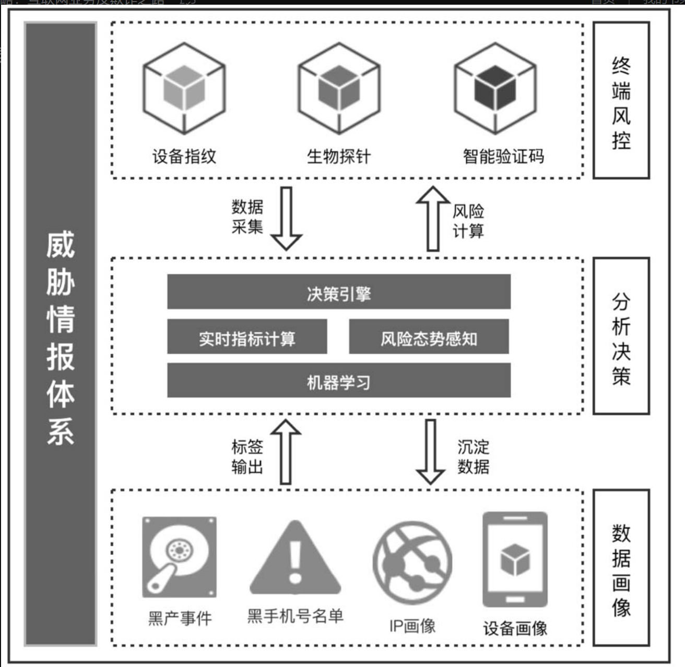

# 金融风控引擎

> 项目地址：[stream\_rule\_flink: a rule-engine try,created by lx in 2024-12-06 (gitee.com)](https://gitee.com/lxmelody/stream_rule_flink)。目前是私有仓库

## 项目背景

在风控要略这本书中，典型的一个反欺诈防控体系有三层。

* 终端风控：有设备指纹，智能验证码
* 分析决策：从终端采集数据，然后进行决策引擎，以及实时指标的计算，并结合数据挖掘的部分，以及数据画像的标签输出，对数据进行计算
* 数据画像：从分析层沉淀数据，并将标签输出到分析层

我的目标，是做一个全流程的风控系统，其中的核心是Flink引擎结合OLAP。

## 项目技术栈

目前集中精力在开发分析决策层的部分，并开始考虑加入数据挖掘部分挖掘有效的规则补充进去。

主开发语言：Java/Scala

* 引擎核心：Flink
* OLAP：Doris
* 缓存选型：Redis
* 消息队列：Kafka

## 项目难点

静态规则的实现的核心逻辑已经完成。

目前在实时规则的动态添加与修改有一些问题。首先，现有的开源项目有好几个，但是全部没有文档。仅有的文档是Flink官方的Flip200的设计思路。唯一的方法就是深入源码，一步一步调试代码后将逻辑进行调整，并加入自己项目。

## 开发进度

- 2024-12-06
  - 将之前的scala SparkDemo静态规则版本等价转换为flink,初始化项目
  - 对软件版本进行规划，最新版Flink部分组件仍旧没有适配1.20
  - 构建工具类和最初始逻辑
- 2024-12-07 添加
  - 序列化选型，考虑Protobuf,添加Demo并进行单测
  - 对于普通规则，组合规则，组合顺序规则进行参数封装
  - 添加规则的匹配逻辑，从画像系统取数据，查看规则命中情况
  - 对于普通规则，组合规则，组合顺序规则添加规则匹配服务，生成匹配结果
  - 考虑Flink的cep库函数简化代码，状态后端换为rocksDB对其他组件替换的可能性
  - 考虑doris的物化视图，以及seq_match,缓解Flink state存储压力与计算压力,对数据冷热分离
- 2024-12-08 添加
  - 对于CEP进行深入了解，并通过机架温度探查案例来使用single规则以及combine规则，查看对于动态规则的支持
  - 尝试在本地运行动态cep，但是最后报错，所以开源版本目前还不支持该功能，官方的demo只是用来看的，并且商用版本最高也只支持1.17
  - 考虑把静态规则全部用CEP实现
- 2024-12-09 添加
  - 掌握groovy语法，研究用groovy实现动态规则的可能性
  - 尝试用groovy实现动态规则，但是发现无法实现,因为动态规则的需求是在执行中动态修改的，而不是在初始化的时候进行类加载来实现的
  - 最终通过对一个二开的flink版本进行测试与打包，实现动态规则的增加，并且在温度探查中测试功能完备，动态添加规则也可以看出来探查出的数据有变化
- 2024-12-10 添加
  - 查看flink底层原理，尝试解决动态规则修改失败的问题
  - 成功实现基于多规则，并且可动态添加规则的登陆日志信息检测机制，考虑存入分析系统进行分析
- 2024-12-11 添加
  - 对于doris的连接部分以及seq_match进行封装和测试，并对日志输出进行调整，之前的运行不起来，现在可以运行
  - 对于dynamic-cep的尝试暂时截止并注释掉，没有文档，能跑起来和简单使用就行
  - 对于groovy，引入的jar包在有的时候一直报错，暂时注释掉
- 2024-12-12 添加
  - Doris功能测试完毕，单测通过，包括从KafKa导入数据，物化视图，以及JDBC连接查询部分
  - 主流程引入Doris完毕，还未测试主流程
  - 考虑后续添加的ML模块，要不要考虑使用Spark，还是直接使用Flink
- 2024-12-13 添加
  - 主流程在n次debug在跑起来了，由于没有做画像，所以把日志分析部分全部放doris，直接从doris查询，这里逻辑还有问题，listState没有结合完整
  - 部分接口等参数，以及数据模拟的分布有问题，不方便测试，需要重新设计
- 2024-12-14 添加
  - 重新加回动态CEP接口，准备和项目结合。但是考虑之后，引入的开源代码暂时不使用git进行版本管理了
- 2024-12-15 添加
  - 大致梳理清楚了动态CEP的具体实现，开始研究具体的类加载实现
- 2024-12-16 添加
  - 发现了外部引入的开源实现，其实同样是参考官方那个半成品开源而实现的,尤其是与DB交互，类加载的部分完全一致
  - 没有合适的数据源，以及外部已经做好的日志系统。只能暂时再把之前的逻辑完善一下。
- 2024-12-17 添加
  - 考虑了所有可能的Flink多线程共享状态的方案来维护物化视图，考虑自定义oper来接一下数据流获取结果，然后和coodrinator交互的实现难度
- 2024-12-18 添加
  - 考虑数据规模，最后直接用侧写流把命中数据复制一份，相当于采样来确定使用的维度，然后并行做命中数据的sink以及物化视图的创建。
- 2024-12-19 添加
  - 一步一步，参考多个开源实现，研究flink动态cep实现内部原理，准备后续实现一个精简版的
- 2024-12-20 添加
  - 考试复习
